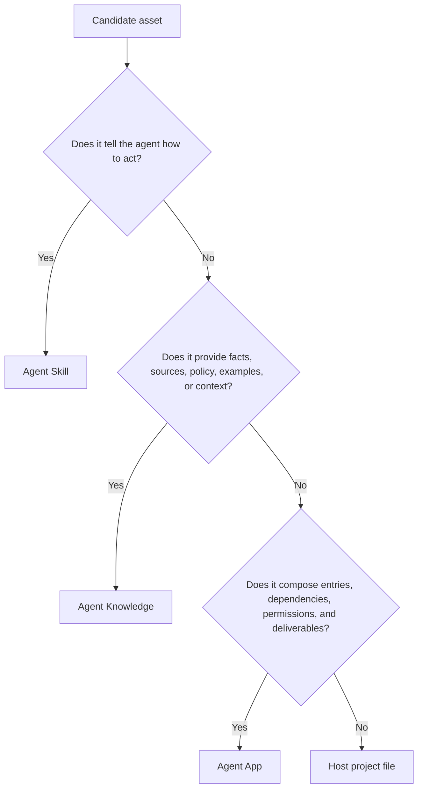
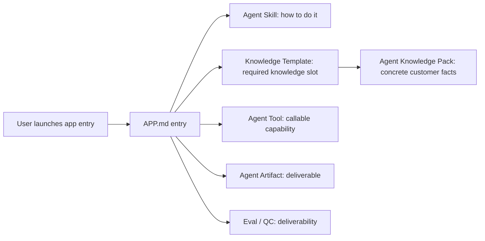

# Agent App vs Skills and Knowledge

Agent Skills, Agent Knowledge, and Agent App answer different questions.

| Standard | Answers | Entry |
| --- | --- | --- |
| Agent Skills | How does the agent do the work? | `SKILL.md` |
| Agent Knowledge | What trusted facts and context can enter the model? | `KNOWLEDGE.md` |
| Agent App | Which UI, workflows, storage, services, entries, capability dependencies, tools, artifacts, and evals make up an installable app? | `APP.md` + runtime package |

## Decision tree

## How they work together

Agent App does not copy procedural details from Skills or factual content from Knowledge. It declares how those assets are composed, and may carry its own UI, workers, storage schemas, and business workflows. Runtime still happens under host authorization through the Capability SDK.

## Content Factory example

| Asset | Correct place | Reason |
| --- | --- | --- |
| How to interview a founder and compile IP facts | Agent Skill | It is a knowledge-production method. |
| Founder history, voice, boundaries, quotes | Agent Knowledge | It is source-grounded persona data. |
| How to draft articles and remove AI tone | Agent Skill | It is writing and review procedure. |
| Project home, knowledge pages, content factory, `/IP Article`, `/Review Report` | Agent App | They are app UI and user-visible entries. |
| Competitor research, image generation, Feishu export | Agent Tool | They are external capabilities. |
| Article draft, script batch, strategy report | Agent Artifact | They are durable deliverables. |
| Fact grounding, voice fit, publish readiness | Eval / Agent QC / Evidence | They are quality and trust checks. |

## Common mistakes

- Embedding customer data in an official app package.
- Putting full writing procedures in `APP.md` instead of a Skill.
- Treating Knowledge as executable instructions.
- Inventing a new tool protocol for one app.
- Letting a cloud registry become a hidden Agent Runtime.
- Hardcoding business entries in host core instead of generating them from app projection.

## Fixed conclusions

- App is a complete application package; execution happens in the host runtime and capability calls must go through the Capability SDK.
- Skill is procedure, not customer fact.
- Knowledge is data, not instruction.
- Runtime packages carry app implementation but must not bypass host runtime and policy.
- Cloud may distribute apps, but it should not run agents by default.

## Packaging patterns

| Situation | Package as | Reason |
| --- | --- | --- |
| A reusable writing method or review rubric | Skill | It changes agent behavior but does not own product UI or storage. |
| A verified product handbook, brand rule set, or policy library | Knowledge | It is grounded data with provenance and update lifecycle. |
| A CRM, search, export, parser, or generator integration | Tool | It is an external callable capability with auth and side effects. |
| A dashboard, guided workflow, settings, artifacts, evals, and storage | Agent App | It is a complete installed product experience. |
| A one-off local project file | Workspace asset | It belongs to one workspace, not to a reusable app release. |

## Review questions

- Can this asset be reused by another app without bringing along the current UI? If yes, consider Skill, Knowledge, Tool, or Artifact first.
- Does it need installation, permissions, entries, storage, and lifecycle? If yes, it likely belongs in Agent App.
- Would placing it in host core make the host vertical-specific? If yes, package it as an app.
- Would bundling it leak customer facts or credentials? If yes, use Knowledge, overlays, workspace files, or secrets instead.
