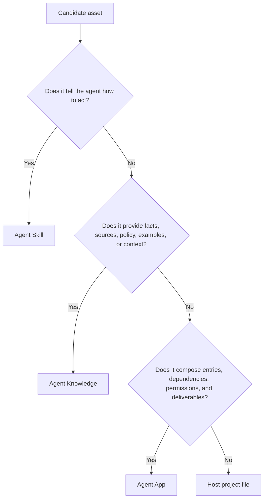

# Agent App vs Skills and Knowledge

Agent Skills, Agent Knowledge, and Agent App answer different questions.

| Standard | Answers | Entry |
| --- | --- | --- |
| Agent Skills | How does the agent do the work? | `SKILL.md` |
| Agent Knowledge | What trusted facts and context can enter the model? | `KNOWLEDGE.md` |
| Agent App | Which capabilities, knowledge slots, entries, tools, artifacts, and evals make up an installable app? | `APP.md` |

## Decision tree

## Example

An AI content engineering application should package:

- Writing method and workflow as Agent Skills.
- Personal IP, product facts, and content operations playbooks as Agent Knowledge.
- `/IP Article`, `/Content Calendar`, required knowledge slots, tool requirements, artifact contracts, and quality gates as Agent App declarations.

Customer data belongs in Knowledge packs or overlays, not in the official Agent App package.
