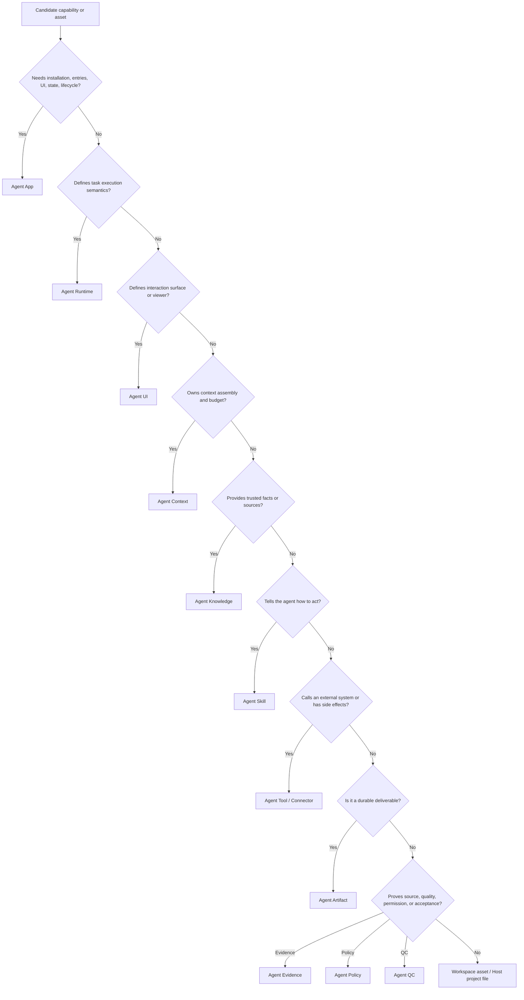
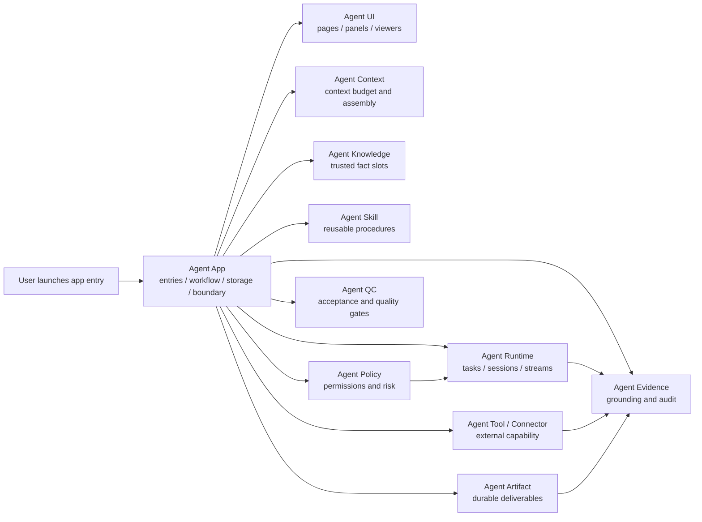

# Agent App and Standards Ecosystem Boundary

Agent App is the application and delivery-boundary layer in the agent standards ecosystem. It composes Runtime, UI, Context, Knowledge, Skills, Tools / Connectors, Artifacts, Evidence, Policy, QC, and domain standards instead of centering on one asset type.

Current fact source: **Agent App owns installable business application composition, experience, delivery, and boundaries; adjacent standards own reusable capabilities; Lime Host and Lime Cloud own execution, governance, connectors, and distribution.**

## Standards map

| Standard / plane | Owns | How App uses it |
| --- | --- | --- |
| Agent App | Installable app package, entries, runtime package, workflow, storage, release, v0.7 requirement boundary. | Composition layer for how a business workbench is installed, run, accepted, and upgraded. |
| Agent Runtime | Tasks, models, tools, sessions, checkpoints, event streams, structured output. | Starts controlled tasks through `lime.agent` and `app.runtime.yaml`; does not ship a hidden runtime. |
| Agent UI | Pages, panels, commands, interaction state, artifact viewers, Host Bridge. | Exposes product surfaces through entries, UI bundles, and `lime.ui`. |
| Agent Context | Context assembly, budget, priority, compression, missing-context requests. | Declares which context sources and budgets each entry or workflow needs. |
| Agent Knowledge | Trusted facts, sources, provenance, freshness, retrieval or data mode. | Declares `knowledgeTemplates`; workspace or tenant binds concrete Knowledge Packs. |
| Agent Skills | Reusable procedures, scripts, steps, rubrics, executable process fragments. | References them through `skillRefs` or `skills/`; does not copy full procedures into `APP.md`. |
| Agent Tool / Connector | External callable capability, CLI, API, MCP, browser adapter, auth, side effects. | Declares `toolRefs`, `app.integrations.yaml`, and Host/Cloud connector needs. |
| Agent Artifact | Durable deliverables, schemas, viewers, exporters, versions, states. | Declares output contracts through `artifactTypes`. |
| Agent Evidence | Grounding, traces, replay, redaction, audit export. | Records evidence refs for trust-sensitive flows across inputs, tasks, tools, and artifacts. |
| Agent Policy | Permissions, risk, cost, retention, tenant rules, human-review thresholds. | Declares policy inputs through `permissions`, `app.operations.yaml`, and Host policy. |
| Agent QC | Quality gates, acceptance metrics, regression, waivers, reports. | Enters release and runtime through `evals`, readiness, and review gates. |
| Domain standards, such as Agent Novel | Business-domain workspace semantics, file shape, long-running workflow. | Can be an app domain profile or specialized app type; should not be hardcoded into Host Core. |
| Lime Host / Cloud | Local execution, sandbox, credentials, connectors, registry, tenant policy, OAuth, webhook, sync. | App declares requirements; Host / Cloud provide capabilities, governance, and evidence. |

## Decision tree

## How they work together

Agent App does not copy adjacent standards into itself. It declares which standards a business workbench needs, how they are bound, when they run, how results are accepted, and how failures recover. Actual execution remains mediated by Host / Cloud capability, policy, secrets, connector, and evidence boundaries.

## Lime Agent, Expert, and App boundary

Lime Agent is not another app package format. It is the Host-provided Runtime capability. Expert Chat is also not a replacement for App; it is one conversational entry an App may expose.

| Layer | Correct responsibility | Incorrect responsibility |
| --- | --- | --- |
| Agent App | Own business UI, workflow state, storage schema, artifacts, requirement boundaries, and human review. | Rebuild model gateways, credential stores, evidence stores, tool brokers, or connector runtimes outside Lime governance. |
| Lime Agent / Runtime | Run tasks, stream events, route models, call tools, manage sessions, checkpoints, structured output. | Own vertical business pages or force users into generic chat for app workflows. |
| Expert Chat | Provide a conversational entry, collaborator, explainer, or review assistant. | Replace the app's main workflow or become a detached copy-paste side channel. |
| Lime Host / Cloud | Host capabilities, permissions, sandbox, secrets, registry, tenant policy, OAuth, webhook, and sync. | Merge non-core vendor adapters or customer-private workflows into Core. |

## Example decomposition

| Need or asset | Correct place | Reason |
| --- | --- | --- |
| Content workspace home, draft list, review flow, pre-publish confirmation | Agent App | User-facing product experience and business state. |
| Long task execution, structured output, session resume, checkpoint | Agent Runtime | Execution semantics, not a hidden private app runtime. |
| Forms, panels, artifact viewers, command entries | Agent UI | Interaction surfaces. |
| Project materials needed by a task, context budget, missing-context request | Agent Context | Determines how context is assembled and compressed. |
| Brand rules, product handbook, policy library, project facts | Agent Knowledge | Source-grounded data, not instructions. |
| Writing method, interview flow, review rubric | Agent Skill | Reusable procedure. |
| External tables, CRM, search, export, parser, Feishu/drive/API adapter | Agent Tool / Connector | External capability with auth and side effects. |
| Article drafts, script batches, reports, decks, tables | Agent Artifact | Durable deliverables. |
| Source citations, tool-call logs, publish approval record | Agent Evidence | Trust, replay, and audit support. |
| Cost limits, retention, human-review threshold, tenant deny rule | Agent Policy | Decision rules. |
| Fact grounding, voice fit, publish readiness, regression checks | Agent QC | Quality and acceptance gates. |

## Common mistakes

- Discussing only a narrow subset of assets while ignoring Runtime, UI, Context, Tool, Artifact, Evidence, Policy, and QC.
- Embedding customer data in an official app package instead of Knowledge, workspace files, secrets, or overlays.
- Putting full procedures in `APP.md` instead of a Skill or app runtime workflow.
- Treating Knowledge as executable instructions.
- Inventing a one-off tool protocol instead of using Tool / Connector / MCP / CLI / API adapters.
- Letting a Cloud registry become a hidden Agent Runtime.
- Hardcoding vertical business entries in Host Core instead of generating them from app projection.

## Fixed conclusions

- App is a complete application package and composition layer, not a dumping ground for every standard.
- Runtime owns execution semantics; App only declares task intent and how results write back.
- UI owns interaction surfaces; App may ship a UI bundle, but Host Bridge still mediates it.
- Context owns context assembly; Knowledge owns trusted facts; Skills own reusable procedures.
- Tool / Connector owns external capability; Artifact owns durable deliverables.
- Evidence / Policy / QC own trust, authorization, and acceptance.
- Cloud may distribute, govern, and connect apps, but should not run local agent tasks by default.

## Review questions

- Does this capability need installation, entries, state, storage, and lifecycle? If yes, it belongs in Agent App.
- Can it be reused by several apps? If yes, first consider Runtime, UI, Context, Knowledge, Skill, Tool / Connector, Artifact, Evidence, Policy, QC, or a domain profile.
- Does it have external side effects? If yes, it must go through Tool / Connector and `app.operations.yaml`.
- Is it execution semantics? If yes, it belongs in Agent Runtime, not a private app runtime.
- Would placing it in Host Core make the host vertical-specific? If yes, package it as an app or domain standard.
- Would bundling it leak real-world subjects, accounts, credentials, or private workflow? If yes, externalize it.
