# Architecture overview

This page collects the key structural, requirement-boundary, and runtime diagrams for Agent App v0.7 in one place. The [specification](./specification) defines rules; this page renders them.

## 1. Standard layers

v0.7 inherits v0.6 layering and splits delivery across App, Host, Cloud, connector, external-system, and human-decision planes. The layered manifest and Capability SDK are the stable boundaries; hosts and the Cloud control plane stay on contracts and never on business implementation.

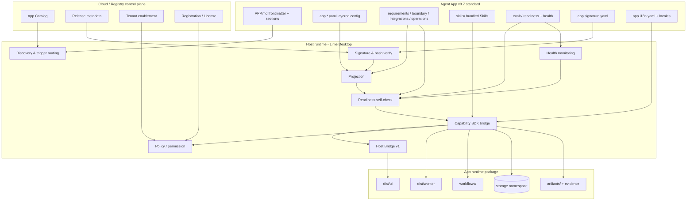

## 2. Responsibility matrix

| Layer | Owns | Does not own |
| --- | --- | --- |
| Cloud / Registry | catalog, release metadata, tenant enablement, registration, license, ToolHub metadata | app execution, UI rendering, local storage |
| Host runtime | discovery, signature verify, projection, readiness, SDK injection, Host Bridge, policy, cleanup | business logic, customer data, vertical rules |
| App runtime | UI, workers, workflows, storage business code, artifact, evidence write-back | model / tool / credential / permission scheduling (must go through the SDK) |
| Standard (agentapp) | manifest schema, reference CLI, SDK contract, best practices | concrete host or app implementations |

## 3. v0.7 requirement-boundary architecture

v0.7 uses this view to answer the product and delivery question: what can the App do, and what requires Lime Host, Lime Cloud, connectors, external systems, or human confirmation.

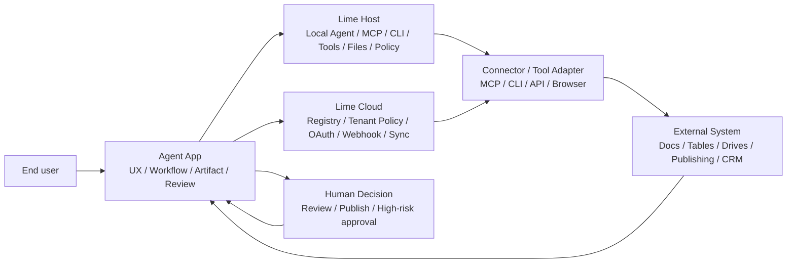

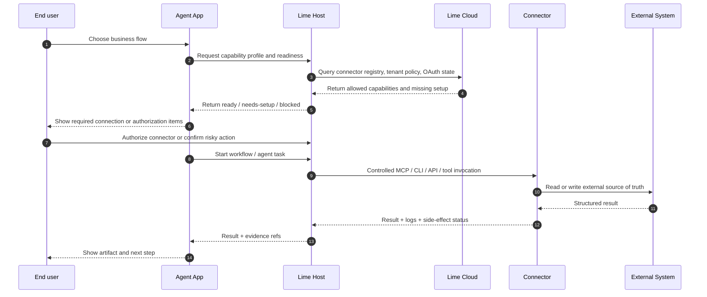

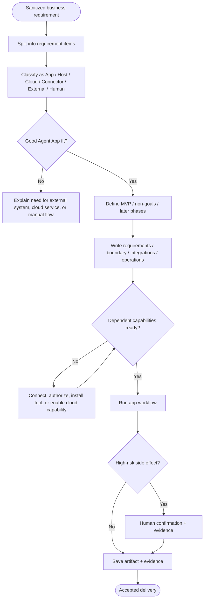

## 4. Install and launch sequence

End-to-end flow from Cloud bootstrap → local download → verify → projection → readiness → launch.

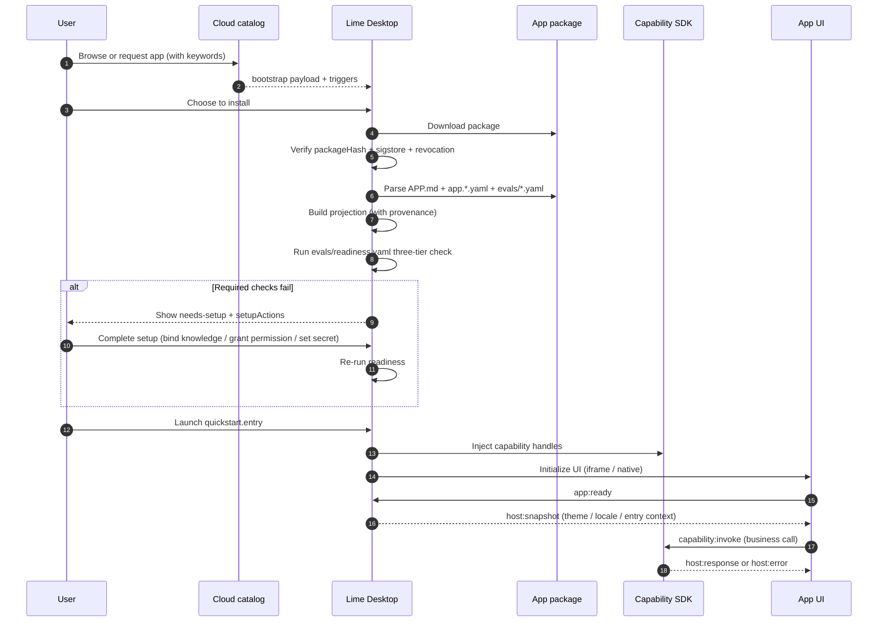

## 5. Readiness flow

`evals/readiness.yaml` runs three tiers (required / recommended / performance) and produces five states.

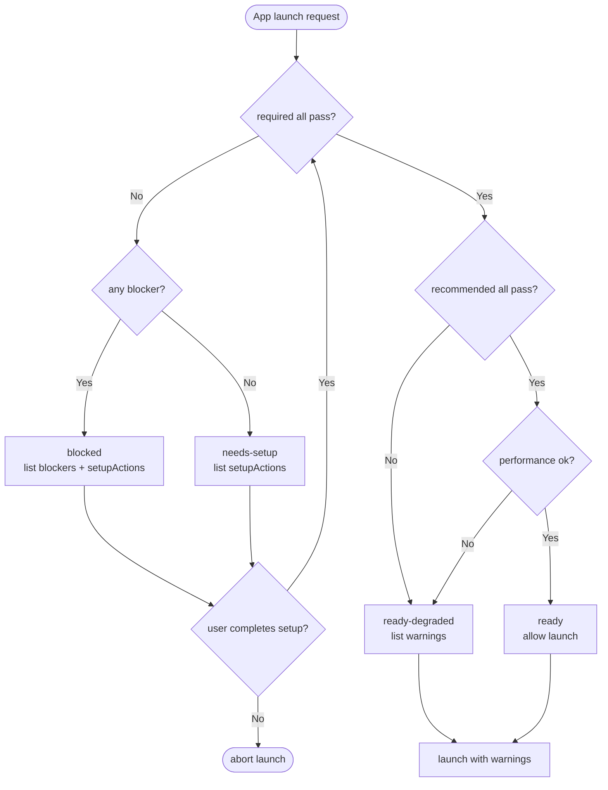

## 6. Host Bridge v1 sequence

App UI and Host exchange events through `lime.agentApp.bridge`; all capability calls go through `capability:invoke` and the host decides allow or deny.

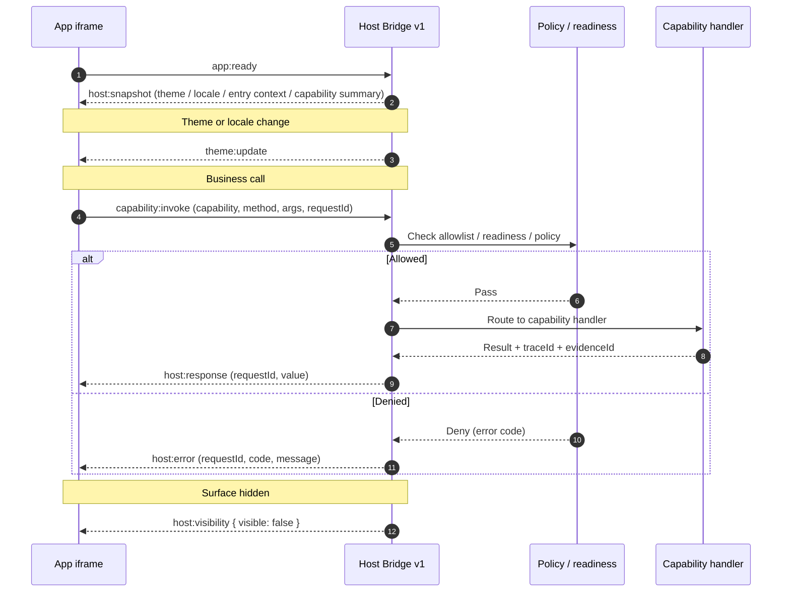

## 7. Capability invocation topology

`capability:invoke` requests are routed to capability handlers; each capability has its own permission, policy, and evidence boundary.

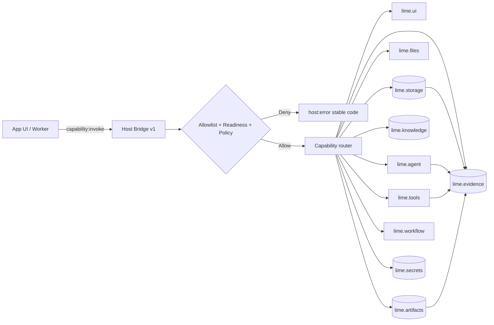

## 8. Workflow state machine example

v0.5 workflow descriptors keep the v0.3 state machine and add a mermaid diagram and unified recovery policy. The example below is the Content Factory `content_scenario_planning` workflow.

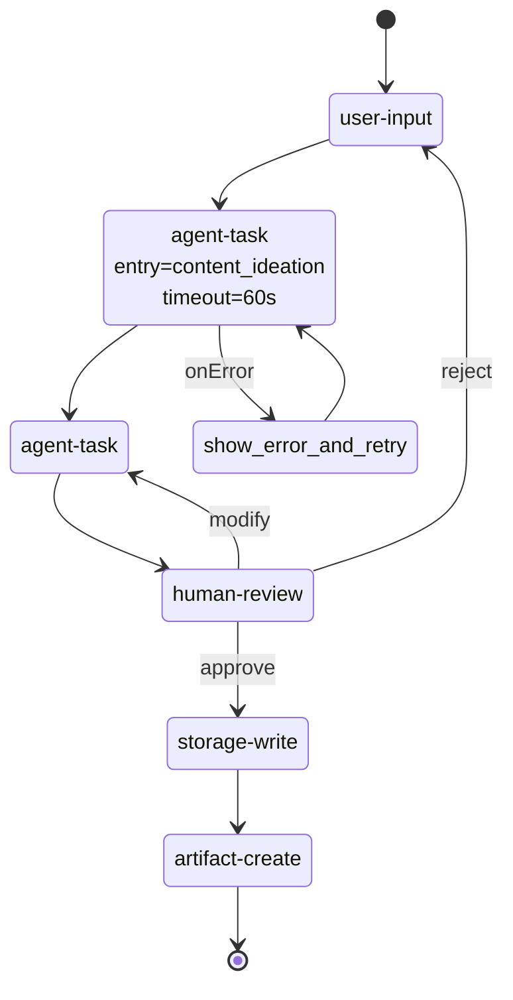

## 9. Package file dependency

`APP.md` is the discovery entry; layered files are loaded by file-name convention and form the projection input together.

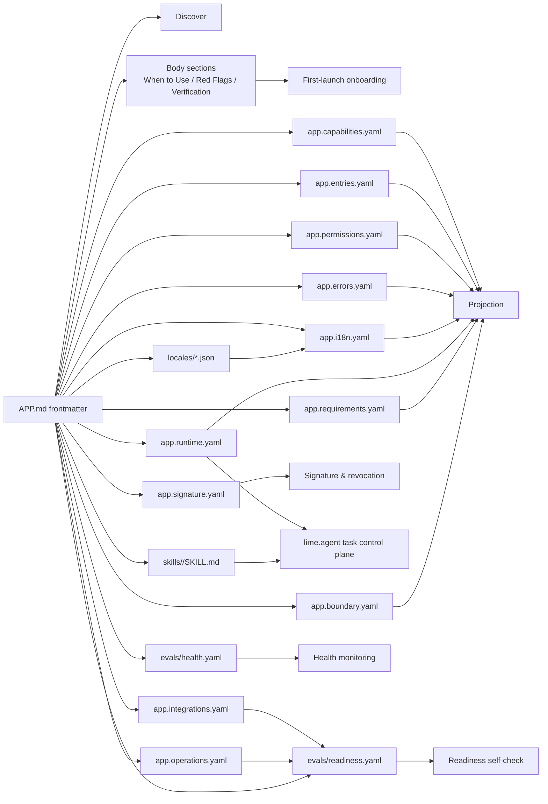

## 10. Upgrade and rollback

v0.6 / v0.5 / v0.4 / v0.3 manifests continue to work in v0.7 hosts; the reference CLI provides `migrate-check` / `migrate-generate`.

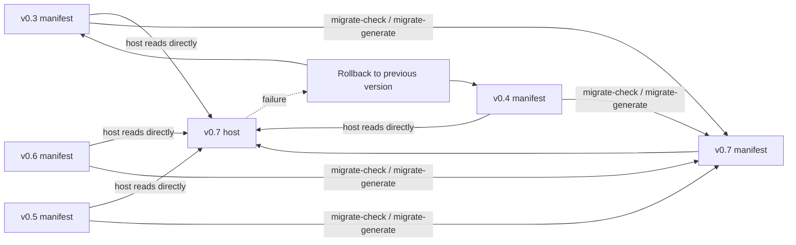

## 11. Further reading

- [Specification](./specification): rules, fields, and constraints.
- [Quickstart](./authoring/quickstart): build a v0.7 package from scratch.
- [Runtime model](./client-implementation/runtime-model): host implementation detail.
- [Capability SDK](./client-implementation/capability-sdk): stable capability call contract.
- [v0.7 snapshot](./versions/v0.7/overview): pinned version notes.
