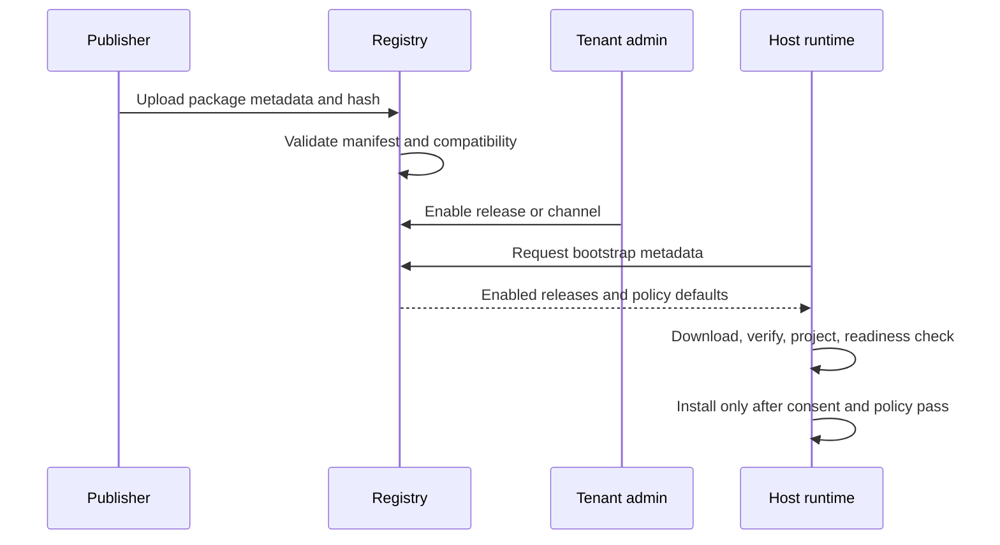

# Release and distribution

Agent App releases should be immutable, reviewable, and safe to roll back. A registry can distribute packages and authorize tenants, but the host still performs local verification, readiness, policy checks, and runtime execution. The install contract adds one more release decision: the same package may be offered for in-Lime installation, standalone branded installation, runtime-backed installation, or compatible web hosts.

## Release object

A release should include enough metadata for a host to decide whether it can install the package before downloading every support file.

| Field | Purpose |
| --- | --- |
| `appId` | Stable package identity. |
| `version` | SemVer package version. |
| `manifestVersion` | Agent App manifest version. |
| `packageUrl` | Download or registry reference. |
| `packageHash` | Integrity check for the package. |
| `manifestHash` | Integrity check for `APP.md` or extracted manifest. |
| `signatureRef` | Optional signature or supply-chain attestation. |
| `compatibility` | Host, SDK, and capability version ranges. |
| `install` | install modes and runtime relationship from `app.install.yaml`. |
| `releaseNotesUrl` | Human-readable change notes. |
| `rollbackTarget` | Known safe previous release. |

## Channels and pins

Registries may expose channels such as `stable`, `beta`, or `internal`, but tenant enablement should resolve to a concrete release.

```text
channel: stable
  -> release: content-factory-app@0.3.0
  -> packageHash: sha256:...
```

Pinning matters because app packages can include migrations and runtime code. A host should know exactly which package was installed.

## Distribution flow



The registry distributes. The host installs and runs. For standalone releases, the host may be Lime App Shell embedded in the branded app bundle; for runtime-backed releases, the host must verify that the system `lime-runtime` satisfies the declared version range.

Developer-tool publish authentication is not part of the host business layer. An embedded app may use `lime.cloudSession` to fetch the current host session token just in time, then call the registry or control plane itself. The host only provides generic login, session, and authorization support; it must not proxy the publish flow or persist the token into app config.

If a just-in-time token is rejected by the control plane, the app may call `lime.cloudSession.requestLogin` with `{ "force": true }` and retry once. The retry still belongs to the generic host session capability; the host must refresh authorization only, not execute the publish operation on behalf of the app.

Visual publish tools for everyday developers must keep the primary path minimal: app directory, inspection result, publish action, and publish result. Token, release ID, API base, payload, hash, and dry-run diagnostics must default to a collapsed details panel or CLI output, not permanent page chrome.

## What must not be overwritten

A release upgrade must not overwrite:

- user Knowledge bindings
- workspace files
- app storage records
- secrets
- tenant overlays
- user overrides
- generated artifacts
- evidence history

Official package defaults can change. User and tenant state must remain separate.

## Migration notes

If a release changes storage schema or workflow state, ship explicit migration metadata:

```yaml
lifecycle:
  upgrade:
    migrations:
      - from: "0.2.x"
        to: "0.3.0"
        storage: ./storage/migrations/003_v0_3.sql
        reversible: false
        risk: requires user confirmation before deleting old indexes
```

Hosts should dry-run migrations when possible and show irreversible risks.

## Rollback

Rollback is not just downloading the older package. The host must decide what to do with data written by the newer version.

Minimum rollback plan:

- disable new entries if incompatible
- keep user data by default
- avoid running downgrade migrations automatically
- preserve evidence records
- record which release created each artifact
- expose export before delete when data loss is possible

## Release checklist

Before publishing a release:

- `agentapp-ref validate` passes.
- `agentapp-ref project` output is deterministic.
- `agentapp-ref readiness` produces actionable setup tasks.
- Package hash and manifest hash are recorded.
- Compatibility ranges are accurate.
- `app.install.yaml` declares supported install modes and runtime requirements.
- Release notes describe breaking changes and migrations.
- Example workspace still passes expected evals.
- Customer data is not bundled in the official package.
- Rollback target is known.

## Recommended version policy

| Change | Version impact |
| --- | --- |
| Text-only docs or examples | Patch |
| Optional entry, optional tool, optional eval | Minor |
| Required capability, schema migration, breaking entry key | Major or explicit compatibility note |
| Security fix | Patch with clear advisory |
| Deprecation | Minor with removal window |

Agent App is still pre-1.0, but app authors should behave as if users depend on stable contracts.
