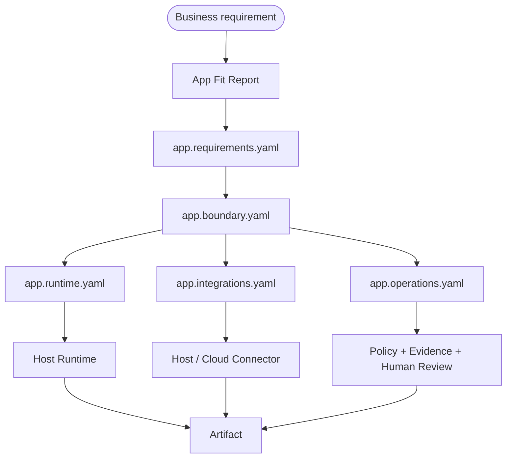

# Standards Interop

Agent App does not replace adjacent standards. It composes Runtime, UI, Context, Knowledge, Skills, Tools / Connectors, Artifacts, Evidence, Policy, QC, and domain profiles into an installable business application.

Boundary principle: **App declares composition and delivery boundaries. It does not copy adjacent standards into itself, and it does not move Host / Cloud / Connector responsibilities into the app package.**

## Trust model

| Asset or standard | Trust question | Runtime behavior |
| --- | --- | --- |
| Agent Runtime | Are task execution, model routing, tool calls, sessions, and checkpoints controlled? | Host executes through `lime.agent`; App only declares `app.runtime.yaml`. |
| Agent UI | Does the surface run inside controlled containers, Host Bridge, and permission boundaries? | Host injects theme, context, and capability handles. |
| Agent Context | Are context sources, budgets, priorities, and compression reproducible? | Host assembles context from entry and workflow requirements. |
| Agent Knowledge | Is the data trustworthy, fresh, and source-grounded? | Loaded as fenced data or retrieved context; not executed. |
| Agent Skill | Is the procedure safe, executable, and reusable? | Activated after skill trust and permission checks. |
| Agent Tool / Connector | Is the external capability authorized, auditable, and recoverable? | Called through Host/Cloud-managed connectors, MCPs, CLIs, APIs, or browser adapters. |
| Agent Artifact | Are deliverable schema, viewer, export, and state stable? | App declares artifact types; Host stores and displays them. |
| Agent Evidence | Are sources, traces, tool calls, review, and replay traceable? | Host records evidence refs; App displays and references them. |
| Agent Policy | Are permissions, cost, risk, retention, and tenant rules enforced? | Host / Cloud enforces policy; App only declares inputs. |
| Agent QC | Does output meet quality and acceptance gates? | Expressed through evals, readiness, review gates, and reports. |

## Reference patterns

### Runtime

```yaml
requires:
  capabilities:
    - lime.agent
agentRuntime:
  agentTask:
    eventSchema: lime.agent-task-event.v1
    resultSchema: lime.agent-task-result.v1
    structuredOutput:
      type: json_schema
```

Runtime is execution semantics, not a private app model gateway. Apps must not bypass Host to start models, tools, or MCP runtimes.

### UI

```yaml
entries:
  - key: workspace
    kind: page
    title: Workspace
    route: /workspace
runtimePackage:
  ui:
    path: ./dist/ui
```

UI bundles can ship in the app package, but rendering, navigation, downloads, external links, and capability calls remain mediated by Host Bridge.

### Context

```yaml
metadata:
  contextHints:
    workspace: required
    sourceRecords: on_demand
    maxTokens: 12000
```

Context hints describe needs only. Host / Runtime owns assembly, budgeting, compression, and missing-context requests.

### Knowledge

```yaml
knowledgeTemplates:
  - key: project_knowledge
    standard: agentknowledge
    type: brand-product
    runtimeMode: retrieval
    required: true
```

Knowledge templates describe slots, not private facts. During install or workspace setup, the host binds concrete Knowledge Packs to these slots.

### Skills

```yaml
skillRefs:
  - id: draft-review-rubric
    standard: agentskills
    activation: workflow
    required: true
```

A Skill is reusable procedure. Apps can reference or bundle Skills, but should not copy full Skill content into the `APP.md` body.

### Tool / Connector

```yaml
integrations:
  - key: source_records
    provider: docs.table
    executionPlane: host
    hostCapability: lime.connectors
    adapter:
      kind: api
```

External systems, MCPs, CLIs, APIs, and browser adapters should be managed by Host / Cloud. Apps declare intent and readiness; they do not store credentials or directly execute external side effects.

### Artifact / Evidence / Policy / QC

```yaml
artifactTypes:
  - key: content_draft
    standard: agentartifact

evals:
  - key: fact_grounding
    kind: quality
    evidenceRequired: true

permissions:
  - key: write_external_draft
    scope: tool
    access: write
```

Artifacts are deliverables, Evidence is the trust chain, Policy is the decision input, and QC is the acceptance gate. They should not collapse into one free-form prompt.

## v0.7 handoff flow



## Common mistakes

- Declaring only a narrow subset of assets while omitting Runtime, UI, Context, Tool, Artifact, Evidence, Policy, and QC.
- Embedding external-system adaptation in app code instead of connector / MCP / CLI / API adapters.
- Bundling private facts in the official package instead of Knowledge, workspace files, secrets, or overlays.
- Putting runtime execution semantics into a private app worker instead of `lime.agent` / Host Runtime.
- Encoding policy and QC as prompt text instead of stable permissions, operations, evals, and evidence rules.

## Checklist

- Every entry states its Runtime, UI, Context, Knowledge, Skill, Tool, and Artifact needs.
- Every external side effect declares approval, dry-run, idempotency, and evidence in `app.operations.yaml`.
- Every external system enters through `app.integrations.yaml` and Host / Cloud capabilities.
- Every private fact stays in Knowledge, workspace files, secrets, or overlays.
- Evidence links app entry, context, Knowledge source, Skill ID, Tool call, Artifact, and QC verdict.
