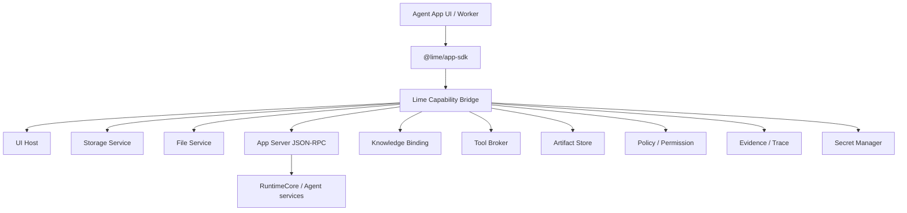

# Capability SDK

The Capability SDK is the stable boundary between Agent Apps and Lime. It solves two problems:

1. Apps do not reimplement file, storage, task, artifact, knowledge, tool, policy, and evidence features that Lime already owns.
2. When Lime internals change, apps depend on versioned capability contracts instead of internal implementation details.

## Architecture



The SDK is a facade, not a re-export of Lime internals. Apps must not import `lime/src/...`; they request capability handles.

Backend execution for `lime.agent` / `lime.workflow` does not happen inside the SDK. Desktop hosts should project SDK requests through Host Bridge / Desktop Host IPC into App Server JSON-RPC, then into RuntimeCore / services. Apps must not import `app-server-client`, spawn sidecars, read JSONL transport, or hold RuntimeCore internal types.

## Capability negotiation

During install, the host reads the manifest:

```yaml
requires:
  sdk: "@lime/app-sdk@^0.3.0"
  capabilities:
    lime.ui: "^0.3.0"
    lime.storage: "^0.3.0"
    lime.agent: "^0.3.0"
```

Host decisions:

| Result | Behavior |
| --- | --- |
| All satisfied | Install and enable. |
| Optional capability missing | Install but mark degraded readiness. |
| Required capability missing | Block activation; ask to upgrade Lime or disable the entry. |
| Major incompatibility | Block install and show compatibility matrix. |

## Runtime injection

Apps do not carry host implementations. The host injects capability handles:

```ts
const lime = await getLimeRuntime()
const table = lime.storage.table('content_assets')
const task = await lime.agent.startTask({ entry: 'batch_copy', input, idempotencyKey })
const hits = await lime.knowledge.search({ template: 'project_knowledge', query, topK: 8 })
const artifact = await lime.artifacts.create({ type: 'strategy_report', data: task.output })
await lime.evidence.record({ subject: artifact.id, sources: hits })
```

Every handle should include:

- appId / workspaceId / tenantId context
- permission and policy interception
- automatic provenance
- mock implementation for app tests
- telemetry and evidence hooks

## Shared user state and app-owned services

The SDK follows a mini-program style boundary: the host shares user state and platform capabilities, while apps keep their own product code, storage namespace, and backend services.

Apps may read host projections such as user id, workspace id, tenant id, locale, theme, effective model profile, billing entitlement, and capability availability. These are projections, not credentials. The SDK must never expose bearer tokens, refresh tokens, provider keys, plaintext secrets, database handles, filesystem paths, Electron objects, Tauri commands, or RuntimeCore internals.

App-owned backend services use the same SDK contract as UI and workflow code. A Python parser, Go report engine, Rust indexer, Node worker, Wasm transform, or remote service may exist inside the app package, but it requests `lime.files`, `lime.storage`, `lime.agent`, `lime.artifacts`, `lime.secrets`, and other capabilities through host-mediated handles. Backend services must not open host databases, read workspace files, or fetch secrets directly.

Storage calls are logical namespace calls. The host may map them to per-app SQLite files, per-app database schemas, dedicated databases, or shared metadata tables, but apps see only the SDK namespace contract.

## App-scoped agent tasks

`lime.agent` is the capability that lets an app use Lime Agent without sending the user back to generic chat or rebuilding agent infrastructure inside the app.

`lime.agent.startTask(request)` should be app-scoped:

- `request.appId`, `entryKey`, `taskKind`, `idempotencyKey`, and business context identify the app workflow that owns the task.
- `request.input` contains product data or references, not unbounded host internals.
- `request.expectedOutput` describes the structured result the app can write back, such as rows, records, report sections, or artifact descriptors.
- `request.knowledge`, `tools`, `files`, and `secrets` are declared capability bindings, not direct filesystem paths or plaintext credentials.
- The returned task exposes `taskId`, `traceId`, stream events, stable error codes, cancellation, retry, cost policy, artifact references, and evidence references.

Apps decide when to start a task and how to apply the structured result to their business state. Lime decides how the agent task runs, which tools and knowledge are allowed, how permissions are enforced, and how trace, artifact, and evidence records are attached.

Generic chat and expert-chat can reuse this same task contract as an interaction surface, but they must not be the only way an app completes core work.

### `lime.agent` to App Server mapping

A host that supports the App Server bridge should project `lime.agent.startTask(request)` into:

```text
agentSession/start
agentSession/turn/start
agentSession/event
agentSession/read
```

The SDK returns governed projections for `taskId`, `traceId`, events, artifact refs, and evidence refs. Apps do not observe Electron IPC channels, Tauri commands, JSON-RPC envelopes, sidecar paths, or provider API keys. When App Server is unavailable, the SDK must return a stable blocked error instead of mock success.
## Host Bridge and SDK Bridge

Inside UI runtime, `getLimeRuntime()` may be transported by Host Bridge, but its semantics still belong to the Capability SDK. Implementations should keep two layers:

1. `lime.agentApp.bridge`: cross-iframe or sandbox messaging for ready, snapshot, theme, toast, navigation, download, and request / response.
2. `@lime/app-sdk`: the typed facade app authors call; it converts `lime.storage.table()`, `lime.tools.invoke()`, and similar APIs into standard bridge requests.

App authors should not hand-roll private `postMessage` protocols. They should call the SDK for host capabilities. Only runtime lifecycle events such as `app:ready` and `host:getSnapshot` may be sent by a small bootstrap.

Theme synchronization is also an SDK boundary, not page logic inside each business app. The host sends `lime.ui` theme snapshots through `host:snapshot` and `theme:update`; the app must use SDK helpers to apply them instead of parsing `theme.tokens`, guessing Lime themes, or reading the outer DOM in every app.

```js
import {
  createLimeHostBridgeCapabilityInvoker,
  syncLimeHostTheme,
} from '@limecloud/agent-app-runtime';

const invoker = createLimeHostBridgeCapabilityInvoker({
  appId: 'my-app',
  entryKey: 'dashboard',
});

const stopThemeSync = syncLimeHostTheme(invoker);
```

For one-off host snapshots or tests, use `applyLimeHostTheme(payload)`. The helper only applies supported `--lime-*` and `--app-*` CSS variables and maintains `data-lime-theme`, `data-lime-theme-effective`, and `data-lime-color-scheme`. Business apps should consume those CSS variables as their own visual tokens.

Desktop shared capabilities follow the same rule. Model settings, cloud session, OEM branding, billing, and app updates are host capabilities exposed through SDK handles such as `lime.modelSettings`, `lime.cloudSession`, `lime.branding`, `lime.billing`, and `lime.appUpdates`. Business apps may read effective projections or request setup, but must not persist host sessions, global model configuration, billing ledgers, or updater state as app-local facts.

Host implementors must ensure that:

- every Host Bridge message has `protocol="lime.agentApp.bridge"` and `version=1`
- every request and response is correlated by `requestId`
- every capability call passes manifest declaration, entry readiness, permission, and policy checks
- unavailable capabilities return stable blocked errors instead of writing fake data or returning mock success
- theme, locale, visibility, and entry context are host snapshots, not app business state

## Minimal typed API

Host implementors should provide TypeScript types, schemas, mocks, and contract tests for at least:

```ts
lime.ui.registerRoute(route)
lime.storage.set({ key, value })
lime.storage.get({ key })
lime.files.readRef(ref)
lime.agent.startTask(request)
lime.knowledge.search(request)
lime.tools.invoke(request)
lime.artifacts.create({ kind, title, content })
lime.workflow.start(request)
lime.policy.requestPermission(request)
lime.secrets.getRef({ key })
lime.evidence.record({ kind, message, refs })
```

Every call must return stable error codes and support permission denial, cancellation, retries, timeouts, cost limits, and traceId.

## Capability version rules

- Major: breaking changes allowed; migration guide required.
- Minor: additive only; existing calls remain compatible.
- Patch: bug fixes; no contract changes.
- Deprecated: keep for at least two minor versions or a clear LTS window.
- Removed: remove only in a major version.

## Host implementor checklist

- Every capability has schema, TypeScript types, mocks, and contract tests.
- Every call can be associated with appId, entryId, taskId, workspaceId.
- Permissions are enforced at runtime bridge, not only in UI prompts.
- Host service replacement does not affect SDK contracts.
- SDK error codes are stable so apps can degrade gracefully.
- Capability calls record provenance and evidence by default.
