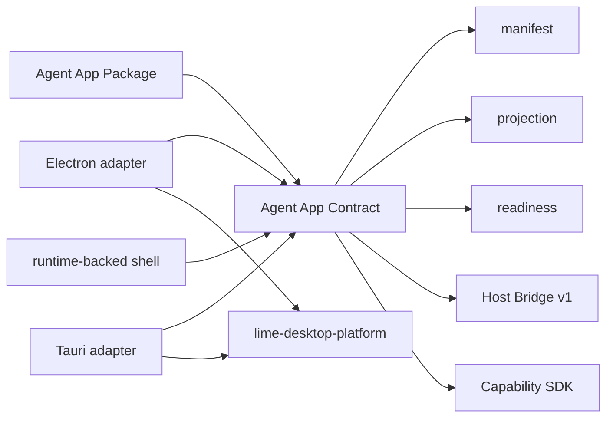
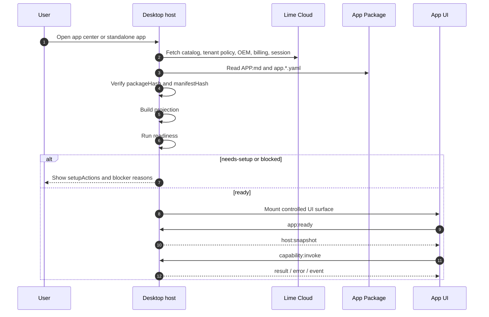

# Desktop host conformance

This page defines how a desktop host conforms to the Agent App standard. It is not the product PRD for `lime-desktop-platform`, and it is not an implementation note for a vertical business app. It only specifies how a desktop host installs, projects, checks, runs, and governs Agent Apps.

Fact-source relationship:

- `agentapp` is the fact source for the Agent App standard.
- `lime-desktop-platform` is one conforming desktop host implementation.
- `content-studio`, `zhongcao`, and OEM apps are Agent App consumers; `lime-desktop-platform/samples/platform-conformance` is a host-conformance reference fixture.
- Electron and Tauri may use different adapters, but they must share manifest, projection, readiness, Host Bridge, Capability SDK, and App Server bridge semantics.

## Conformance levels

| Level | Host capability | Must not do |
| --- | --- | --- |
| Desktop P0 | Read packages, verify hashes, emit projection, run readiness. | Execute app UI, workers, or workflows. |
| Desktop P1 | Show app center, install state, setup tasks, blocked / needs-setup. | Pretend blocked work succeeded. |
| Desktop P2 | Inject Host Bridge and Capability SDK, run controlled UI. | Expose Electron, Tauri, Node, Rust, or filesystem internals. |
| Desktop P3 | Provide model settings, OAuth session, OEM, billing, updates, and local evidence projection. | Rebuild those platform capabilities inside each app. |
| Desktop P4 | Let multiple apps share host capabilities and support uninstall, disable, update, and rollback. | Let one app-specific shortcut pollute host core. |
| Desktop P5 | Reuse the same contract in Tauri or runtime-backed shells while preserving the App Server JSON-RPC / RuntimeCore fact source. | Create a second standard or second Agent runtime for another technology stack. |

## Required desktop host behavior

| Standard capability | Host responsibility | What the app sees |
| --- | --- | --- |
| Discovery | Discover local directories, registry entries, OEM bootstrap payloads, or development fixtures. | Installable app list. |
| Verification | Verify package hash, manifest hash, signatures, and version compatibility. | Install review result. |
| Projection | Emit catalog cards, entries, capability previews, and provenance without executing code. | App center and entry cards. |
| Readiness | Check host version, capabilities, session, model settings, secrets, billing, and policy. | `ready` / `needs-setup` / `blocked`. |
| Host Bridge | Use `lime.agentApp.bridge` v1 to transport host snapshots, theme, locale, navigation, and capability calls. | SDK bridge and lifecycle events. |
| Capability SDK | Inject `lime.*` handles and let the host decide permission. | Governed platform capabilities. |
| App Server bridge | Host owns the App Server client and projects `lime.agent` / `lime.workflow` through Desktop Host IPC into JSON-RPC. | SDK tasks, events, and artifact projections only. |
| Storage / Artifacts / Evidence | Namespace app data, outputs, logs, and evidence by app. | Traceable business state. |
| Cleanup | Support disable, uninstall keep data, uninstall delete data, and export then delete. | Recoverable or removable app lifecycle. |

## Shared platform capabilities

A desktop host may expose these generic capabilities, but only through the Capability SDK or Host Bridge. Business apps must not import host internals.

| Capability | Suggested capability | Boundary |
| --- | --- | --- |
| Model settings | `lime.modelSettings` | Apps read effective settings or request setup; they do not persist global model settings. |
| OAuth / session | `lime.cloudSession` | Snapshots do not include bearer tokens; tokens are fetched just in time only. |
| OEM / branding | `lime.branding` / `lime.ui` | The host projects branding, theme, and shell copy; apps consume tokens. |
| Billing / subscription | `lime.billing` | The host projects tenant billing state; apps do not own the ledger. |
| Updates / distribution | `lime.appUpdates` | The host checks releases, downloads, switches versions, and rolls back; apps do not build private updaters. |
| Permissions and policy | `lime.policy` | High-risk actions need human review or policy approval. |
| Evidence | `lime.evidence` | Important runs and external side effects keep provenance. |

These capability names may be refined in future minor versions, but the semantics must remain stable: apps request capabilities, Host / Cloud governs them, and business facts stay in the app or external system.

## Electron and Tauri relationship



An Electron adapter may use `ipcMain`, preload, `BrowserView`, or WebView. A Tauri adapter may use Rust commands, WebView IPC, and a system runtime. The implementation differs, but the app should not observe those differences.

The desktop Agent execution path is fixed:

```text
App UI / Worker
  -> Host Bridge / Capability SDK
  -> Electron ipcMain / preload or Tauri WebView IPC
  -> App Server client
  -> App Server JSON-RPC
  -> RuntimeCore / services
  -> ExecutionBackend
```

Host implementation constraints:

- Electron / Tauri adapters only own desktop shell capabilities, IPC allowlists, sidecar lifecycle, and renderer-safe projection.
- The App Server client is held by the host main process or equivalent trusted process; renderers / iframes do not connect directly to the sidecar.
- `initialize -> initialized` is a required gate for every App Server transport.
- `agentSession/event` is the public task event ingress; app UI must not fabricate runtime success from local state.
- When App Server is unavailable, the host returns blocked / host:error; product paths must not fall back to mock success.

## Launch flow



## Minimum host snapshot fields

A host snapshot may contain:

- app id, entry key, route, and install mode
- non-sensitive locale, timezone, workspace id, and tenant id summary
- theme mode, effective theme, and CSS variables
- capability profile summary
- readiness state and setup findings summary
- cloud session presence, control-plane base URL, and tenant context
- non-sensitive billing, branding, and model settings status or versions

A host snapshot must not contain:

- bearer tokens
- plaintext secrets
- private user file contents
- raw billing ledgers
- host internal paths, Electron objects, Tauri command names, or Rust structs

## Readiness state rules

| State | Meaning | UI requirement |
| --- | --- | --- |
| `ready` | The current entry can launch. | Primary action is enabled. |
| `needs-setup` | A user or admin can fix setup. | Show setupActions. |
| `blocked` | The current environment cannot run the app or is incompatible. | Show reasons and block launch. |
| `disabled` | An admin or policy hides the entry. | Entry visibility is controlled. |

`blocked` and `needs-setup` are user-visible states, not internal logs. The host must explain which capability, policy, secret, billing state, model setting, or host version caused the failure.

## Storage boundary

A desktop host should separate:

| Scope | Contents | Example |
| --- | --- | --- |
| App package cache | Official packages, hashes, signatures, projection cache. | Install directory or download cache. |
| App namespace | App-local storage, workflow state, artifact refs. | `appId` namespace. |
| Workspace | User-movable business data and app outputs. | Workspace files and artifacts. |
| User data | Session, secure cache, host preferences, download cache. | OS `userData`. |
| Cloud | Registry, tenant policy, OAuth, billing, OEM. | Lime Cloud control plane. |

Apps must not copy platform sessions, global model settings, billing ledgers, or OEM authority config into their persistent state.

## `lime-desktop-platform` positioning

`lime-desktop-platform` can be Lime's standard desktop host implementation, but it must not redefine the Agent App standard.

It should implement:

- app center
- app install, projection, readiness, launch, disable, uninstall, and update
- Host Bridge v1
- Capability SDK adapter
- host projection for model settings, OAuth, OEM, billing, updates, and platform settings
- developer diagnostics
- Electron-first adapter
- Tauri adapter compatibility plan

It should not implement:

- `content-studio` content production workflows
- `zhongcao` or other sample domain business logic
- proxy execution for vertical publishing platforms
- private model gateways that bypass standard capabilities
- a second manifest, projection, readiness, or bridge contract that conflicts with Agent App

## Conformance checklist

- [ ] Projection is stable for the same package and host profile.
- [ ] Verification, projection, and readiness finish before app code executes.
- [ ] Host Bridge messages include `protocol="lime.agentApp.bridge"` and `version=1`.
- [ ] Apps can only call host capabilities through the Capability SDK.
- [ ] Apps declaring `agentRuntime.bridge.kind=app-server-json-rpc` enter App Server JSON-RPC through Desktop Host IPC.
- [ ] App Server transport completes `initialize -> initialized` before business methods are allowed.
- [ ] `agentSession/event`, `artifact/read`, and `evidence/export` derive from RuntimeCore / services facts, not app UI synthesis.
- [ ] `lime.cloudSession` snapshots never leak tokens.
- [ ] Model settings, OAuth, OEM, billing, and updates are platform capabilities, not app-local state.
- [ ] blocked / needs-setup are visible and explainable or recoverable.
- [ ] App data, artifacts, evidence, and logs are namespaced.
- [ ] disable / uninstall / update do not break other apps.
- [ ] Electron and Tauri adapters share the same contract.
