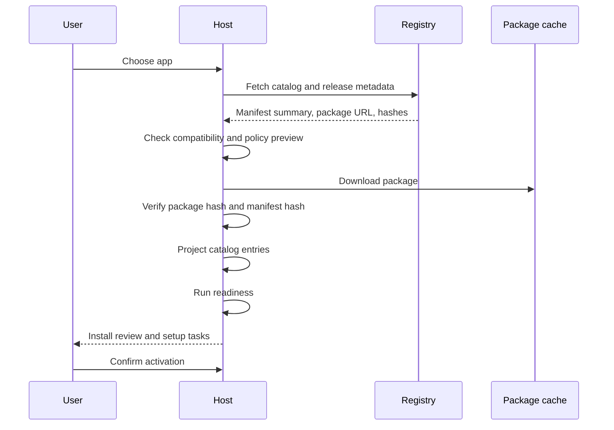

# Discovery and installation

Installation is not execution. A host should discover and verify an Agent App before it creates runtime state or exposes executable entries.

## Discovery sources

A host may discover apps from:

- a local folder containing `APP.md`
- a registry catalog item
- a tenant bootstrap payload
- a private package URL
- a development fixture

All sources should converge into the same package identity and manifest parser.

## Installation stages

## Package identity

Package identity should include:

- app name
- package version
- manifest version
- source URI
- package hash
- manifest hash
- installed timestamp
- release channel or tenant enablement reference

This identity is attached to projection, runtime runs, artifacts, evidence, and cleanup plans.

## Projection before activation

Projection compiles manifest data into host objects such as entries, cards, workflow descriptors, permissions, and setup tasks. Projection must not call models, invoke tools, read customer data, or execute package code.

Projection is safe to show in a review screen.

## Readiness before activation

Readiness turns projection into a setup report. It should identify blockers before a user clicks an entry.

Common blockers:

- unsupported host version
- missing required capability
- unbound required Knowledge template
- unavailable required Tool
- missing secret slot
- denied permission
- unsafe storage migration

## Activation

Activation should happen after install review and readiness. A host may allow partial activation if missing items are optional.

Activation can expose:

- app dashboard pages
- command palette entries
- workflow start buttons
- artifact viewers
- background task schedules
- settings pages

Activation should not automatically run long workflows unless the user or tenant policy explicitly allows it.

## Update flow

On update, the host should:

1. Verify the new release.
2. Compare manifest and capability requirements.
3. Generate migration plan.
4. Preserve user data, overlays, secrets, and artifacts.
5. Re-run readiness.
6. Allow rollback or disable if setup fails.

## Uninstall states

| State | Behavior |
| --- | --- |
| Disable only | Hide entries but keep package and data. |
| Uninstall keep data | Remove package and projection; keep storage and artifacts. |
| Uninstall delete data | Remove package, projection, storage, artifacts, evidence, and logs. |
| Export then delete | Export user data before deletion. |

## Implementation checklist

- Use one parser for local and registry apps.
- Verify package and manifest hashes.
- Project before activation.
- Readiness runs without executing app code.
- Installation review shows permissions and data boundaries.
- App data is namespaced from the first install.
- Uninstall plan is available before real runtime execution.
