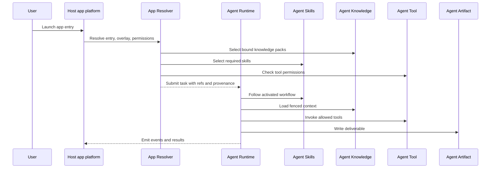

# Runtime model

Agent App is runtime-neutral but host-executed. It declares what should be available; the host decides how to run it through existing standards.

Cloud services can provide registries, models, or tools, but they should not become a hidden app runtime unless the app explicitly declares a server-assisted target and the host policy permits it.
