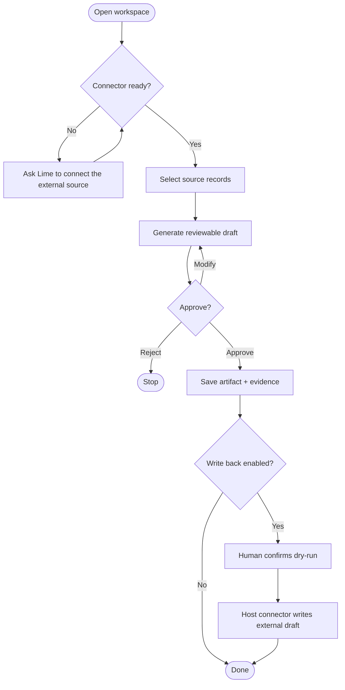

# Lightweight Content Ops App

This is a sanitized v0.7 example for a common content-operations workflow. It demonstrates how Agent App separates what the app can do from what Lime Host, Lime Cloud, connectors, external systems, and humans must provide.

Reference package: [`docs/examples/lightweight-content-ops-app/APP.md`](../../examples/lightweight-content-ops-app/APP.md)

## Ordinary-user flow



## v0.7 files

| File | Purpose |
| --- | --- |
| `app.requirements.yaml` | MVP, non-goals, later phases, and acceptance criteria. |
| `app.boundary.yaml` | App / Host / Cloud / connector / external-system / human responsibilities. |
| `app.integrations.yaml` | Host/Cloud-managed `source_records` and optional `draftbox` connectors. |
| `app.operations.yaml` | Side effects, approval, dry-run, idempotency, and evidence rules. |

## Boundary summary

- App owns the workspace UI, draft review workflow, content draft artifact, and handoff status.
- Host owns local agent execution, connector invocation, secrets, policy, sandbox, and evidence.
- Cloud may own connector registry, tenant policy, OAuth broker, webhook, or scheduled sync.
- External systems own source records and optional draft-box records.
- Humans own approval before write-back, publish, delete, or bulk update.

## Try it locally

```bash
npm run cli -- validate docs/examples/lightweight-content-ops-app --version 0.7
npm run cli -- project docs/examples/lightweight-content-ops-app
npm run cli -- readiness docs/examples/lightweight-content-ops-app
```
