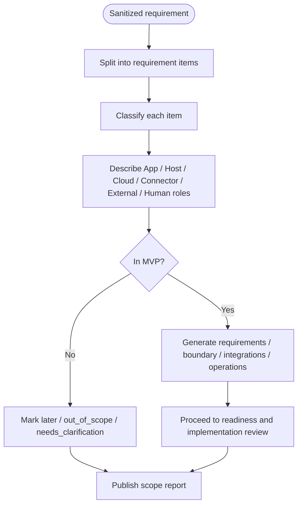

# App Fit Report

An App Fit Report is the v0.7 planning artifact. It maps natural-language business requirements into delivery planes so a team knows what can become an Agent App, what requires Lime Host, what requires Lime Cloud, what needs a connector or external system, and what must remain a human decision.

## Fit flow



## Classification enum

| Classification | Meaning |
| --- | --- |
| `APP_EXPERIENCE` | App pages, panels, entries, dashboards, forms, or end-user experience. |
| `APP_WORKFLOW` | App business workflow, state machine, artifact generation, or human review node. |
| `HOST_CAPABILITY` | Local Host needs Agent, MCP, CLI, tools, files, sandbox, secrets, or evidence. |
| `CLOUD_CAPABILITY` | Lime Cloud needs registry, tenant policy, OAuth, webhook, scheduled sync, or team governance. |
| `CONNECTOR_ADAPTER` | External adapter is required: API, MCP server, CLI adapter, or browser adapter. |
| `EXTERNAL_SYSTEM` | Source of truth or final state remains in an external system. |
| `HUMAN_DECISION` | Human review, publish confirmation, risk exception, or final business judgment is required. |
| `LATER_PHASE` | Useful later, not in the current MVP. |
| `OUT_OF_SCOPE` | Not part of the Agent App standard or current delivery scope. |
| `NEEDS_CLARIFICATION` | Missing key business, permission, data, or acceptance information. |

## Minimal example

```json
{
  "appFitReport": {
    "requirementSource": {
      "kind": "sanitized_business_request",
      "confidential": false
    },
    "recommendedApp": {
      "name": "lightweight-content-ops-app",
      "appType": "domain-app"
    },
    "requirementItems": [
      {
        "id": "R001",
        "text": "End users complete source organization, draft generation, and review in a workspace",
        "classification": ["APP_EXPERIENCE", "APP_WORKFLOW"],
        "appRole": "Provide workspace UI, workflow state, and artifacts",
        "mvp": true,
        "risk": "low"
      },
      {
        "id": "R002",
        "text": "Read an external table or document as the source of truth",
        "classification": ["HOST_CAPABILITY", "CONNECTOR_ADAPTER", "EXTERNAL_SYSTEM"],
        "hostRole": "Host connector execution and authorization",
        "connectorRole": "Adapt the external table or document API",
        "externalSystemRole": "Keep source-of-truth state",
        "mvp": true,
        "risk": "medium"
      },
      {
        "id": "R003",
        "text": "One-click publish to external channels",
        "classification": ["CONNECTOR_ADAPTER", "HUMAN_DECISION", "LATER_PHASE"],
        "humanRole": "Final confirmation before publish",
        "mvp": false,
        "risk": "high"
      }
    ]
  }
}
```

## Principles

- Write the Fit Report before writing the app package; do not push vague requirements into workflows.
- Use sanitized requirements only: no customer names, deal names, real accounts, private links, or contract details.
- `OUT_OF_SCOPE` is not a refusal; it explains where external systems, cloud services, or manual processes must help.
- If one requirement spans multiple planes, state what each plane owns, what it accepts, and who handles failures.

