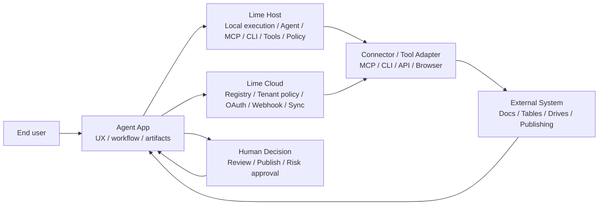
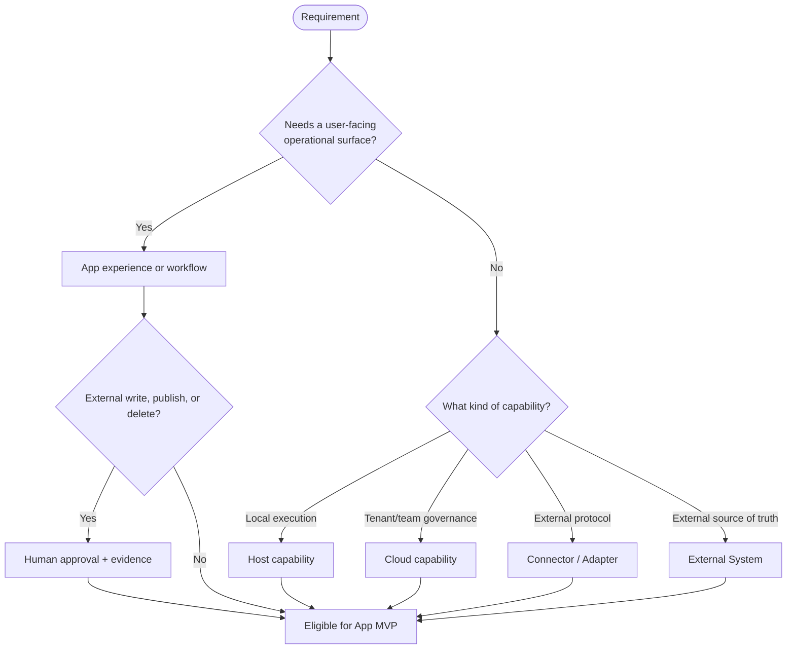

# Responsibility Boundary

v0.7 asks a practical delivery question: not only “can AI help”, but “which plane should own each part of the requirement”. Agent App owns product experience and workflow orchestration. Lime Host, Lime Cloud, connectors, external systems, and human decisions own execution, governance, integration, source-of-truth state, and risk approval.

## Boundary overview

## Ownership table

| Plane | Owns | Must not own |
| --- | --- | --- |
| Agent App | User experience, business workflow, app state, artifacts, review, acceptance rules | Credential hosting, direct MCP/CLI startup, bypassing host policy, direct external-system control |
| Lime Host | Local AgentRuntime, MCP, CLI, tools, files, sandbox, user confirmation, local evidence | Vertical business rules, customer-private workflow, hard-coded vendor-specific adapters |
| Lime Cloud | Registry, tenant policy, OAuth broker, webhook, scheduled sync, team governance | Default local agent execution, customer business implementation, non-core vendor logic |
| Connector / Tool Adapter | External protocol adaptation, field mapping, read/write actions, error translation | Product UX, final tenant-policy decision, plaintext credential storage |
| External System | Source-of-truth records, third-party state, publishing platform, existing business system | Agent App internal state, Lime permission model |
| Human | High-risk decisions, final review, publish confirmation, exception handling | Repetitive mechanical execution that is safe to automate |

## Decision flow

## Rules

- Apps **must** declare external side effects, required connections, acceptance criteria, and non-goals before execution.
- Host / Cloud **must** own MCP, CLI, tools, credentials, policy, authorization, and evidence execution.
- Apps **must not** store plaintext third-party credentials.
- Apps **must not** directly start MCP servers, CLIs, or tool runtimes.
- Apps **must not** auto-execute publish, delete, or bulk-update operations by default.
- Non-core vendor adapters should be installed as connector packages, MCP servers, CLI adapters, browser adapters, or customer overlays.

