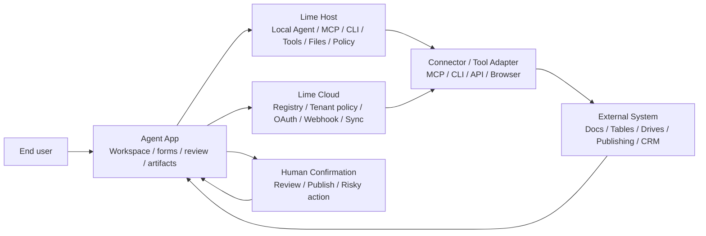
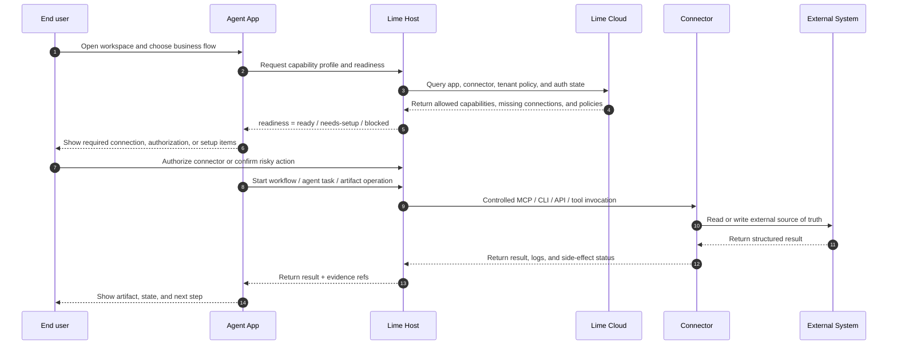
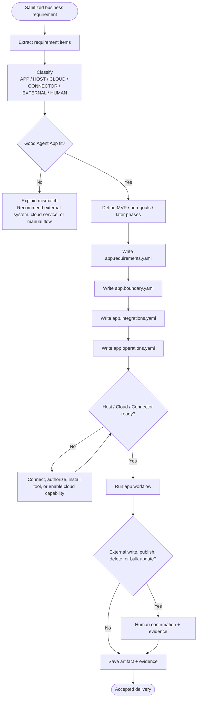

# Specification

Agent App defines a complete installable application package for agent hosts. It is not a Markdown prompt and not a single chat expert. An app may include real UI bundles, worker or service code, data models, migrations, business workflows, agent entries, Runtime intent, Context needs, Knowledge bindings, Skill references, Tool / Connector requirements, Artifacts, Evidence, Policies, QC, and Evals.

`APP.md` remains the required discovery entry. Hosts read it first for manifest data, human guidance, and progressive loading hints. But `APP.md` is only declaration and guidance; business capability must be implemented by the runtime package and by calls through the Lime Capability SDK.

The current contract combines task runtime control, requirement boundaries, installation modes, and an explicit **App Server Bridge Profile**. Apps must map business requirements to App, Host, Cloud, connector, external-system, and human-decision responsibilities; declare whether they install inside Lime Desktop, as standalone branded apps, against a shared system Lime Runtime, or inside compatible web hosts; declare how app-facing Agent tasks map to Desktop Host IPC, App Server JSON-RPC, RuntimeCore services, and execution backends; and follow a mini-program style host model where shared user state and platform capabilities come from the host while app-local storage and app backend services stay isolated.

> Project-level architecture, sequence, flow, and state-machine diagrams live in [Architecture overview](./architecture). This specification only embeds diagrams that bind to specific clauses.

## Goals

1. Let real business apps install into Lime without adding vertical branches to Lime Core.
2. Let apps use Lime platform capabilities without depending on Lime internal implementation details.
3. Expose UI, storage, background jobs, artifacts, agent runtime, knowledge, and tools through stable Capability SDK surfaces.
4. Keep Cloud responsible for catalog, release, license, tenant enablement, and gateway, not hidden agent execution.
5. Keep customer data, credentials, and tenant differences in workspace state, Agent Knowledge, secrets, or overlays, not official packages.
6. Preserve app provenance on every projected entry, task, tool call, artifact, eval, and evidence record.
7. Let Agent Apps become standalone products without making Lime Desktop the mandatory entry point for every user.
8. Share host-governed user state and platform capabilities across apps without leaking tokens, secrets, host databases, or internal paths.
9. Let apps ship app-owned backend services in multiple languages while keeping those services under host supervision and capability policy.

## Layers

```text
Lime Runtime Core
  Governed services: UI / Storage / Files / Agent Runtime / Tool Broker / Knowledge / Artifact / Policy / Evidence / Secrets
    ↑ used by Lime Desktop / Lime App Shell / runtime-backed shells / compatible web hosts
    ↓ Capability Bridge
@lime/app-sdk
  Stable, versioned, authorized, mockable capability facade
    ↓
Agent App Runtime Package
  UI bundle / workers / workflows / storage schema / migrations / business code / agent entries
```

Apps must not import Lime internal modules or bypass host services. Every platform capability must be called through the SDK or host-injected capability handles.

## Package shape

```text
app-name/
├── APP.md                    # required: discovery manifest + app guide
├── app.manifest.json         # optional: separated machine manifest
├── app.capabilities.yaml     # optional: detailed capability config
├── app.entries.yaml          # optional: detailed entry config
├── app.permissions.yaml      # optional: permission config
├── app.errors.yaml           # optional: standardized error codes
├── app.i18n.yaml             # optional: i18n config
├── app.signature.yaml        # optional: signature and trust chain
├── app.runtime.yaml          # optional: lime.agent task runtime control plane and App Server bridge profile
├── app.requirements.yaml     # optional: requirements, MVP, non-goals, acceptance
├── app.boundary.yaml         # optional: App / Host / Cloud / Connector / External / Human boundary
├── app.integrations.yaml     # optional: Host/Cloud-managed external integration needs
├── app.operations.yaml       # optional: side effects, approval, dry-run, evidence
├── app.install.yaml          # optional: in-Lime, standalone, runtime-backed install modes
├── dist/
│   ├── ui/                   # optional: real UI bundle, route manifest, assets
│   ├── worker/               # optional: business workers, background tasks, long-running jobs
│   └── tools/                # optional: packaged tool adapters, still authorized by Tool Broker
├── services/                 # optional: app-owned backend services, possibly multi-language
├── storage/
│   ├── schema.json           # optional: data model in the app namespace
│   └── migrations/           # optional: versioned migration scripts
├── workflows/                # optional: business workflow, state machine, human review nodes
├── agents/                   # optional: expert-chat personas and conversation entries
├── skills/                   # standardized: bundled Agent Skill packages (with SKILL.md)
├── knowledge-templates/      # optional: Agent Knowledge binding slot templates
├── artifacts/                # optional: artifact schemas, viewers, exporters, examples
├── evals/                    # optional: quality gates, readiness checks, regression fixtures
│   ├── readiness.yaml        # optional: self-check model
│   └── health.yaml           # optional: runtime health checks
├── policies/                 # optional: permissions, data boundaries, cost and risk policies
├── locales/                  # optional: i18n translation files
├── assets/                   # optional: icons, screenshots, templates, sample media
└── examples/                 # optional: sample workspaces, inputs, outputs, replays
```

Only `APP.md` is mandatory. Compatible hosts must read `APP.md` and catalog metadata first, then progressively load the runtime package according to user action, readiness, permission, and capability version checks.

The layered configuration principle: `APP.md` carries only discovery metadata and human-readable guidance, while complex configuration (capabilities, entries, permissions, errors, i18n, signature, Agent task runtime contracts, App Server bridge profile, requirement boundaries, integrations, operation side effects, and install modes) moves into independent `app.*.yaml` files when needed, preventing frontmatter bloat.

## `APP.md`

`APP.md` must contain YAML frontmatter and Markdown guidance.

The frontmatter is the machine entry for installation and projection. The body is for users, AI clients, and reviewers: what problem the app solves, how to set it up, which capabilities are required, what data must not be packaged, and how results are accepted.

### Required fields

| Field | Constraint |
| --- | --- |
| `name` | 1-64 characters; lowercase kebab-case is recommended; should match the directory name. |
| `description` | 1-1024 characters; describes user value and activation context. |
| `version` | App package version; SemVer is recommended for releases. |
| `status` | `draft`, `ready`, `needs-review`, `deprecated`, or `archived`. |
| `appType` | `agent-app`, `workflow-app`, `domain-app`, `customer-app`, or `custom`. |

### Open-platform metadata

For open-platform distribution, promotes "app identity, version, timeline, links, and compliance" into structured top-level fields. All fields are author-fillable except those marked "host-decided".

#### Identity and presentation

| Field | Purpose |
| --- | --- |
| `displayName` | 1-128 chars, human-readable name shown in catalogs and launchers. |
| `displayNameI18n` | locale -> displayName overrides. |
| `shortDescription` | 1-140 chars, one-line catalog tagline. |
| `shortDescriptionI18n` | locale -> shortDescription overrides. |
| `keywords` | Catalog search keywords (max 32), complementary to `triggers.keywords`. |
| `categories` | Top-level catalog categories (max 8). |
| `publisher.publisherId` | **Required for open platform**: globally unique publisher id issued by the registry; not user-claimable. |
| `publisher.name` / `publisher.displayName` | Publisher machine name / display name. |
| `publisher.kind` | `individual / organization / team / platform`. |
| `publisher.verified` | **Host-decided**: written by the registry after verification; ignored if self-declared. |
| `publisher.verifiedDomain` | Domain verified through DNS / .well-known / DID. |
| `publisher.did` | Decentralized identifier. |
| `publisher.homepage` / `publisher.email` / `publisher.logoUrl` | Public publisher links. |
| `publisher.country` | ISO 3166-1 alpha-2. |
| `author` | npm-style string or `{ name, email, url }`. |
| `maintainers[]` | `{ name, email, url, role }`. |
| `contributors[]` | `{ name, email, url }`. |

#### Version and timeline

| Field | Purpose |
| --- | --- |
| `manifestVersion` | Manifest protocol version; current packages should set `0.10.0`. |
| `version` | App package version (SemVer). |
| `createdAt` | ISO 8601; first appearance in any registry. |
| `updatedAt` | ISO 8601; manifest last updated. |
| `releasedAt` | ISO 8601; this version became publicly installable. |
| `deprecatedAt` | ISO 8601; entered deprecation. |
| `endOfLifeAt` | ISO 8601; host support ends; readiness blocks afterward. |
| `supportWindow.channel` | `stable / lts / preview / experimental`. |
| `supportWindow.supportedUntil` | ISO 8601 support end date. |
| `supportWindow.supersededBy` | Successor version string. |

#### Links and support

| Field | Purpose |
| --- | --- |
| `homepage` | App home URL. |
| `repository` | string or `{ type, url, directory }`. |
| `documentation` | Documentation URL. |
| `issues` | Issue tracker URL. |
| `changelog` | URL or in-package relative path. |
| `license` | SPDX identifier (`Apache-2.0`, `MIT`, `UNLICENSED`, `proprietary`, …). |
| `licenseUrl` | Full license URL. |
| `copyright` | 1-256 chars copyright statement. |
| `support.email` / `support.url` | Support entry (at least one). |
| `support.statusPageUrl` | Status page. |
| `support.discordUrl` / `support.slackUrl` / `support.discussionsUrl` | Community channels. |
| `support.responseSla` | Free-text SLA description. |

#### Distribution and compliance

`distribution` is reserved metadata for the open platform; billing logic is not part of this standard. Hosts and platforms decide payment flow based on these hints.

| Field | Purpose |
| --- | --- |
| `distribution.channel` | `stable / preview / beta / alpha / internal`. |
| `distribution.visibility` | `public / unlisted / private / invite-only`. |
| `distribution.pricing` | `free / freemium / paid / contact_sales / custom`. |
| `distribution.billingModel` | `one_time / subscription / usage_based / tiered / contact_sales / none`. |
| `distribution.trialDays` | Trial days (0-365). |
| `distribution.regions` | ISO 3166-1 alpha-2 region codes. |
| `compliance.dataResidency` | `global / cn / eu / us / apac / sg / jp / kr / in` array. |
| `compliance.dataRetention` | Free-text retention policy. |
| `compliance.certifications` | `soc2 / iso27001 / gdpr / hipaa / pci-dss / ccpa / csa-star` array. |
| `compliance.privacyPolicyUrl` | Privacy policy. |
| `compliance.termsOfServiceUrl` | Terms of service. |
| `compliance.dpaUrl` | Data processing agreement. |
| `compliance.subprocessorsUrl` | Subprocessors list. |
| `compliance.exportControl` | Export-control statement. |

#### Metadata lifecycle

```text
Draft (status=draft, createdAt set)
  ↓ Internal testing
Preview (status=needs-review, distribution.channel=preview)
  ↓ Approved + publisher.verified=true (set by registry)
Released (status=ready, releasedAt set, distribution.channel=stable)
  ↓ New version ships
Deprecated (status=deprecated, deprecatedAt set, supersededBy points to successor)
  ↓ EOL reached
Archived (status=archived, endOfLifeAt set; readiness blocks)
```

Hosts must mark apps with `endOfLifeAt < now` as `blocked` in readiness and surface `supersededBy`; `deprecatedAt < now` shows a deprecation warning without blocking.

### Recommended fields

| Field | Purpose |
| --- | --- |
| `manifestVersion` | Agent App manifest version. |
| `runtimeTargets` | `local`, `hybrid`, or `server-assisted`. `local` means execution happens in the local host runtime. |
| `requires` | Host, SDK, and capability version constraints. |
| `triggers` | AI auto-discovery keywords and scenarios. Contains `keywords[]` and `scenarios[]`. |
| `quickstart` | Recommended first-launch entry and sample workflow. |
| `runtimePackage` | Locations and hashes for UI, workers, tools, storage, and migrations. |
| `capabilities` | Required Lime capabilities or adjacent Agent standards. |
| `permissions` | Permission requests that the host must authorize before install or runtime. |
| `entries` | Host-visible entries such as page, panel, expert-chat, command, workflow, artifact, background-task, and settings. |
| `ui` | UI routes, panels, cards, settings, and artifact viewers. |
| `storage` | App namespace, schema, indexes, migrations, and retention rules. |
| `services` | Workers, app-owned backend services, background tasks, tool adapters, schedulers. |
| `knowledgeTemplates` | Agent Knowledge slots to bind through user, tenant, or workspace overlays. |
| `skillRefs` | Required or recommended Agent Skill packages. Prefer the `skills/` directory for bundled Skills. |
| `toolRefs` | Agent Tool surfaces, external connectors, or ToolHub capabilities. |
| `artifactTypes` | Artifact contracts, viewers, or exporters the app can produce. |
| `evals` | Quality gates, readiness checks, regression evals, and human review rules. |
| `events` | Events emitted or consumed by the app. |
| `secrets` | Credential slots hosted by the Secret Manager. |
| `lifecycle` | Hooks for install, activate, upgrade, disable, and uninstall. |
| `agentRuntime` | Shorthand for Agent task runtime control plane; prefer `app.runtime.yaml` for detailed config. |
| `requirements` | Shorthand for requirements, MVP scope, non-goals, and acceptance; prefer `app.requirements.yaml` for detailed config. |
| `boundary` | Shorthand for App / Host / Cloud / Connector / External / Human boundaries; prefer `app.boundary.yaml` for detailed config. |
| `integrations` | Shorthand for external integration needs; prefer `app.integrations.yaml` for detailed config. |
| `operations` | Shorthand for side effects, approval, dry-run, and evidence; prefer `app.operations.yaml` for detailed config. |
| `install` | Shorthand for in-Lime, standalone, runtime-backed, and web-host install modes; prefer `app.install.yaml` for detailed config. |
| `overlayTemplates` | Configurable slots for tenant, workspace, user, or customer overlays. |
| `presentation` | App card, icon, category, home copy, and sorting hints. |
| `compatibility` | Compatibility matrix, fallback policy, and deprecation window. |
| `metadata` | Namespaced implementation metadata. |

### Layered configuration

Detailed configuration can move to independent files; the frontmatter keeps only core metadata:

| File | Purpose | Reference |
| --- | --- | --- |
| `app.capabilities.yaml` | Detailed capabilities and entries | Loaded by manifest convention |
| `app.entries.yaml` | Detailed entry config | Loaded by manifest convention |
| `app.permissions.yaml` | Permissions and policy detail | Loaded by manifest convention |
| `app.errors.yaml` | Standardized error codes and recovery | Loaded by manifest convention |
| `app.i18n.yaml` | i18n config | Loaded by manifest convention |
| `app.signature.yaml` | Signature, trust, and revocation | Loaded by manifest convention |
| `app.runtime.yaml` | Agent task event/result, structured output, approval, session, tool discovery, checkpoint, observability; App Server bridge profile | Loaded by manifest convention |
| `app.requirements.yaml` | Requirements, MVP scope, non-goals, later phases, and acceptance criteria | Loaded by manifest convention |
| `app.boundary.yaml` | App / Host / Cloud / Connector / External / Human responsibility boundary | Loaded by manifest convention |
| `app.integrations.yaml` | Host/Cloud-managed external systems, CLIs, MCPs, APIs, webhooks, or browser adapter needs | Loaded by manifest convention |
| `app.operations.yaml` | Operation side effects, approval, dry-run, idempotency, and evidence requirements | Loaded by manifest convention |
| `app.install.yaml` | In-Lime, standalone, runtime-backed, and web-host installation modes | Loaded by manifest convention |
| `evals/readiness.yaml` | Readiness self-check model | Loaded by manifest convention |
| `evals/health.yaml` | Runtime health checks | Loaded by manifest convention |

Hosts load these files by file-name convention while parsing the manifest. When frontmatter and an independent file disagree, the independent file wins.

### Install modes

`app.install.yaml` is the boundary between product packaging and runtime substrate. It lets an app be distributed in more than one shape without changing the business package:

```yaml
install:
  modes:
    - in_lime
    - standalone
    - runtime_backed
  runtime:
    minVersion: current
    distribution:
      standalone:
        embedRuntime: true
        shell: lime-app-shell
      runtimeBacked:
        requires: lime-runtime
  standalone:
    shell: lime-app-shell
    bundleId: ai.limecloud.contentfactory
    platforms: [macos, windows]
  runtimeBacked:
    requires: lime-runtime
    minVersion: current
  branding:
    name: Content Factory
    icon: ./assets/icon.svg
    windowTitle: Content Factory
```

The install contract does not let an app bypass governance. Standalone and runtime-backed apps still receive `lime.*` capability handles from a compatible host shell, and Lime Runtime still owns model routing, tool execution, secrets, policy, storage namespace, and evidence. When an app needs Agent backend capability, the host must project SDK calls into the Desktop Host IPC / App Server JSON-RPC / RuntimeCore path. Apps must not spawn sidecars, read JSONL stdout, call legacy desktop commands, or copy RuntimeCore / ExecutionBackend.

### Trigger field

`triggers` helps hosts and AI clients route natural-language requests to the right app, inspired by the Agent Skills practice of putting trigger phrases in `description`:

```yaml
triggers:
  keywords:
    - content
    - marketing
    - copywriting
    - creative
    - calendar
  scenarios:
    - content_planning
    - batch_generation
    - asset_management
```

`keywords` are user-facing semantic terms; `scenarios` are machine-readable identifiers used by catalog indexing, recommendation ranking, and command palettes.

### Quickstart field

`quickstart` declares the recommended first-launch entry and sample workflow:

```yaml
quickstart:
  entry: dashboard
  sampleWorkflow: content_scenario_planning
  setupSteps:
    - bind_knowledge: brand_guidelines
    - configure_secret: api_key
```

Hosts use this for onboarding, sample workspaces, and verification checklists.

## Capability SDK

The Capability SDK is the only stable boundary between apps and Lime. It should be thin: expose capabilities, not implementation.

| Capability | Typical responsibilities |
| --- | --- |
| `lime.ui` | Register pages, panels, commands, settings, Artifact viewers; read theme and locale. |
| `lime.storage` | App namespace, tables, CRUD, migrations, local indexes, cache. |
| `lime.files` | Pick user files, read authorized files, parse documents, store persistent file refs. |
| `lime.agent` | Start tasks, stream output, interrupt, retry, select models, read traces. |
| `lime.knowledge` | Bind Knowledge Packs, Top-K search, export Markdown / text, read versions and citations. |
| `lime.tools` | Invoke Tool Broker / ToolHub, handle permissions, long-running progress, and fallback. |
| `lime.artifacts` | Create persistent deliverables and register viewers / exporters. |
| `lime.workflow` | Start workflows, persist state, human review nodes, background and scheduled jobs. |
| `lime.policy` | Permission requests, risk confirmation, cost limits, enterprise policy, data boundaries. |
| `lime.evidence` | Record model calls, tool calls, knowledge sources, artifact provenance, eval results. |
| `lime.secrets` | Host API keys, OAuth tokens, and external credentials without exposing plaintext to the app. |
| `lime.cloudSession` | Host session snapshot, login trigger, and just-in-time access token; snapshots do not expose the token. |
| `lime.modelSettings` | Effective model provider/profile projection and setup status; apps do not persist global model settings. |
| `lime.branding` | OEM brand, shell copy, and visual token projection; apps consume tokens instead of hardcoding host branding. |
| `lime.billing` | Tenant billing, subscription, quota, and needs-payment projection; apps do not own the ledger. |
| `lime.appUpdates` | Host-managed release check, download, switch, rollback, and installed package status. |
| `lime.events` | Publish and subscribe app events so workflow and UI stay decoupled. |

Apps must declare capability and version requirements before install. Hosts perform capability negotiation at install, activation, and runtime. `lime.cloudSession` snapshots must never include bearer tokens. Apps that need to call a control plane may explicitly request a just-in-time token. If that token is rejected, apps may call `lime.cloudSession.requestLogin` with `{ "force": true }` and retry once; hosts must only refresh the generic session, may use a local OAuth callback bridge to complete login, and must not proxy the app's business operation.

```yaml
requires:
  lime:
    appRuntime: "current"
  sdk: "@lime/app-sdk"
  capabilities:
    lime.ui: "current"
    lime.storage: "current"
    lime.agent: "current"
    lime.artifacts: "current"
    lime.cloudSession: "current"
    lime.modelSettings: "current"
```

The SDK is a typed contract, not only a list of capability names. Compatible hosts should stabilize at least these call semantics:

```ts
const lime = await getLimeRuntime()
await lime.ui.registerRoute(routeDescriptor)
const table = lime.storage.table('content_assets')
const task = await lime.agent.startTask({ entry: 'batch_copy', input, idempotencyKey })
const hits = await lime.knowledge.search({ template: 'project_knowledge', query, topK: 8 })
const result = await lime.tools.invoke({ key: 'document_parser', input })
const artifact = await lime.artifacts.create({ type: 'strategy_report', data })
const run = await lime.workflow.start({ key: 'content_calendar', input })
await lime.evidence.record({ subject: artifact.id, sources: hits })
```

SDK calls must support stable error codes, cancellation, retries, timeouts, permission denial, cost limits, traceId, and mock implementations. Apps may depend on this contract only, not host file paths, database tables, or frontend components.

## Agent Task Runtime Control Plane

This layer does not turn Agent App into a new AgentRuntime and does not require apps to embed a model SDK. It standardizes the task control plane around `lime.agent` so apps, hosts, AgentRuntime, ToolHub, Evidence, and UI surfaces share the same task facts.

### Design goals

1. Apps declare business tasks, output contracts, and runtime boundaries; the host remains the only authority for permissions, policy, tools, secrets, evidence, and model routing.
2. Task execution must be streamable, resumable, retryable, auditable, and linkable to artifacts and evidence.
3. Structured output must be validated and materialized; prompt-only conventions are not enough.
4. Sessions, business state, files, and artifact checkpoints must have separate scopes.
5. Tools and Skills should be discovered on demand instead of loading every schema into context.

### `app.runtime.yaml`

Apps that use `lime.agent` should add `app.runtime.yaml` to declare Agent task runtime constraints:

```yaml
agentRuntime:
  bridge:
    kind: app-server-json-rpc
    transport: host-mediated
    protocolVersion: appserver.v0
    clientSurface: capability-sdk
    hostBoundary: desktop-host-ipc
    runtimeOwner: runtime-core
    methods:
      initialize: initialize
      initialized: initialized
      startSession: agentSession/start
      readSession: agentSession/read
      startTurn: agentSession/turn/start
      cancelTurn: agentSession/turn/cancel
      respondAction: agentSession/action/respond
      events: agentSession/event
      listCapabilities: capability/list
      readArtifact: artifact/read
      exportEvidence: evidence/export
  agentTask:
    eventSchema: lime.agent-task-event.v1
    resultSchema: lime.agent-task-result.v1
    structuredOutput:
      type: json_schema
      schemaRef: ./artifacts/workspace-patch.schema.json
      maxValidationRetries: 2
      failureSubtype: error_max_structured_output_retries
    approval:
      behavior: host-mediated
      supportsUpdatedInput: true
      supportsDefer: true
      rememberScopes: [task, session, workspace]
    sessionPolicy:
      modes: [new, resume, continue, fork]
      compactionEvents: true
    toolDiscovery:
      mode: on_demand
      topK: 5
      includeSchemas: selected_only
    checkpointScope:
      workflowState: true
      appStorage: true
      artifacts: true
      files: tracked_only
      conversation: resume_only
      externalSideEffects: record_only
    observability:
      profileEvents: true
      openTelemetryMapping: true
      exportContentByDefault: false
```

`agentRuntime.bridge` is the App Server bridge profile. It tells the host how app-facing `lime.agent` / `lime.workflow` calls should map to the backend fact source, but it is not a network address or process handle the app may access directly.

Fixed rules:

- Apps only call the Capability SDK or Host Bridge `capability:invoke`; they must not import `app-server-client`, spawn sidecars, read or write JSONL transport, or hold RuntimeCore internal types.
- Electron / Tauri / runtime-backed shells are Desktop Host bridges. They own IPC, preload / WebView allowlists, sidecar lifecycle, windows, and renderer-safe projections; they do not own Agent execution facts.
- Agent execution facts must come from App Server JSON-RPC: `initialize -> initialized -> agentSession/start -> agentSession/turn/start -> agentSession/event -> agentSession/read`.
- `agentSession/event` is the public event ingress. `assistant:delta`, tool, approval, artifact, evidence, and terminal status must derive from RuntimeCore facts, not app UI state.
- `capability/list`, `artifact/read`, and `evidence/export` are current entries for capability, artifact, and evidence projection; apps must not bypass them to read host databases or filesystems.
- `mock` is only allowed in reference hosts, test fixtures, or offline evals. Product paths must fail closed when real Desktop Host IPC / App Server JSON-RPC is unavailable.

These fields express runtime intent, not execution permission. Hosts must still combine them with `app.permissions.yaml`, tenant policy, readiness, and user authorization before running anything.

### Agent task event envelope

Hosts should project `lime.agent.startTask`, `streamTask`, `getTask`, and subscription updates into a stable event envelope:

```ts
interface AgentTaskEvent {
  schemaVersion: "lime.agent-task-event.v1"
  eventId: string
  sequence: number
  type:
    | "system:init"
    | "system:compact_boundary"
    | "task:queued"
    | "task:progress"
    | "assistant:delta"
    | "tool:call"
    | "approval:requested"
    | "artifact:created"
    | "evidence:recorded"
    | "result"
  subtype?: string
  appId: string
  taskId: string
  traceId: string
  sessionId: string
  turnId?: string
  parentTaskId?: string
  at: string
  payload?: unknown
  refs?: string[]
  usage?: unknown
  cost?: unknown
}
```

The final result must use `type: "result"` and a stable `subtype`:

| subtype | Meaning |
| --- | --- |
| `success` | Task completed and structured output / evidence is readable. |
| `error_max_turns` | Maximum turns reached. |
| `error_during_execution` | Runtime execution error. |
| `error_max_budget` | Cost or budget limit reached. |
| `error_max_structured_output_retries` | Structured output validation failed after retries. |
| `error_permission_denied` | Permission or policy denied execution. |
| `cancelled` | User or system cancelled the task. |

### Structured output

`expectedOutput` may stay in the `lime.agent.startTask` request, but explicit JSON Schema is recommended:

```ts
await lime.agent.startTask({
  taskKind: "content_factory.copy.generate",
  input,
  expectedOutput: {
    artifactKind: "content_batch",
    outputFormat: {
      type: "json_schema",
      schemaRef: "./artifacts/content-factory-workspace-patch.schema.json",
      maxValidationRetries: 2
    },
    materializer: {
      kind: "content_factory.workspace_patch",
      acceptedKeys: ["contentFactoryWorkspacePatch", "workspacePatch"]
    }
  }
})
```

Hosts / AgentRuntime should validate structured output before artifact or storage write-back. Validation may trigger limited retries; after the limit, return `error_max_structured_output_retries` and never treat a natural-language summary as a successful patch.

### Runtime approval

Runtime approval unifies tool approval, user questions, and context elicitation:

```ts
interface RuntimeApprovalRequest {
  requestId: string
  kind: "tool_confirmation" | "ask_user" | "elicitation" | "policy_exception"
  toolName?: string
  input?: unknown
  risk?: "low" | "medium" | "high"
  scope: { appId: string; taskId: string; sessionId: string; turnId?: string }
  suggestions?: Array<{ label: string; updatedInput?: unknown }>
  rememberPolicy?: "never" | "task" | "session" | "workspace"
}

interface RuntimeApprovalDecision {
  behavior: "allow" | "deny" | "defer"
  updatedInput?: unknown
  message?: string
  remember?: boolean
  interrupt?: boolean
}
```

Permission evaluation order must be: app manifest allowlist -> readiness -> tenant / workspace policy -> deny rules -> risk policy -> runtime approval -> post-action evidence. Deny wins over allow. Agent App manifests must not declare `bypassPermissions`.

### Sessions, forks, and checkpoints

`sessionPolicy` describes Agent conversation history only; it is not business state:

| mode | Meaning |
| --- | --- |
| `new` | Create a new Agent session. |
| `resume` | Resume an existing session context. |
| `continue` | Continue the same business task or previous incomplete task. |
| `fork` | Fork from an existing session to explore alternatives; business storage is not forked automatically. |

Checkpoints must declare scope: `workflowState`, `appStorage`, and `artifacts` may be restored; `files` only covers host-managed file snapshots; `conversation` is resume / fork only; `externalSideEffects` are evidence-only and not automatically rolled back.

### Tool discovery and observability

When many tools exist, apps should declare `toolDiscovery.mode: on_demand`. The host selects the most relevant tools from ToolHub / Creative Capability / Skills catalogs and loads only selected schemas. Tool catalogs should expose descriptions, keywords, input/output schemas, read-only / destructive hints, availability, cost, and tenant availability.

Runtime profile events should map to OpenTelemetry spans: `agent.task`, `llm.request`, `tool.call`, `approval.request`, `artifact.materialize`, `evidence.record`, and `subagent.run`. Prompt text, user content, and artifact bodies are not exported by default; content export must be explicit opt-in.


## Requirement Boundary & Capability Handoff

This layer does not replace the runtime control plane. It adds requirement boundaries and capability handoff above it. Given a sanitized business requirement, an Agent App must explain what becomes user-facing app experience, what the Host executes, what Cloud governs, what connectors adapt, what remains in external systems, and what humans must approve.

### End-user architecture



### Install, readiness, and execution sequence



### Requirement decomposition flow



### New layered files

```yaml
# app.requirements.yaml
requirements:
  - id: R001
    text: End users complete the minimum business flow inside the app workspace
    priority: mvp
    acceptance:
      - Users see state, artifacts, and next steps without leaving the app
      - Outputs are saved as reviewable artifacts
  - id: R002
    text: Read an external source of truth and generate reviewable drafts
    priority: mvp
    acceptance:
      - External reads are handled by Host/Cloud-managed connectors
      - Drafts write to app storage and evidence
nonGoals:
  - Store plaintext third-party credentials in the app package
  - Bypass host policy to mutate external systems
later:
  - Automatic publishing to external channels
```

```yaml
# app.boundary.yaml
boundaries:
  - requirementId: R001
    planes:
      app:
        owns: [business_ui, workflow_state, artifact_contracts]
      host:
        requires: [lime.agent, lime.storage, lime.artifacts, lime.evidence]
      human:
        owns: [review_decision]
  - requirementId: R002
    planes:
      app:
        owns: [draft_review_ui, handoff_status]
      host:
        requires: [lime.connectors, lime.secrets, lime.policy, lime.evidence]
      cloud:
        optional: [tenant_policy, connector_registry, oauth_broker]
      connector:
        requires: [external_source_adapter]
      external:
        owns: [source_of_truth_state]
```

```yaml
# app.integrations.yaml
integrations:
  - key: source_records
    provider: cloud.table
    role: source_of_truth
    executionPlane: host
    hostCapability: lime.connectors
    cloudCapability: lime.oauth
    adapter:
      kind: api
      outputFormat: json
    access:
      read: true
      write: false
    readiness:
      missing: blocked
      setupAction: open_host_connector
  - key: draft_export
    provider: local.cli
    role: draft_exporter
    executionPlane: host
    hostCapability: lime.terminal
    adapter:
      kind: cli
      command: draft-export
      outputFormat: json
```

```yaml
# app.operations.yaml
operations:
  - key: generate_reviewable_artifact
    type: agent_task
    sideEffect: artifact_create
    approvalRequired: false
    dryRunRequired: false
    evidenceRequired: true
    autoExecute: true
  - key: write_external_draft
    type: external_write
    integration: source_records
    sideEffect: external_write
    approvalRequired: true
    dryRunRequired: true
    idempotencyRequired: true
    evidenceRequired: true
    autoExecute: false
```

### App Fit Report classifications

| Classification | Meaning |
| --- | --- |
| `APP_EXPERIENCE` | App pages, forms, dashboards, or end-user experience. |
| `APP_WORKFLOW` | App workflow, state machine, artifact generation, or human review node. |
| `HOST_CAPABILITY` | Host needs Agent, MCP, CLI, tools, files, sandbox, secrets, or evidence. |
| `CLOUD_CAPABILITY` | Cloud needs registry, tenant policy, OAuth, webhook, scheduled sync, or team governance. |
| `CONNECTOR_ADAPTER` | A connector package, MCP server, CLI adapter, API, or browser adapter is required. |
| `EXTERNAL_SYSTEM` | Source-of-truth or final write state belongs to an external system. |
| `HUMAN_DECISION` | Risk approval, publish review, exception handling, or final business judgment. |
| `LATER_PHASE` | Later phase, not in the current MVP. |
| `OUT_OF_SCOPE` | Not part of the Agent App standard or current delivery scope. |
| `NEEDS_CLARIFICATION` | Missing key business, permission, data, or acceptance information. |

### MUST / MUST NOT

- Apps **must** declare external side effects, required connections, acceptance criteria, and non-goals before execution.
- Host / Cloud **must** own MCP, CLI, tools, credentials, policy, authorization, and evidence execution.
- Apps **must not** store plaintext third-party credentials.
- Apps **must not** directly start MCP servers, CLIs, or tool runtimes.
- Apps **must not** auto-execute publish, delete, or bulk-update operations by default.
- Non-core vendor adapters **must not** be merged into Lime Core; install them as connector packages, MCP servers, CLI adapters, browser adapters, or customer overlays.

## Host Bridge v1

Host Bridge is the event boundary for `lime.ui` and the Capability SDK inside the UI runtime. It standardizes theme, locale, entry context, navigation, notifications, downloads, and capability calls instead of letting every app invent a private `postMessage` protocol.

Host Bridge does not replace the Capability SDK. It is the transport layer between sandboxed UI and the host capability bridge. The host remains the only decision maker: apps may request actions, but must not directly access host DOM, Tauri, Node, filesystems, databases, or credentials.

In desktop hosts, Host Bridge also does not replace Desktop Host IPC or App Server JSON-RPC. The recommended path is:

```text
App UI / Worker
  -> @lime/app-sdk or lime.agentApp.bridge capability:invoke
  -> Desktop Host IPC / preload allowlist
  -> App Server JSON-RPC
  -> RuntimeCore / services
  -> ExecutionBackend
```

Apps may only see SDK results, events, and governed projections. They must not see Electron IPC channels, Tauri commands, App Server transport, Rust structs, sidecar paths, or provider API keys.

Standard message envelope:

```ts
interface LimeAgentAppBridgeMessage {
  protocol: "lime.agentApp.bridge"
  version: 1
  type: string
  requestId?: string
  appId: string
  entryKey?: string
  payload?: unknown
}
```

Host -> App events:

| Event | Purpose |
| --- | --- |
| `host:snapshot` | Initial full snapshot with theme, locale, host metadata, entry context, and available capability summary. |
| `theme:update` | Theme token snapshot after theme, color scheme, or system light/dark changes. |
| `host:response` | Successful response to an app request; must include `requestId`. |
| `host:error` | Failed response to an app request; must include stable code, user-readable message, and `requestId`. |
| `host:visibility` | Runtime surface visibility change so the app can pause refreshes or resume light sync. |

App -> Host events:

| Event | Purpose |
| --- | --- |
| `app:ready` | App initialization completed; requests the first host snapshot. |
| `host:getSnapshot` | Pulls the current host snapshot in case the first push was missed. |
| `host:navigate` | Requests navigation to an Agent App entry or app-local route. |
| `host:toast` | Requests a non-technical host notification. |
| `host:openExternal` | Requests opening an external URL; the host must validate protocol and origin. |
| `host:download` | Requests download of a same-origin runtime artifact; the host must validate URL and permission. |
| `capability:invoke` | Unified capability invocation envelope; the host executes or rejects based on allowlist, readiness, and policy. |

Theme synchronization must use Host Bridge. The host reads effective Lime CSS variables and sends them through `host:snapshot` and `theme:update`; the app only applies tokens to its own `document.documentElement.style`. Apps should not guess Lime themes, read the outer DOM, or persist theme tokens as business facts.

## Entry model

Entries are host-visible launch points. They are not limited to chat experts.

| Type | Meaning | Common projection |
| --- | --- | --- |
| `page` | App-owned page. | Workbench, dashboard, business home. |
| `panel` | Embedded side panel or detail panel. | File details, artifact editing helper. |
| `expert-chat` | Chat-first expert entry. | Persona + skills + tools in a conversation surface. |
| `command` | Atomic action entry. | Command palette, slash command, quick action. |
| `workflow` | Multi-step business process. | Wizard, state machine, human review flow. |
| `artifact` | Artifact viewing, editing, or export entry. | Report, table, PPT, code, image workspace. |
| `background-task` | Background or scheduled work. | Sync, monitoring, review, index rebuild. |
| `settings` | App settings entry. | Credentials, model, default knowledge bindings, rules. |

An expert is only an `expert-chat` entry. Agent Apps may contain many experts, or none.

The current standard no longer treats `scene` as a current entry kind. `scene` / `home` entries from older manifests are compatibility only. New apps should use `page`, `command`, `workflow`, `artifact`, `background-task`, or `settings`.

## Workflow descriptor

A workflow is a resumable business state machine, not prompt text. A manifest may reference workflow files and may also declare machine-readable states:

```yaml
workflows:
  - key: knowledge_builder
    path: ./workflows/knowledge-builder.workflow.md
    humanReview: true
    states:
      - key: parse_files
        kind: tool-call
        uses: [document_parser]
        next: structure_sections
      - key: structure_sections
        kind: agent-task
        next: human_confirm
      - key: human_confirm
        kind: human-review
        next: persist_knowledge
      - key: persist_knowledge
        kind: storage-write
        next: create_evidence
```

Hosts should understand at least `agent-task`, `tool-call`, `human-review`, `storage-write`, `artifact-create`, `branch`, `wait`, and `end`. Long-running workflows must support interrupt, resume, retry policy, timeout, artifact outputs, and evidence recording.

## Capability declarations

Agent Apps may reference adjacent standards and Lime platform capabilities. They are different concepts:

| Type | Examples | Meaning |
| --- | --- | --- |
| Agent standards | `agentruntime`, `agentui`, `agentcontext`, `agentknowledge`, `agentskills`, `agenttool`, `agentartifact`, `agentevidence`, `agentpolicy`, `agentqc` | Ecosystem resources and protocols composed by the app. |
| Lime capabilities | `lime.ui`, `lime.storage`, `lime.agent`, `lime.tools`, `lime.connectors`, `lime.artifacts`, `lime.evidence`, `lime.policy` | Host capabilities called by the app through the SDK. |

Apps must not redefine Runtime, UI, Context, Knowledge, Skills, Tool / Connector, Artifact, Evidence, Policy, or QC. They can declare how they call them and provide business implementation code.

## Shared host model

Agent App follows a mini-program style host model:

```text
shared user state
+ shared host capabilities and UI
+ app-local storage
+ app-owned backend services
+ host-governed isolation, policy, and provenance
```

The host may share non-sensitive user, tenant, workspace, locale, theme, entitlement, model profile, and capability availability across installed apps. The host must not expose bearer tokens, refresh tokens, provider keys, plaintext secrets, raw billing ledgers, direct database handles, or internal filesystem paths to apps.

Apps may own product UI, workflow state, storage schema, migrations, cache, and backend services. Those backend services may be implemented in JavaScript, TypeScript, Python, Go, Rust, Java, Wasm, or another host-supported runtime, but they must declare their execution plane and access files, secrets, models, storage, tools, artifacts, and user state only through authorized capabilities.

App backends split into two classes:

| Backend type | `executionPlane` | Deployment | Boundary |
| --- | --- | --- | --- |
| Client-local service backend | `client-local` | Ships with the desktop app / runtime package and runs in a client-host-supervised process, socket, or Wasm sandbox. | The host owns lifecycle, port / socket binding, environment, resource limits, logs, cancellation, and permissions; users should not need to install PostgreSQL or a separate service. |
| Cloud service backend | `cloud-remote` | Remote service deployed by the app author, enterprise, or Cloud. | Must explicitly declare `server-assisted`, endpoint, auth mode, tenant policy, audit, data egress / retention, and failure behavior; it must not masquerade as a local capability. |

Preferred app backend protocols:

| Protocol | Use case | Constraint |
| --- | --- | --- |
| `stdio-jsonrpc` | Cross-language local service, short or long-running. | Host owns process lifecycle, env, stdout/stderr capture, cancellation, and permission envelope. |
| `local-http` or local socket | Long-lived local backend with streaming or multiplexing. | Host owns binding, random port/socket, auth token, and shutdown; apps must not expose it directly to the network. |
| `wasm` | Deterministic transforms or sandboxed compute. | No ambient filesystem, network, or secret access. |
| `remote-http` | SaaS or OEM backend. | Must declare data boundary, authentication mode, tenant policy, audit, and server-assisted execution. |

## Storage and data boundary

Apps may declare their own storage namespace, schema, and migrations, but the host owns the storage implementation.

Rules:

1. Apps can access only their namespace unless the user explicitly grants cross-app or workspace data.
2. Customer facts belong in Agent Knowledge, workspace files, or app storage, not official packages.
3. Credentials belong in `lime.secrets`, never in package files or storage tables.
4. Migrations must be replayable, reversible, or clearly declare irreversible risk.
5. Upgrades must not overwrite tenant / workspace overlays or user data.
6. Host core state must not be writable by app-owned migrations.
7. A host may co-locate app storage in one physical database engine only if it exposes isolated app namespaces, schemas, or databases.
8. High-risk apps should use dedicated databases or dedicated schemas. Low-risk shared indexes may use a shared table only with tenant / workspace / app scoping and database-enforced policy.

Recommended placement:

| Environment | Default | When to isolate further |
| --- | --- | --- |
| Local desktop | Separate host database plus per-app SQLite database files. | High-write apps, regulated data, destructive migrations, or app-specific corruption risk. |
| App Server / PostgreSQL | Shared instance with per-app schema and role. | Enterprise tenants, regulated data, heavy write load, custom backup / retention, or strict compliance. |
| Shared metadata | Shared tables with `tenantId`, `workspaceId`, `appId`, and row-level policy. | Only for catalog, indexes, or non-sensitive metadata; not for app business source of truth. |

## Projection contract

Projection is deterministic. It compiles the manifest into host catalog objects. Projection does not run agents, call models, execute workers, or access customer data.

Projection output should include:

- app summary
- capability requirements
- projected entries
- UI routes / panels / settings / artifact viewers
- storage namespace, schema, migration plan
- service / worker descriptors
- knowledge templates
- tool requirements
- artifact types
- eval rules
- permissions and policy prompts
- provenance

Every projected object should include:

```text
appName + appVersion + packageHash + manifestHash + standard + standardVersion
```

## Runtime contract

Compatible hosts must:

1. Discover apps through `APP.md`.
2. Verify package hash, signature, manifest, and capability versions.
3. Install or activate an app only after user, tenant, or workspace consent.
4. Generate projection and register entries, UI, storage, services, skills, knowledge, tools, artifacts, evals, and permissions into host catalogs.
5. Run readiness before execution: capability negotiation, permissions, Knowledge bindings, secrets, storage migrations, tool availability, policy.
6. Inject capability handles at runtime; apps must not access Lime internals directly.
7. Render UI bundles inside host-controlled containers; execute workers and app backend services inside host-controlled runtimes.
8. Keep Cloud to catalog, release, license, tenant enablement, and gateway; Cloud is not the default agent runtime.
9. Preserve app provenance on tasks, tool calls, artifacts, evals, storage migrations, and evidence records.

## Overlay precedence

```text
Workspace Override > User Overlay > Tenant Overlay > App Default > Host Default
```

Overlays may override knowledge bindings, tool credentials, default models, UI order, disabled entries, eval thresholds, banned words, cost limits, and industry defaults. Overlays must not modify the official package hash.

## Overlay package

Industry apps should stay reusable; customer differences belong in overlays rather than forks of the official package. Current packages should use these objects:

```yaml
overlayTemplates:
  - key: tenant_defaults
    scope: tenant
    required: false
  - key: workspace_content_rules
    scope: workspace
    required: false
```

Overlays may override:

- Knowledge bindings and default retrieval policy.
- Tool credentials, default models, budgets, and network policy.
- UI ordering, disabled entries, and default workflow parameters.
- Quality thresholds, banned words, brand voice, and industry rules.

Overlays must not override the official package hash, write plaintext secrets into package files, or bypass readiness and policy.

## Readiness

Readiness is a host-side check before execution. It answers whether the app can run safely and usefully in the current workspace.

Readiness should check:

- host and capability versions satisfy requirements
- UI / worker / storage package is complete and hash-matched
- required permissions are granted
- required Knowledge templates are bound to compatible packs
- required Skills, Tools, Artifact viewers, and Evals are available
- required secrets are configured
- storage migrations are complete or waiting for user approval
- policy allows the requested entry

Readiness may return `ready`, `needs-setup`, or `failed`; hosts may also use `ready-degraded`, `blocked`, and `unknown`.

### Readiness self-check model

`evals/readiness.yaml` moves readiness from host-coded logic to declarative app intent, in three tiers:

```yaml
readiness:
  required:
    - check: sdk_version
      expect: current
      blocker: true
      message: Current Lime SDK is required
    - check: capability_available
      capability: lime.agent
      blocker: true
      message: Content Factory requires Agent Runtime
    - check: knowledge_bound
      template: brand_guidelines
      blocker: true
      message: Bind a brand guidelines knowledge pack first
  recommended:
    - check: knowledge_bound
      template: product_catalog
      blocker: false
      message: Bind product catalog to improve content quality
  performance:
    - check: storage_quota
      expect: ">= 100MB"
      blocker: false
      message: At least 100MB of storage is recommended
```

| Tier | On failure | State mapping |
| --- | --- | --- |
| `required` | Block launch | `needs-setup` or `blocked` |
| `recommended` | Warn but allow | `ready-degraded` |
| `performance` | Inform | `ready` or `ready-degraded` |

Hosts must surface failures to the user and provide `setupActions[]` pointing to a fix flow.

## Health checks

`evals/health.yaml` describes runtime health observation:

```yaml
health:
  startup:
    - check: sdk_connection
      timeout: 5s
      critical: true
    - check: storage_accessible
      timeout: 3s
      critical: true
    - check: ui_bundle_loaded
      timeout: 10s
      critical: true
  runtime:
    - check: agent_runtime_available
      interval: 60s
      critical: false
    - check: knowledge_sync_status
      interval: 300s
      critical: false
  metrics:
    - metric: task_success_rate
      threshold: "> 0.8"
      alert: true
    - metric: average_task_duration
      threshold: "< 30s"
      alert: false
```

Failed `startup` checks regress readiness to `blocked`. Failed `runtime` checks trigger degradation or auto-recovery. `metrics` feed the host observability surface. Health checks must not run app business logic; they only read host-observable signals.

## Standardized error codes

`app.errors.yaml` turns error strings into a stable contract:

```yaml
errors:
  CAPABILITY_NOT_AVAILABLE:
    code: APP_E001
    message: Required capability is not available
    recovery: Check Lime version and capability configuration
    userAction: Ask an admin to enable the capability
  PERMISSION_DENIED:
    code: APP_E002
    message: Permission denied
    recovery: Request user authorization
    userAction: Grant permission in Settings
  AGENT_TASK_FAILED:
    code: APP_E101
    message: Agent task failed
    recovery: Check inputs and model availability
    userAction: Retry or adjust input
    retryable: true
    maxRetries: 3
```

Code ranges:

- `APP_E0xx` SDK / permission / configuration errors
- `APP_E1xx` Agent task errors
- `APP_E2xx` Storage errors
- `APP_E3xx` Workflow errors
- `APP_E9xx` Uncategorized errors

Hosts pass error codes through evidence and telemetry; UIs render `userAction` as guidance; `retryable: true` errors must support manual or automatic retry.

## i18n configuration

`app.i18n.yaml` standardizes localization so each app does not reinvent it:

```yaml
i18n:
  defaultLocale: en-US
  supportedLocales:
    - zh-CN
    - zh-TW
    - en-US
    - ja-JP
    - ko-KR
  translations:
    zh-CN: ./locales/zh-CN.json
    zh-TW: ./locales/zh-TW.json
    en-US: ./locales/en-US.json
    ja-JP: ./locales/ja-JP.json
    ko-KR: ./locales/ko-KR.json
  fallback:
    zh-TW: zh-CN
    ja-JP: en-US
    ko-KR: en-US
```

Translation files are flat or nested JSON covering entries, errors, workflows, and UI copy. Hosts surface the active locale through `lime.ui.getLocale()`; apps stop guessing the host language.

## Package signing and revocation

`app.signature.yaml` describes signature, trust chain, and revocation:

```yaml
signature:
  package:
    algorithm: sha256
    hash: aaaa...aaaa
    signedBy: sigstore
    signatureRef: sigstore:content-factory-app@current
    timestamp: 2026-05-16T00:00:00Z
  manifest:
    algorithm: sha256
    hash: bbbb...bbbb
    signedBy: sigstore
  trust:
    publisher: Lime Official
    publisherId: lime-official
    verifiedDomain: limecloud.example
  revocation:
    checkUrl: https://revoke.limecloud.example/check
    cacheSeconds: 3600
```

Hosts must verify in this order:

1. Verify packageHash and manifest hash.
2. Verify the sigstore signature.
3. Call `revocation.checkUrl` (with cache) for revocation status.
4. Verify publisher and verifiedDomain.
5. Block install and alert on any failure.

Signature verification does not replace Cloud release checks; it is a package-level repeatable verification.

## Skills integration

Inspired by [Agent Skills](https://agentskills.io), apps may bundle or reference Skills, all called through the SDK.

`skills/` directory convention:

```text
skills/
└── content_ideation/
    ├── SKILL.md            # required: Skill metadata + guidance
    └── scripts/            # optional: helper scripts or fixtures
```

`SKILL.md` follows the Agent Skills standard. The app manifest does not duplicate Skill internals; it only declares activation:

```yaml
skills:
  bundled:
    - path: ./skills/content_ideation
      activation: auto
    - path: ./skills/copywriting
      activation: on-demand
  references:
    - id: anthropic/marketing-skills/seo-optimization
      version: ^1.0.0
      activation: on-demand
      required: false
```

Activation modes:

- `auto`: host loads the Skill at startup into the agent context.
- `on-demand`: agent matches by description during task execution.
- `manual`: user enables explicitly.

Skill execution still goes through `lime.agent`; apps must not spawn Skill processes directly, which would bypass readiness, policy, and evidence.

## Workflow descriptor enhancements

Workflow descriptors can keep a state machine and add human-readable overview, mermaid diagrams, and unified recovery policy:

```yaml
workflow:
  key: content_scenario_planning
  title: Content scenario planning
  overview: |
    1. User inputs topic and audience
    2. Agent generates multiple scenarios
    3. User reviews and adjusts
    4. Save to content calendar
  diagram: |
    flowchart TD
      A[Input topic] --> B[Agent analysis]
      B --> C[Generate scenarios]
      C --> D{User review}
      D -->|approve| E[Save calendar]
      D -->|modify| C
      D -->|reject| F[Replan]
  states:
    - key: input_topic
      kind: user-input
      next: analyze_topic
    - key: analyze_topic
      kind: agent-task
      entry: content_ideation
      timeout: 60s
      next: generate_scenarios
      onError: show_error_and_retry
  recovery:
    onTimeout: retry_with_longer_timeout
    onError: show_error_and_allow_retry
    maxRetries: 3
    saveCheckpoint: true
```

`recovery` is required: hosts implement checkpoint resumption, timeout retry, and error fallback. `overview` and `diagram` are for humans, AI clients, and reviewers; they are not executed.

## APP.md body conventions

Inspired by Agent Skills' SKILL.md structure, the APP.md body (Markdown after frontmatter) is recommended to follow these sections:

| Section | Purpose | Audience |
| --- | --- | --- |
| `## When to Use` | App scenarios | Users, AI clients |
| `## Not Suitable For` | Reverse scenarios to avoid misuse | Users, AI clients |
| `## Workflow` | High-level business flow | Users |
| `## Quickstart` | Install, setup, first-launch sample commands | Authors, users |
| `## Red Flags` | Self-check: is current usage off the rails | Users, reviewers |
| `## Verification Checklist` | Post-install capability self-check | Users |
| `## Troubleshooting` | Common issues and diagnostic commands | Users |

These sections are not mandatory schema, but hosts and catalogs may parse them to generate onboarding, install checklists, and user docs.

## Security rules

1. `APP.md` is not a system prompt and cannot override host policy.
2. Apps cannot import Lime internal modules; they must use the Capability SDK.
3. Apps cannot directly access file systems, networks, databases, or credentials; they must use authorized capabilities.
4. UI bundles must not bypass host permission prompts or trick users into granting permissions.
5. Workers, tool adapters, and background tasks must run under host sandbox and policy.
6. Production registries should sign packages or pin by package hash.
7. Customer knowledge, private files, credentials, and overlays must not be bundled in official packages.
8. Server-assisted targets must be explicit and policy-controlled.

## Example

```yaml
name: content-factory-app
version: 0.3.0
status: ready
appType: domain-app
description: Content Factory App for knowledge building, content scenario planning, content production, and review.
runtimeTargets:
  - local
requires:
  lime:
    appRuntime: ">=0.3.0 <1.0.0"
  sdk: "@lime/app-sdk@^0.3.0"
  capabilities:
    lime.ui: "^0.3.0"
    lime.storage: "^0.3.0"
    lime.agent: "^0.3.0"
    lime.artifacts: "^0.3.0"
capabilities:
  - lime.ui
  - lime.storage
  - lime.files
  - lime.agent
  - lime.knowledge
  - lime.tools
  - lime.artifacts
  - lime.evidence
  - agentskills
  - agentknowledge
runtimePackage:
  ui:
    path: ./dist/ui
  worker:
    path: ./dist/worker
  storage:
    schema: ./storage/schema.json
    migrations: ./storage/migrations
entries:
  - key: dashboard
    kind: page
    title: Project Home
    route: /dashboard
  - key: content_strategist
    kind: expert-chat
    title: Content Strategist
    persona: ./agents/content-strategist.md
  - key: batch_copy
    kind: workflow
    title: Batch Copywriting
    workflow: ./workflows/batch-copy.workflow.md
storage:
  namespace: content-factory-app
  schema: ./storage/schema.json
knowledgeTemplates:
  - key: project_knowledge
    standard: agentknowledge
    type: brand-product
    runtimeMode: retrieval
    required: true
```

## Conformance levels

| Level | Meaning |
| --- | --- |
| Catalog | Host discovers `APP.md` and displays app metadata. |
| Installable | Host verifies package, projects catalog objects, installs / uninstalls, and preserves provenance. |
| Capability | Host injects SDK capability handles according to manifest and intercepts permissions. |
| Runtime | Host runs UI, workers, workflows, storage migrations, agent tasks, and artifacts. |
| Product | App has independent business UI, data model, workflows, deliverables, upgrades, and regression validation. |
| Executable | Host can run typed workflows, typed SDK calls, overlays, readiness, evidence, and regression evals. |
