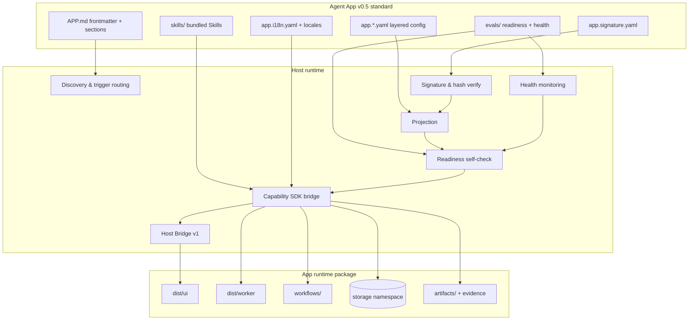
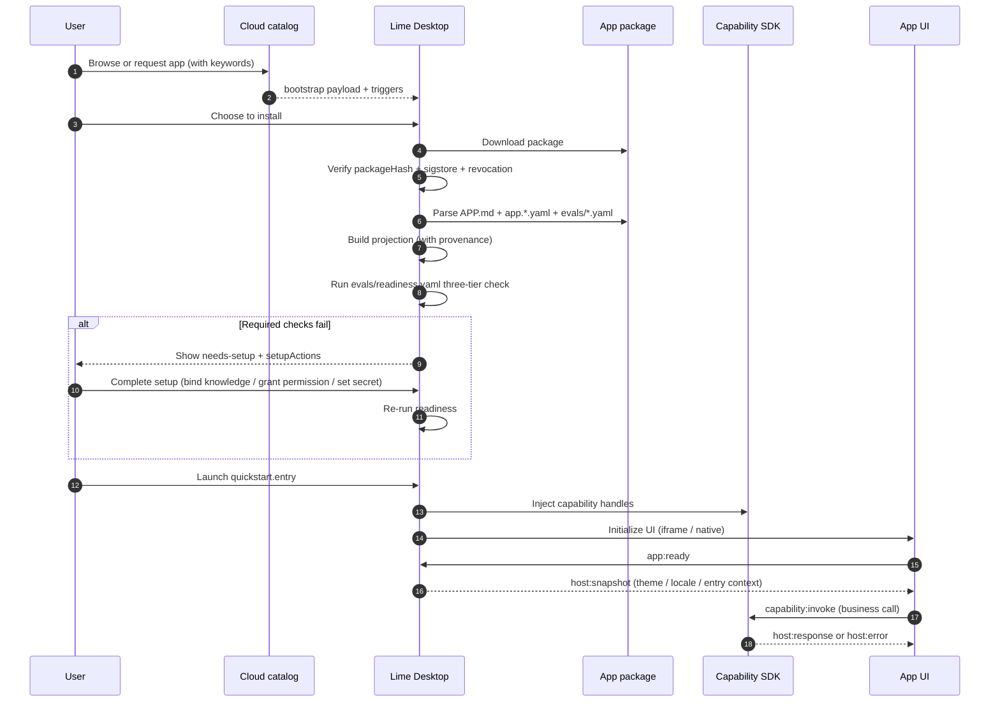
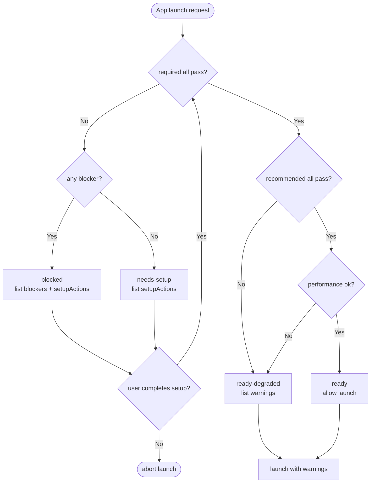
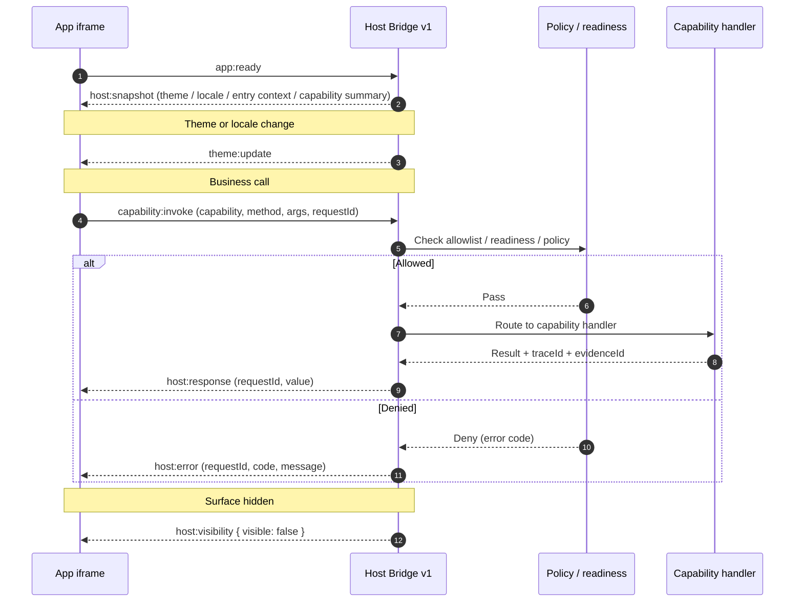
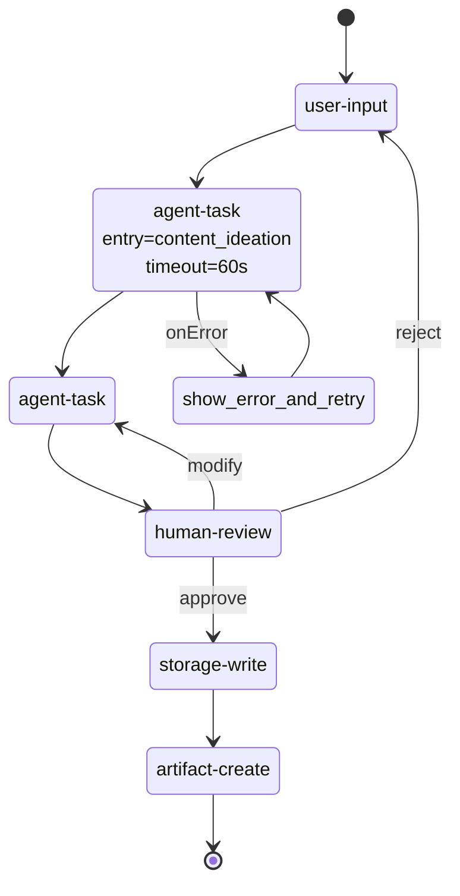

# v0.5 overview

v0.5 adopts the discovery and authoring discipline of the [Agent Skills standard](https://agentskills.io), making the Agent App standard easier for AI clients to understand, easier for authors to write, and easier for hosts to implement.

## Key changes

- **Layered manifest**: `APP.md` keeps a small frontmatter; detailed configuration moves into independent YAML files (`app.capabilities.yaml`, `app.entries.yaml`, `app.permissions.yaml`, `app.errors.yaml`, `app.i18n.yaml`, `app.signature.yaml`, `evals/readiness.yaml`, `evals/health.yaml`).
- **AI auto-discovery**: new `triggers` (keywords / scenarios) and `quickstart` (entry / sampleWorkflow / setupSteps) fields.
- **Standardized Skills integration**: `skills/` directory hosts bundled Agent Skills (with SKILL.md); the manifest only declares activation strategy (auto / on-demand / manual).
- **Readiness self-check**: `evals/readiness.yaml` declarative model with `required / recommended / performance` tiers; states extended to `ready / ready-degraded / needs-setup / blocked / unknown`.
- **Stable error codes**: `app.errors.yaml` provides codes, recovery, retryable, maxRetries.
- **Signing and revocation**: `app.signature.yaml` provides sigstore signature reference, trust chain, and revocation check.
- **First-class i18n**: `app.i18n.yaml` + `locales/*.json`.
- **Runtime health**: `evals/health.yaml` (startup / runtime / metrics).
- **Workflow enhancements**: mermaid diagram, human-readable overview, unified recovery (`onTimeout` / `onError` / `maxRetries` / `saveCheckpoint`).
- **APP.md body conventions**: When to Use / Not Suitable For / Workflow / Quickstart / Red Flags / Verification Checklist / Troubleshooting.

## Why it matters

Manifest fields kept growing through v0.4, raising the authoring barrier. v0.5 returns the frontmatter to a minimal core and lets authors opt into detailed configuration on demand, while giving AI clients `triggers` for accurate request routing.

## Compatibility

- v0.4 / v0.3 manifests continue to work in v0.5 hosts.
- All new fields are optional except in `manifestVersion: 0.5.0` packages where the v0.5 conventions and readiness / errors / signature opt-in apply.
- Reference CLI provides `migrate-check` / `migrate-generate`.

## Mental model

```text
APP.md (small frontmatter + human-readable sections)
  ↳ triggers / quickstart                # AI auto-discovery
  ↳ app.capabilities.yaml                # detailed capabilities
  ↳ app.entries.yaml                     # detailed entries
  ↳ app.permissions.yaml                 # permissions and policy
  ↳ app.errors.yaml                      # stable error codes
  ↳ app.i18n.yaml + locales/*.json       # first-class i18n
  ↳ app.signature.yaml                   # signing and revocation
  ↳ evals/readiness.yaml                 # self-check
  ↳ evals/health.yaml                    # runtime health
  ↳ skills/<name>/SKILL.md               # bundled Agent Skills
```

## Architecture

v0.5 splits the standard, host, and runtime into three layers; the layered manifest and the Capability SDK are the stable boundaries.



## Install and launch sequence

A complete v0.5 install → launch flow with trigger routing, signature verification, readiness self-check, and Host Bridge injection:



## Readiness flow

`evals/readiness.yaml` splits checks into three tiers; the resulting state machine:



## Host Bridge sequence

App UI and Host exchange events through `lime.agentApp.bridge`; capability calls go through `capability:invoke`:



## Workflow state machine example

v0.5 workflow descriptors keep the v0.3 state machine and add a mermaid diagram and unified recovery policy:


