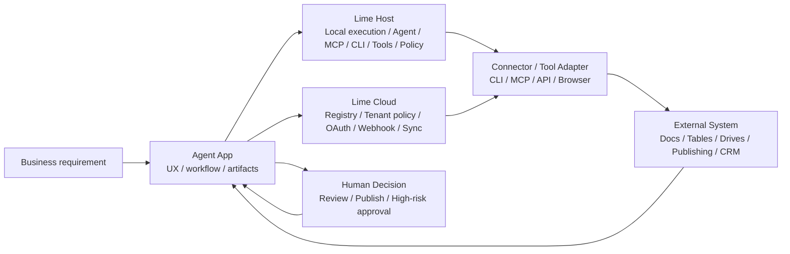
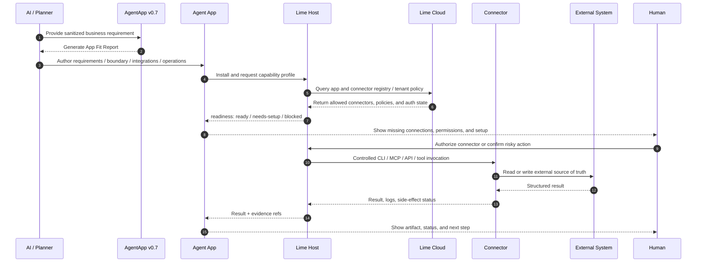
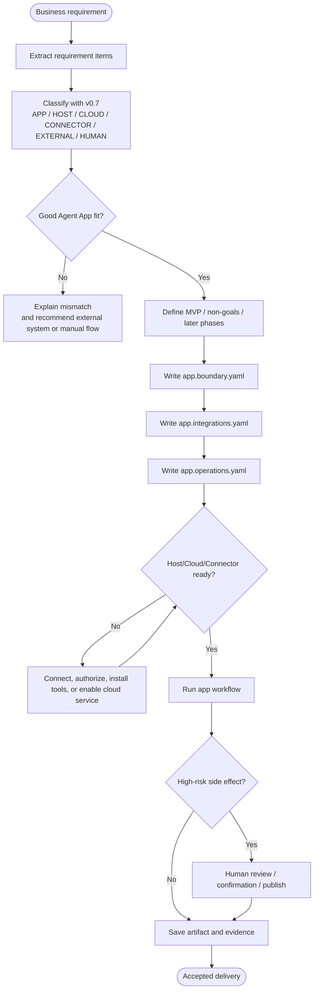

# v0.7 Overview

v0.7 is about **Requirement Boundary & Capability Handoff**. Given a real business requirement, an Agent App must explain what the App owns, what requires Lime Host, what requires Lime Cloud, what belongs to connectors, what remains in external systems, and what needs human decisions.

v0.7 does not encode a single customer, industry, or vendor into the standard. It standardizes the repeated delivery questions: requirement mapping, responsibility boundaries, integrations, side effects, acceptance criteria, MVP scope, and non-goals.

## Core changes

- **`app.requirements.yaml`**: business requirements, MVP scope, non-goals, later phases, and acceptance criteria.
- **`app.boundary.yaml`**: requirement-to-plane mapping across App / Host / Cloud / connector / external system / human.
- **`app.integrations.yaml`**: required external systems, CLI, MCP, API, webhook, or browser adapters, executed by Host/Cloud.
- **`app.operations.yaml`**: operation side effects, approval, dry-run, idempotency, and evidence requirements.
- **App Fit Report**: a pre-implementation report for mapping natural-language requirements into delivery planes.
- **Host/Cloud planes**: Host owns local AgentRuntime, MCP, CLI, tools, files, sandbox, and user confirmation. Cloud owns registries, tenant policy, OAuth broker, webhook, scheduled sync, and team governance.

## Architecture

## Sequence

## Flow

## Compatibility

- v0.6 apps remain valid in v0.7 hosts.
- v0.7 does not replace `app.runtime.yaml`; it adds requirement boundaries and capability handoff above the runtime control plane.
- Non-core vendor adapters should be installed as connector packages, MCP servers, CLI adapters, browser adapters, or customer overlays, not merged into Lime Core.
