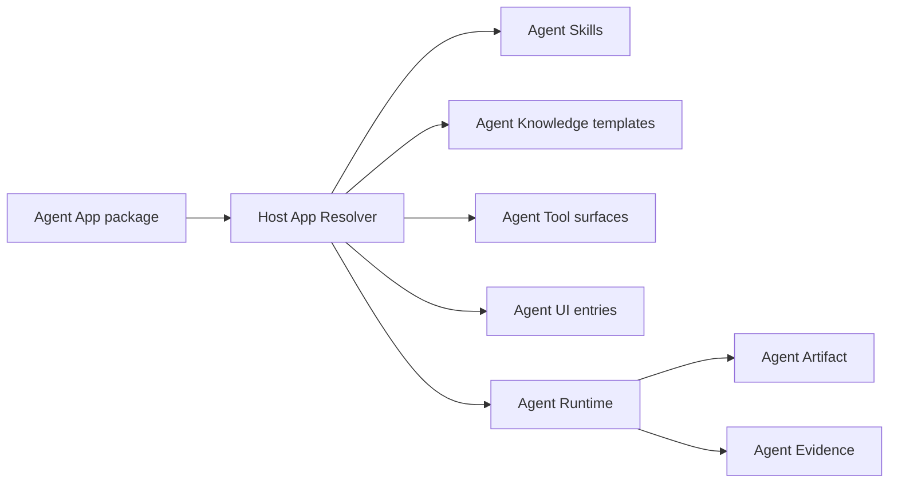

# What is Agent App?

Agent App is a draft companion standard for packaging app-like agent experiences. It does not replace Agent Skills, Agent Knowledge, Agent Runtime, Agent Tool, Agent UI, Agent Artifact, Agent Evidence, Agent Policy, Agent Context, or Agent QC. It composes them into an installable unit.

A useful mental model is a mini-program platform:

- The host platform exposes capabilities.
- The app declares entries, permissions, dependencies, and presentation.
- The client downloads or installs the package locally.
- The host runtime executes the app through controlled APIs.

For Lime, this means Lime Cloud can distribute and authorize Agent Apps, while Lime Desktop installs, resolves, and runs them locally.

## Boundary

Agent App owns the composition declaration. Runtime owns execution facts. Skills own procedures. Knowledge owns trusted data. Tools own callable capabilities.

## Correct use cases

- AI content engineering app.
- Customer support app.
- Sales SOP app.
- Legal drafting app.
- Research report app.
- Internal workflow app.

## Non-goals

- It is not a cloud Agent Runtime.
- It is not a replacement for `SKILL.md`.
- It is not a knowledge format.
- It is not a UI component library.
- It is not a tool protocol.
