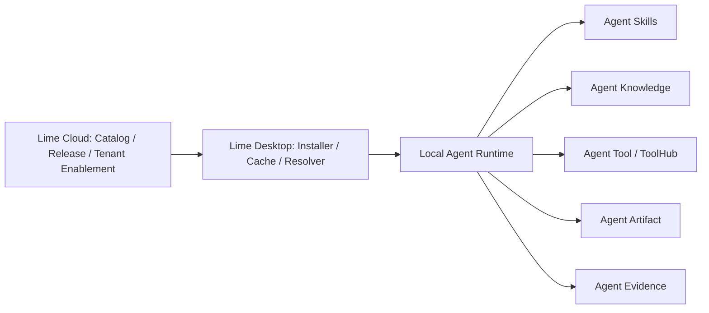

# What is Agent App?

Agent App is a draft companion standard for packaging app-like agent experiences. It does not replace Agent Skills, Agent Knowledge, Agent Runtime, Agent Tool, Agent UI, Agent Artifact, Agent Evidence, Agent Policy, Agent Context, or Agent QC. It composes them into an installable unit.

In one sentence: **Agent App describes which entries, capabilities, knowledge slots, tool permissions, deliverables, and quality gates make up an installable agent application.**

## Mini-program analogy

A useful mental model is a mini-program platform:

| Mini-program platform concept | Agent App counterpart |
| --- | --- |
| The super app is the host. | Lime, an IDE, or an AI client is the host. |
| The mini program declares pages, components, and permissions. | Agent App declares entries, capabilities, and permissions. |
| The client downloads the package locally. | The host installs the Agent App package into a local cache. |
| The mini program calls host APIs. | Agent App uses host Skills, Knowledge, Tools, Runtime, Artifacts, and Policy. |
| The platform manages publishing and permissions. | Registry / Cloud manages release, tenant enablement, policy, and provenance. |

The analogy is architectural, not a request to copy WeChat's JavaScript UI framework. Agent App is not primarily a page framework; it is an application composition layer for agent hosts.

## Position in Lime

Lime Cloud can distribute and authorize Agent Apps. Lime Desktop installs, resolves, and runs them locally. Cloud services can provide models and tools, but they should not become hidden Agent Runtimes in the default chain.

## Correct use cases

- AI content engineering app.
- Customer support app.
- Sales SOP app.
- Legal drafting app.
- Research report app.
- Internal workflow app.
- Customer-specific private workflow app.

These scenarios should not require changes to the host core. A new scenario should usually become a new Agent App.

## Non-goals

- It is not a cloud Agent Runtime.
- It is not a replacement for `SKILL.md`.
- It is not a knowledge format.
- It is not a UI component library.
- It is not a tool protocol.
- It is not a customer data package.

## Why it exists

Skills and Knowledge are not enough for a full product experience. A real app also needs to state:

- where the user enters
- which knowledge must be bound before running
- which tools are required or optional
- what artifacts it produces
- which evals decide readiness
- which host, workspace, or tenant installed it
- how provenance is recorded for audit and upgrade

Agent App defines that composition layer.
