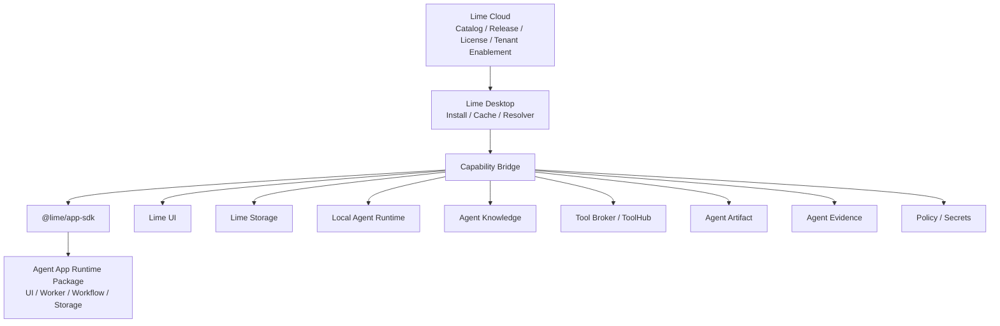

# What is Agent App?

Agent App is a draft standard for complete installable applications in agent hosts. An app may include real UI, business workflows, data storage, background jobs, agent entries, Skills, Tools, Knowledge bindings, Artifacts, Policies, and Evals.

In one sentence: **Agent App is an intelligent application running on Lime platform capabilities. It is not a Markdown file and not a single chat expert.**

`APP.md` is only the discovery entry and manifest carrier. Real business capability comes from the runtime package and from calls through the Lime Capability SDK.

## Business workspace, not a chat wrapper

The product boundary is:

> Business work stays inside the app context; agent execution stays inside Lime capability governance.

An Agent App should be the surface where the user finishes the job: dashboards, forms, tables, review queues, artifacts, settings, and embedded assistant panels all belong there. The app can call `lime.agent`, `lime.knowledge`, `lime.tools`, `lime.storage`, `lime.artifacts`, and `lime.evidence`, but the user should not have to jump back to a generic Lime chat just to complete the app's core workflow.

This also prevents the opposite failure mode. An app should not rebuild its own model gateway, credential store, permission system, evidence store, or tool broker just to avoid Lime. That would make Lime a distribution shell for independent SaaS products. Agent App exists for the middle path: the app owns business shape and business state; Lime owns the agent runtime and governed platform capabilities.

## Relationship to experts

A large-company “expert” is usually:

```text
Expert = Chat UI + Persona + Skills + Tools + Data Connections
```

Agent App is a higher-level package:

```text
Agent App = UI + Workflow + Storage + Services + Agent Entries + Skills + Tools + Knowledge + Artifacts + Policy
```

An expert is only an `expert-chat` entry. An app can contain multiple experts, or none. A Content Factory App should have project home, knowledge pages, content factory, review dashboard, and background jobs; a content strategist expert is only one entry.

Expert chat is therefore an app interaction mode, not the default container for every business workflow. An app may embed an expert beside a table or review step, and that expert should read the current app context and trigger app workflows through the SDK rather than producing detached chat text that the user must copy back manually.

## Mini-program analogy

Agent App can be understood as a mini-program-like model for AI agents, without copying the WeChat Mini Program framework.

| Mini-program mental model | Agent App counterpart |
| --- | --- |
| WeChat is the host platform. | Lime / IDE / AI Client is the host platform. |
| Mini-programs declare pages, components, permissions, storage. | Agent Apps declare UI, entries, capabilities, storage, permissions. |
| Mini-programs call `wx.*`. | Agent Apps call `lime.ui`, `lime.storage`, `lime.agent`, etc. through `@lime/app-sdk`. |
| The platform manages review, release, and permissions. | Cloud / Registry manages release, tenant enablement, license, policy. |
| The client runs the mini-program. | Lime Desktop installs and runs the app package locally. |

The important part is not how it looks, but that the host opens capabilities and apps call those capabilities through a stable SDK.

## Position in Lime



Lime Cloud may distribute, authorize, and enable Agent Apps. Lime Desktop installs, authorizes, injects capabilities, and runs them locally. Cloud should not become a hidden Agent Runtime by default.

## Good fits

- Content Factory systems.
- Customer support knowledge workbenches.
- Sales SOP applications.
- Legal contract review products.
- Investment research workbenches.
- Internal enterprise workflow apps.
- Customer-specific private business systems.

These scenarios should not be implemented by changing Lime Core. New scenarios should become Agent Apps that call Lime platform capabilities.

## Non-goals

Agent App is not:

- a collection of `APP.md` documents
- a single Expert or Persona
- a replacement for `SKILL.md`
- a knowledge base format
- a tool protocol
- a cloud Agent Runtime
- a package containing customer private data

## Why it exists

Skills, Knowledge, and Tools are not enough for real business applications. Apps also need:

- their own UI pages, panels, and settings
- their own data models, indexes, migrations, and caches
- business workflows, background jobs, and human review nodes
- multiple chat or non-chat entries
- traceable Artifacts, Evidence, and Evals
- permissions, costs, credentials, tenant overlays, upgrade policies
- an SDK boundary that decouples apps from Lime internals

Agent App is the application layer that ties these pieces together.
