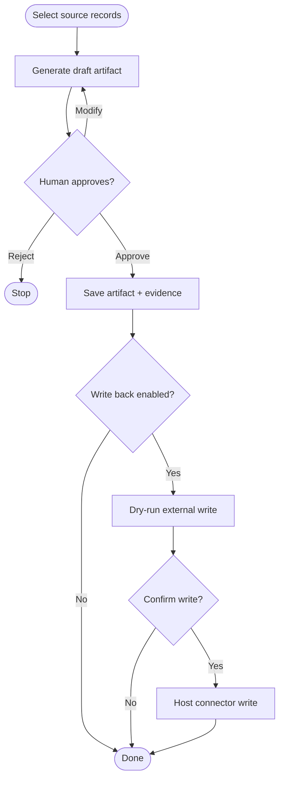

# Draft Review Flow

```mermaid
flowchart TD
  Start([Select source records]) --> Generate[Generate draft artifact]
  Generate --> Review{Human approves?}
  Review -- Modify --> Generate
  Review -- Reject --> Stop([Stop])
  Review -- Approve --> Save[Save artifact + evidence]
  Save --> Optional{Write back enabled?}
  Optional -- No --> Done([Done])
  Optional -- Yes --> DryRun[Dry-run external write]
  DryRun --> Confirm{Confirm write?}
  Confirm -- No --> Done
  Confirm -- Yes --> Write[Host connector write]
  Write --> Done
```
