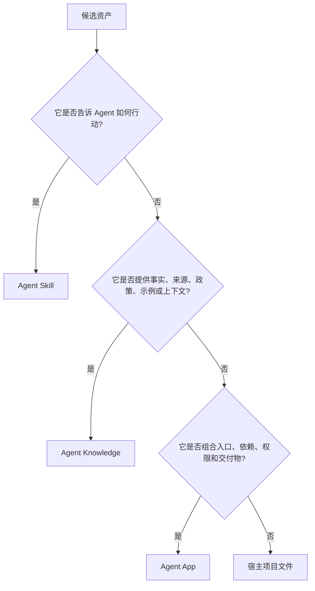
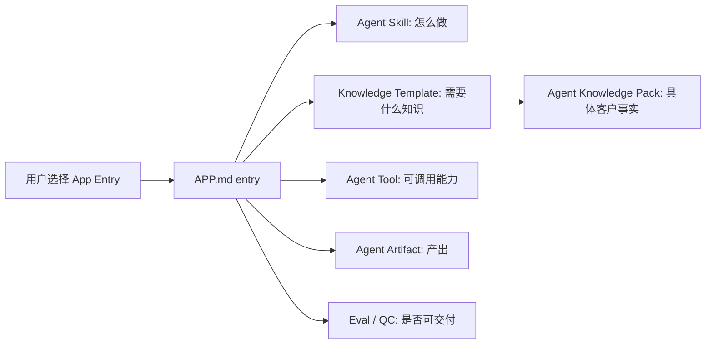

# App 与 Skills / Knowledge 的边界

Agent Skills、Agent Knowledge 和 Agent App 回答的问题不同。

| 标准 | 回答的问题 | 入口 |
| --- | --- | --- |
| Agent Skills | Agent 应该如何完成工作？ | `SKILL.md` |
| Agent Knowledge | 哪些可信事实和上下文可以进入模型？ | `KNOWLEDGE.md` |
| Agent App | 哪些 UI、workflow、storage、services、entries、能力依赖、工具、产物和评估组成一个可安装应用？ | `APP.md` + runtime package |

## 判断树

## 三者如何协作

Agent App 不把 Skill 的流程复制进来，也不把 Knowledge 的事实复制进来。它声明应用如何组合这些资产，并可以携带自己的 UI、worker、storage schema 和业务 workflow；真正运行时仍由宿主通过 Capability SDK 执行和授权。

## Lime Agent、Expert 与 App 的边界

Lime Agent 不是这张表里的另一种包格式，而是宿主为 App、Expert、Workflow 和 Skill 提供的任务运行能力。Agent App 决定业务界面和状态流转；Lime Agent 通过 `lime.agent` 和相邻能力执行 App 作用域内的任务。

| 层 | 正确职责 | 错误职责 |
| --- | --- | --- |
| Agent App | 拥有业务 UI、workflow 状态、storage schema、结构化结果写回和人工确认。 | 绕过 Lime 自建模型网关、凭证系统、证据系统或工具调度器。 |
| Lime Agent / Host | 运行 Agent task、流式进度、强制 policy、调用工具、检索知识、生成 trace / artifact / evidence。 | 拥有垂直业务页面，或强迫用户回到通用聊天框完成 App 流程。 |
| Expert Chat | 提供对话入口或可嵌入协作者，并读取 App 上下文。 | 替代 App 的业务 workflow，或变成用户手工复制结果回 App 的旁路。 |

## 内容工厂示例

内容工厂应该这样拆：

| 资产 | 正确位置 | 原因 |
| --- | --- | --- |
| 如何采访创始人并整理 IP 资料 | Agent Skill | 它是生产知识的方法。 |
| 创始人经历、表达风格、禁忌、金句 | Agent Knowledge | 它是可溯源的 persona 数据。 |
| 如何写公众号文章、如何去 AI 味 | Agent Skill | 它是写作流程和评审工艺。 |
| 项目首页、知识库页面、内容工厂、`/IP文章`、`/复盘报告` | Agent App | 它们是 App UI 和用户可见入口。 |
| 竞品调研、图片生成、飞书导出 | Agent Tool | 它们是外部能力。 |
| 文章草稿、脚本批次、策略报告 | Agent Artifact | 它们是持久交付物。 |
| 事实支撑、本人语气、可发布性 | Eval / Agent QC / Evidence | 它们是质量和信任判断。 |

## 常见错误

- 把客户资料写进官方 App 包。
- 把完整写作流程写进 `APP.md`，而不是 Skill。
- 把知识库当成指令执行。
- 为一个 App 新造工具协议。
- 让 Cloud Registry 变成隐藏 Agent Runtime。
- 在宿主 Core 里写死业务入口，而不是从 App projection 生成。

## 固定结论

- App 是完整应用包；执行发生在宿主 runtime，能力调用必须通过 Capability SDK。
- Skill 是工艺，不是客户事实。
- Knowledge 是数据，不是指令。
- Runtime package 承载 App 实现，但不能绕过宿主 runtime 和 policy。
- Cloud 可以分发 App，但默认不运行 Agent。

## 打包模式

| 情况 | 应打包为 | 原因 |
| --- | --- | --- |
| 可复用写作方法或 review rubric | Skill | 它改变 agent 行为，但不拥有产品 UI 和 storage。 |
| 已验证产品手册、品牌规则或政策库 | Knowledge | 它是有 provenance 和更新生命周期的可信数据。 |
| CRM、搜索、导出、解析器或生成器集成 | Tool | 它是带 auth 和副作用的外部可调用能力。 |
| Dashboard、guided workflow、settings、artifacts、evals、storage | Agent App | 它是完整安装后的产品体验。 |
| 一次性本地项目文件 | Workspace asset | 它只属于某个 workspace，不属于可复用 app release。 |

## Review 问题

- 这个资产能否脱离当前 UI 被另一个 App 复用？如果能，优先考虑 Skill、Knowledge、Tool 或 Artifact。
- 它是否需要 installation、permissions、entries、storage 和 lifecycle？如果需要，通常属于 Agent App。
- 如果放进 host core，会不会让宿主变成垂直业务系统？如果会，应打包成 App。
- 如果打进官方包，是否会泄露客户事实或凭证？如果会，用 Knowledge、overlays、workspace files 或 secrets。
