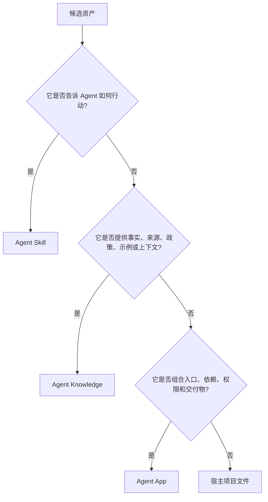
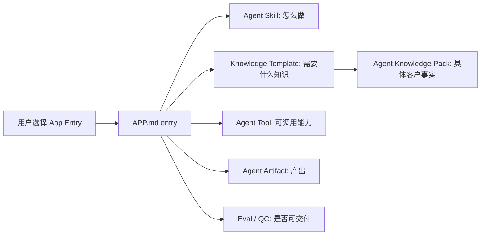

# App 与 Skills / Knowledge 的边界

Agent Skills、Agent Knowledge 和 Agent App 回答的问题不同。

| 标准 | 回答的问题 | 入口 |
| --- | --- | --- |
| Agent Skills | Agent 应该如何完成工作？ | `SKILL.md` |
| Agent Knowledge | 哪些可信事实和上下文可以进入模型？ | `KNOWLEDGE.md` |
| Agent App | 哪些 UI、workflow、storage、services、entries、能力依赖、工具、产物和评估组成一个可安装应用？ | `APP.md` + runtime package |

## 判断树

## 三者如何协作

Agent App 不把 Skill 的流程复制进来，也不把 Knowledge 的事实复制进来。它声明应用如何组合这些资产，并可以携带自己的 UI、worker、storage schema 和业务 workflow；真正运行时仍由宿主通过 Capability SDK 执行和授权。

## 内容工程化示例

AI 内容工程化应用应该这样拆：

| 资产 | 正确位置 | 原因 |
| --- | --- | --- |
| 如何采访创始人并整理 IP 资料 | Agent Skill | 它是生产知识的方法。 |
| 创始人经历、表达风格、禁忌、金句 | Agent Knowledge | 它是可溯源的 persona 数据。 |
| 如何写公众号文章、如何去 AI 味 | Agent Skill | 它是写作流程和评审工艺。 |
| 项目首页、知识库页面、内容工厂、`/IP文章`、`/复盘报告` | Agent App | 它们是 App UI 和用户可见入口。 |
| 竞品调研、图片生成、飞书导出 | Agent Tool | 它们是外部能力。 |
| 文章草稿、脚本批次、策略报告 | Agent Artifact | 它们是持久交付物。 |
| 事实支撑、本人语气、可发布性 | Eval / Agent QC / Evidence | 它们是质量和信任判断。 |

## 常见错误

- 把客户资料写进官方 App 包。
- 把完整写作流程写进 `APP.md`，而不是 Skill。
- 把知识库当成指令执行。
- 为一个 App 新造工具协议。
- 让 Cloud Registry 变成隐藏 Agent Runtime。
- 在宿主 Core 里写死业务入口，而不是从 App projection 生成。

## 固定结论

- App 是完整应用包；执行发生在宿主 runtime，能力调用必须通过 Capability SDK。
- Skill 是工艺，不是客户事实。
- Knowledge 是数据，不是指令。
- Runtime package 承载 App 实现，但不能绕过宿主 runtime 和 policy。
- Cloud 可以分发 App，但默认不运行 Agent。
