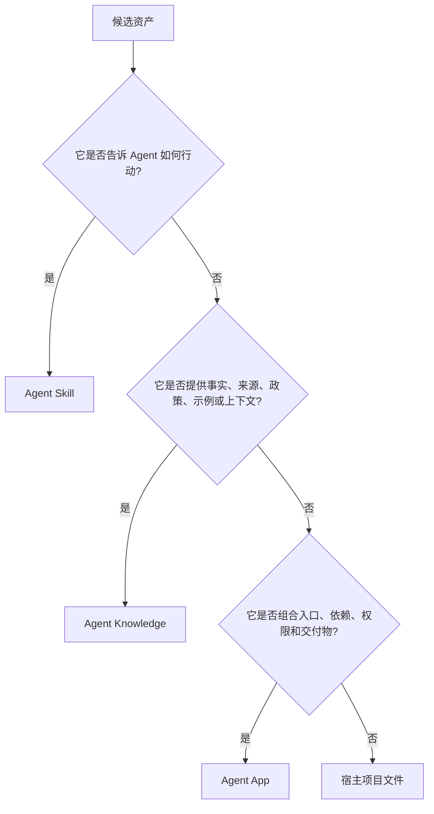

# App 与 Skills / Knowledge 的边界

Agent Skills、Agent Knowledge 和 Agent App 回答的问题不同。

| 标准 | 回答的问题 | 入口 |
| --- | --- | --- |
| Agent Skills | Agent 应该如何完成工作？ | `SKILL.md` |
| Agent Knowledge | 哪些可信事实和上下文可以进入模型？ | `KNOWLEDGE.md` |
| Agent App | 哪些能力、知识槽位、入口、工具、产物和评估组成一个可安装应用？ | `APP.md` |

## 判断树

## 示例

AI 内容工程化应用应该这样拆：

- 写作方法和流程放在 Agent Skills。
- 个人 IP、产品事实、内容运营 playbook 放在 Agent Knowledge。
- `/IP文章`、`/内容日历`、所需知识槽位、工具依赖、Artifact 合约和质量门禁放在 Agent App 声明。

客户数据属于 Knowledge 包或 Overlay，不属于官方 Agent App 包。
