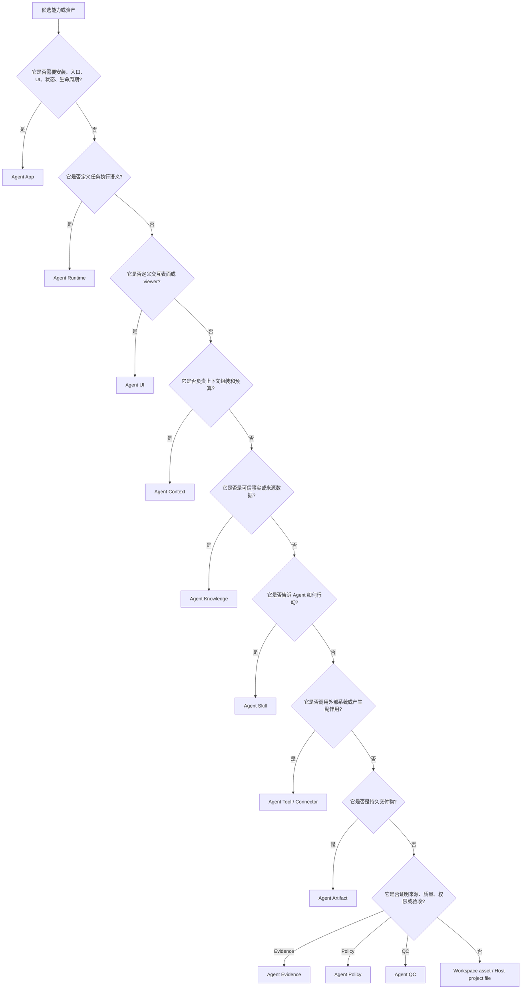
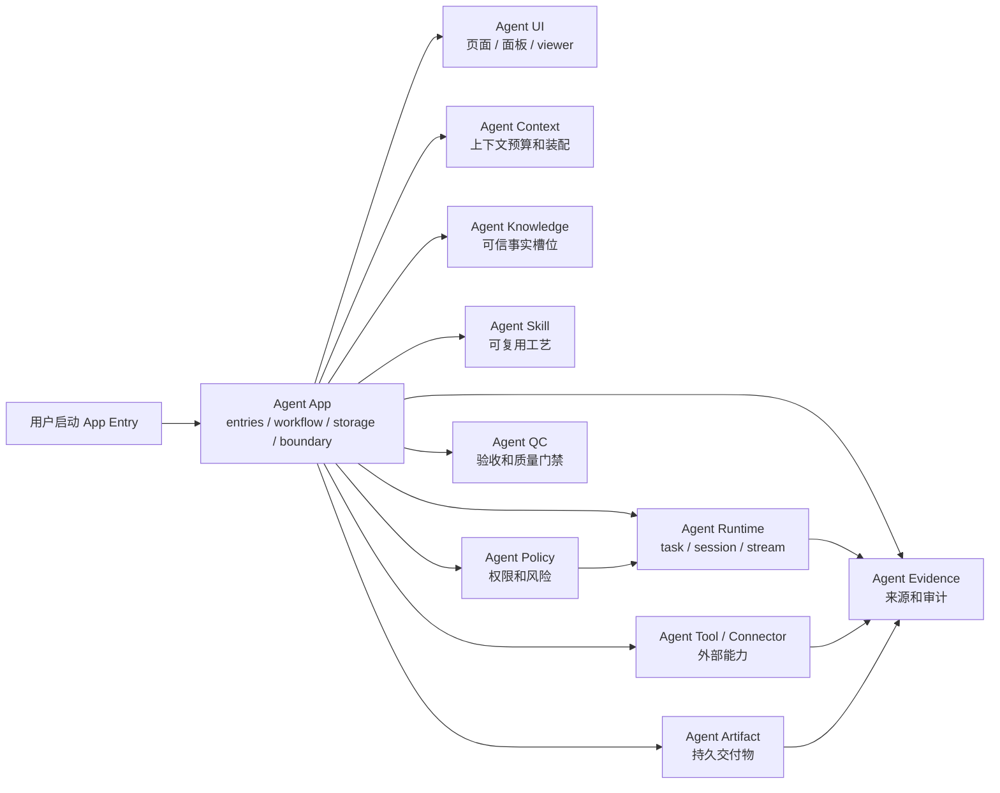

# App 与 Agent 标准生态边界

Agent App 是 Agent 标准生态中的应用层和交付边界层。它要组合 Runtime、UI、Context、Knowledge、Skills、Tools / Connectors、Artifacts、Evidence、Policy、QC 和领域标准，而不是只围绕单一资产类型设计。

当前事实源：**Agent App 负责可安装业务应用的组合、体验、交付和边界；相邻标准负责各自的可复用能力；Lime Host / Lime Cloud 负责执行、治理、连接和分发。**

## 标准地图

| 标准 / 平面 | 负责什么 | App 如何使用 |
| --- | --- | --- |
| Agent App | 可安装应用包、entries、runtime package、workflow、storage、release、v0.7 需求边界。 | 作为组合层，声明一个业务工作台如何安装、运行、验收和升级。 |
| Agent Runtime | task、model、tool、session、checkpoint、event stream、structured output。 | 通过 `lime.agent` 和 `app.runtime.yaml` 发起受控任务，不自带隐藏 Runtime。 |
| Agent UI | 页面、面板、命令、交互状态、artifact viewer、Host Bridge。 | 通过 entries、UI bundle 和 `lime.ui` 暴露产品界面。 |
| Agent Context | 上下文组装、预算、优先级、压缩、缺失上下文请求。 | 为 entry / workflow 声明需要哪些上下文来源和预算。 |
| Agent Knowledge | 可信事实、来源、provenance、新鲜度、检索或 data mode。 | 通过 `knowledgeTemplates` 声明槽位，由 workspace / tenant 绑定具体 Knowledge Pack。 |
| Agent Skills | 可复用工艺、脚本、步骤、rubric、可执行流程片段。 | 通过 `skillRefs` 或 `skills/` 引用，不把完整工艺复制进 `APP.md`。 |
| Agent Tool / Connector | 外部可调用能力、CLI、API、MCP、browser adapter、授权和副作用。 | 通过 `toolRefs`、`app.integrations.yaml`、Host/Cloud connector 能力声明。 |
| Agent Artifact | 持久交付物、schema、viewer、exporter、版本和状态。 | 通过 `artifactTypes` 声明可产生的交付物。 |
| Agent Evidence | 来源支撑、trace、replay、redaction、audit export。 | 对高信任流程记录 evidence refs，连接输入、任务、工具和产物。 |
| Agent Policy | 权限、风险、成本、保留、租户规则、人审门槛。 | 通过 `permissions`、`app.operations.yaml` 和 Host policy 被裁决。 |
| Agent QC | 质量门禁、验收指标、回归、waiver、报告。 | 通过 `evals` 和 readiness / review gates 进入发布与运行流程。 |
| 领域标准（如 Agent Novel） | 某类业务域的工作台语义、文件结构、长期 workflow。 | 可作为 App 的领域 profile 或专用 App 类型，而不是写进 Host Core。 |
| Lime Host / Cloud | 本地执行、沙箱、凭证、连接器、registry、tenant policy、OAuth、webhook、sync。 | App 只声明需求；Host / Cloud 提供能力、治理和 evidence。 |

## 判断树

## 如何协作

Agent App 不复制相邻标准的内部细节。它声明：当前业务工作台需要哪些标准、如何绑定、何时运行、如何验收、失败后怎么恢复。真正执行仍由 Host / Cloud 按 capability、policy、secrets、connector 和 evidence 边界完成。

## Lime Agent、Expert 与 App 的边界

Lime Agent 不是另一种 App 包格式，而是 Host 提供的 Runtime 能力。Expert Chat 也不是 App 的替代品，而是 App 可以暴露的一类对话入口。

| 层 | 正确职责 | 错误职责 |
| --- | --- | --- |
| Agent App | 拥有业务 UI、workflow 状态、storage schema、artifact、需求边界和人工确认。 | 绕过 Lime 自建模型网关、凭证系统、证据系统、工具调度器或 connector runtime。 |
| Lime Agent / Runtime | 运行 task、流式事件、模型路由、工具调用、session、checkpoint、structured output。 | 拥有垂直业务页面，或强迫用户回到通用聊天框完成 App 流程。 |
| Expert Chat | 提供对话入口、协作者、解释器或审核助手。 | 替代 App 的主 workflow，或成为手工复制结果的旁路。 |
| Lime Host / Cloud | 托管 capability、权限、sandbox、secrets、registry、tenant policy、OAuth、webhook 和 sync。 | 把非核心厂商适配或客户私有流程写进 Core。 |

## 示例拆分

| 需求或资产 | 正确位置 | 原因 |
| --- | --- | --- |
| 内容工作台首页、草稿列表、审核流程、发布前确认 | Agent App | 它们是用户可见产品体验和业务状态。 |
| 长任务执行、结构化输出、session resume、checkpoint | Agent Runtime | 它们是执行语义，不属于 App 自己实现的隐藏 runtime。 |
| 表单、面板、artifact viewer、命令入口 | Agent UI | 它们是交互表面。 |
| 任务需要的项目资料、上下文预算、缺失信息请求 | Agent Context | 它决定上下文如何被装配和压缩。 |
| 品牌规则、产品手册、政策库、项目事实 | Agent Knowledge | 它们是可溯源数据，不是指令。 |
| 写作方法、访谈流程、审核 rubric | Agent Skill | 它们是可复用工艺。 |
| 外部表格、CRM、搜索、导出、解析器、飞书/网盘/API 适配 | Agent Tool / Connector | 它们是带授权和副作用的外部能力。 |
| 文章草稿、脚本批次、报告、PPT、表格 | Agent Artifact | 它们是持久交付物。 |
| 来源引用、工具调用日志、发布审批记录 | Agent Evidence | 它们支撑信任、复盘和审计。 |
| 成本上限、数据保留、人审门槛、租户禁用规则 | Agent Policy | 它们是裁决规则。 |
| 事实支撑、语气一致、可发布性、回归检查 | Agent QC | 它们是质量和验收门禁。 |

## 常见错误

- 只讨论少数资产类型，忽略 Runtime、UI、Context、Tool、Artifact、Evidence、Policy、QC。
- 把客户资料写进官方 App 包，而不是 Knowledge、workspace files、secrets 或 overlays。
- 把完整工艺写进 `APP.md`，而不是 Skill 或 App runtime workflow。
- 把 Knowledge 当成可执行指令。
- 为一个 App 新造工具协议，而不是走 Tool / Connector / MCP / CLI / API adapter。
- 让 Cloud Registry 变成隐藏 Agent Runtime。
- 在 Host Core 写死垂直业务入口，而不是从 App projection 生成。

## 固定结论

- App 是完整应用包和组合层，不是所有标准的堆放处。
- Runtime 负责执行语义；App 只声明任务意图和结果如何写回。
- UI 负责交互表面；App 可以携带 UI bundle，但仍由 Host Bridge 托管。
- Context 负责上下文装配；Knowledge 负责可信事实；Skill 负责可复用工艺。
- Tool / Connector 负责外部能力；Artifact 负责持久交付物。
- Evidence / Policy / QC 负责可信、授权和验收。
- Cloud 可以分发、治理和连接 App，但默认不运行本地 Agent task。

## Review 问题

- 这个能力是否需要安装、入口、状态、storage 和 lifecycle？如果需要，属于 Agent App。
- 它是否能被多个 App 复用？如果能，优先拆成 Runtime、UI、Context、Knowledge、Skill、Tool / Connector、Artifact、Evidence、Policy、QC 或领域 profile。
- 它是否有外部副作用？如果有，必须进入 Tool / Connector 和 `app.operations.yaml`。
- 它是否是执行语义？如果是，归 Agent Runtime，不要放进 App 私有 runtime。
- 如果放进 Host Core，会不会让 Host 变成垂直业务系统？如果会，应打包成 App 或领域标准。
- 如果进入官方包，是否会泄露真实主体、账号、凭证或私有流程？如果会，必须外置。
