# 架构概览

本页用图集中展示 Agent App v0.7 的关键结构、需求边界与运行时流程。各章节图与 [规范](./specification) 互相补充：规范是规则，本页是图。

## 1. 标准分层架构

v0.7 继承 v0.6 分层，并把整个生态切成 App、Host、Cloud、Connector、外部系统和人工决策平面。分层 manifest 与 Capability SDK 是稳定边界，宿主和 Cloud 控制面只看接口、不看业务实现。

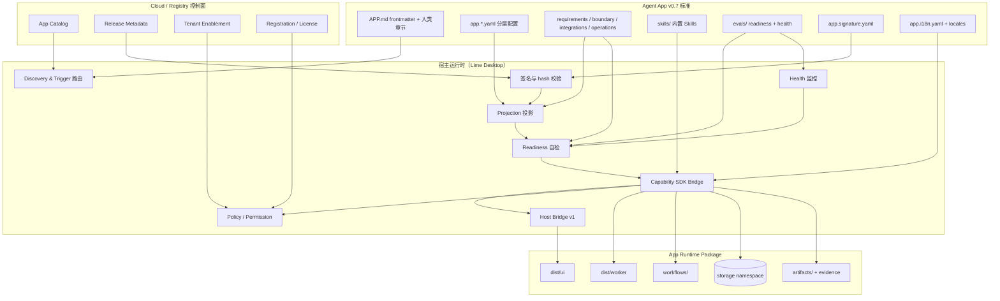

## 2. 责任分工矩阵

| 层 | 拥有 | 不拥有 |
| --- | --- | --- |
| Cloud / Registry | catalog、release metadata、tenant enablement、registration、license、ToolHub metadata | App 运行、UI 渲染、本地 storage |
| 宿主运行时 | discovery、签名校验、projection、readiness、Capability SDK 注入、Host Bridge、policy、cleanup | 业务实现、客户数据、行业逻辑 |
| App Runtime | UI、worker、workflow、storage 业务、artifact、evidence 写回 | 模型 / 工具 / 凭证 / 权限调度（必须走 SDK） |
| 标准（agentapp） | manifest schema、reference CLI、SDK 契约、最佳实践 | 任意宿主或 App 的具体实现 |

## 3. v0.7 需求边界架构

v0.7 用这个图回答普通用户和交付团队最关心的问题：App 能做什么，哪些需要 Lime Host / Lime Cloud / 外部连接器 / 人工确认配合。

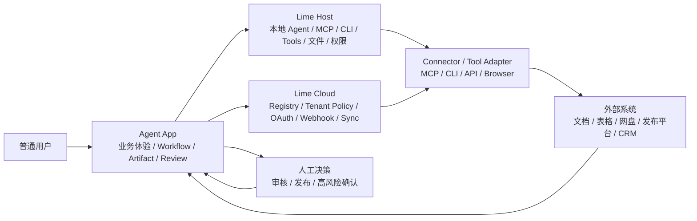

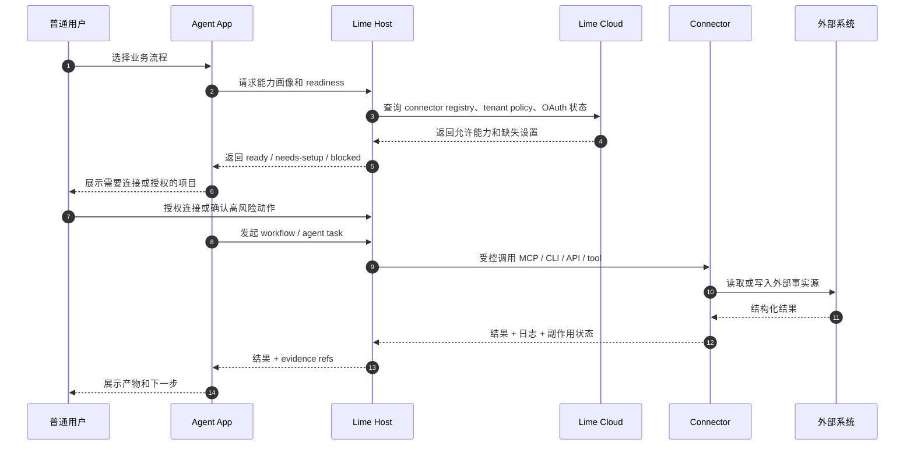

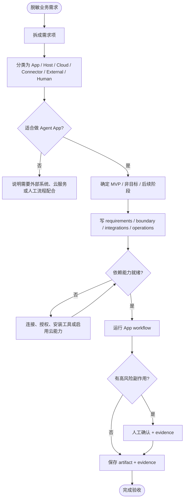

## 4. 安装与启动时序

完整的从 Cloud bootstrap → 本地下载 → 校验 → projection → readiness → 启动的端到端流程。

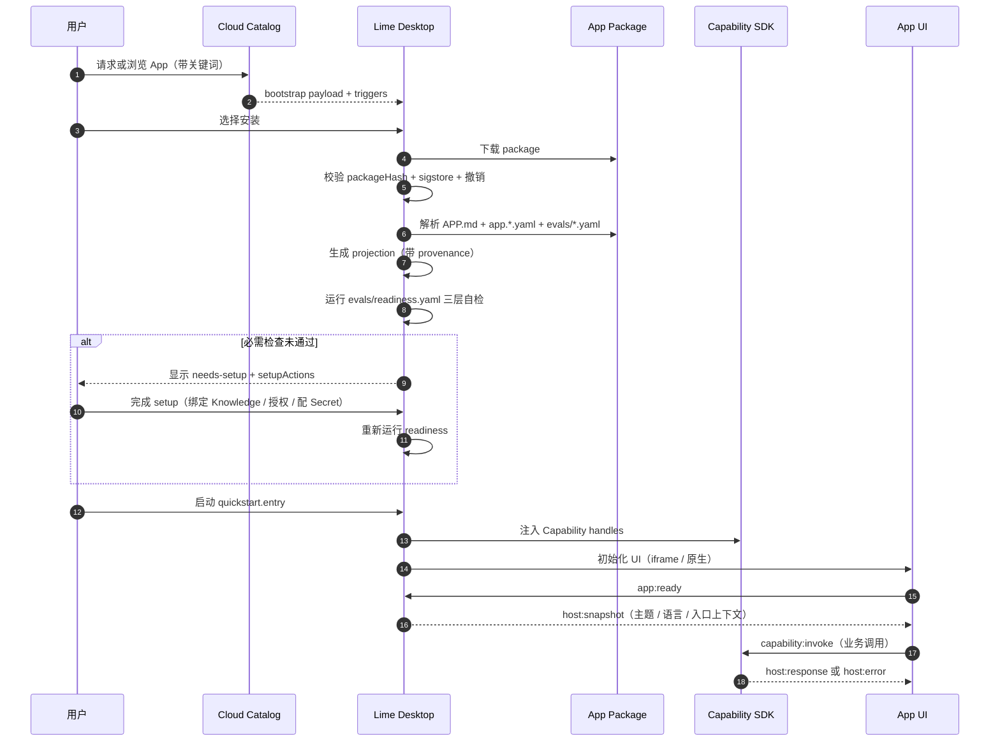

## 5. Readiness 自检流程

`evals/readiness.yaml` 三层 required / recommended / performance 检查，对应 5 种状态机输出。

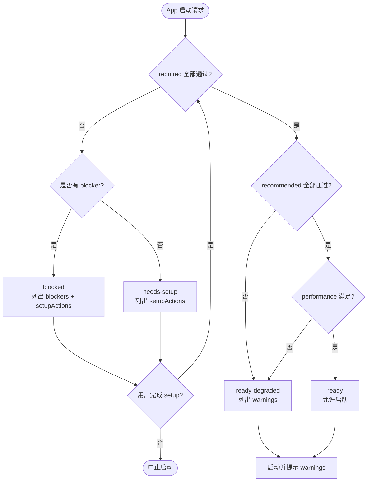

## 6. Host Bridge v1 消息时序

App UI 与 Host 之间通过 `lime.agentApp.bridge` 协议交换事件，所有能力调用都走 `capability:invoke`，由 Host 裁决放行或拒绝。

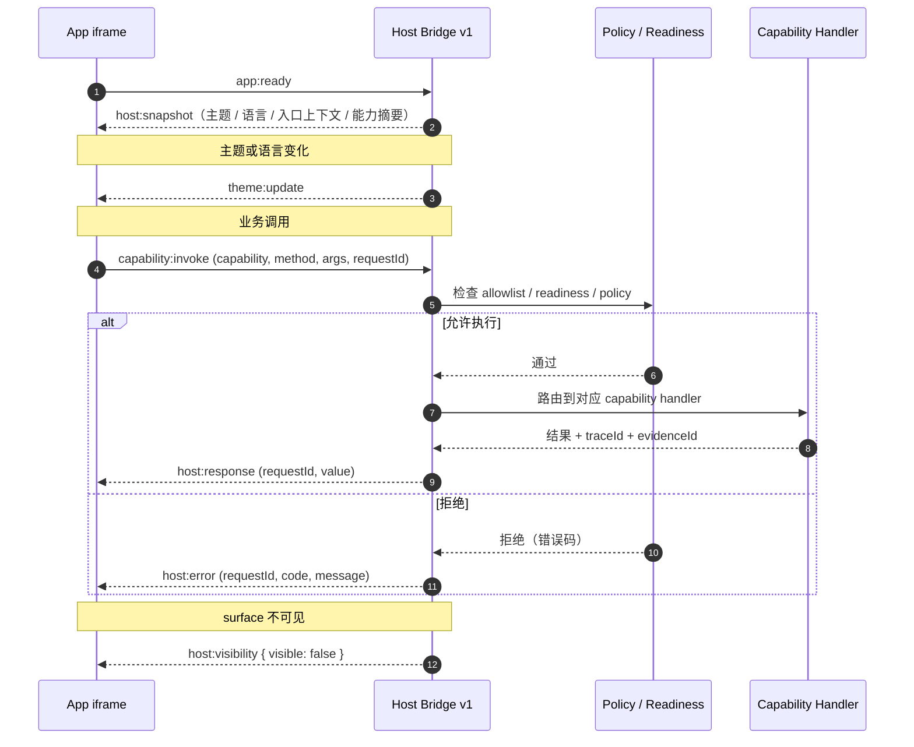

## 7. Capability 调用拓扑

`capability:invoke` 请求被 Host 路由到不同的 capability handler，每个能力都有独立的权限、policy 和 evidence 边界。

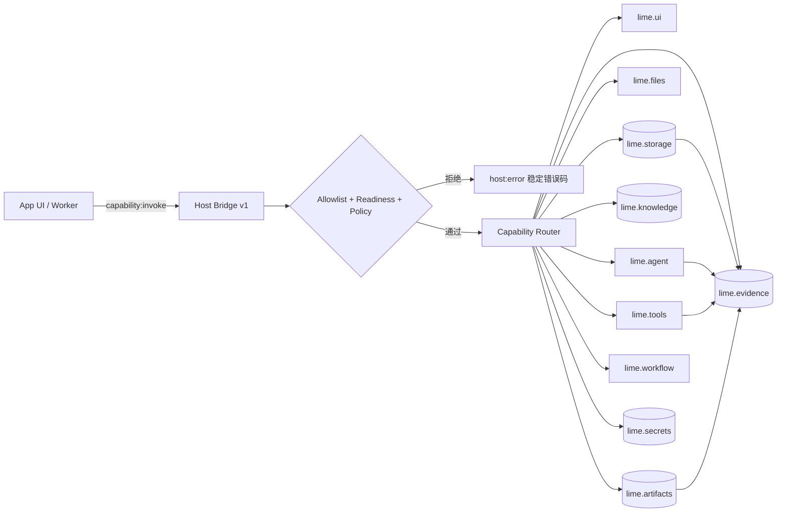

## 8. Workflow 状态机示例

v0.5 workflow 描述符在 v0.3 状态机基础上引入 mermaid 流程图与统一 recovery 策略。下面是内容工厂 `content_scenario_planning` workflow 的状态机示例。

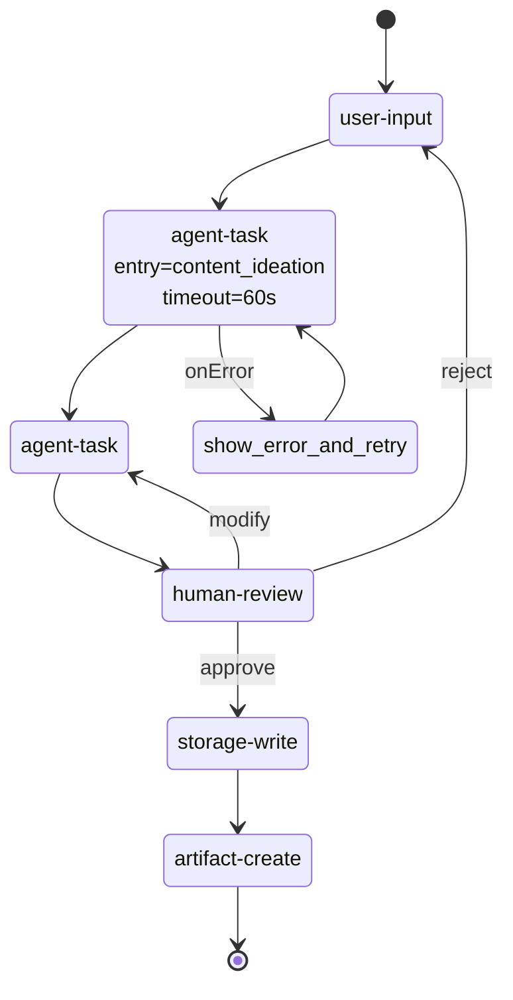

## 9. 包文件依赖关系

`APP.md` 是发现入口；其余分层文件被 manifest 按文件名约定加载，构成完整投影输入。

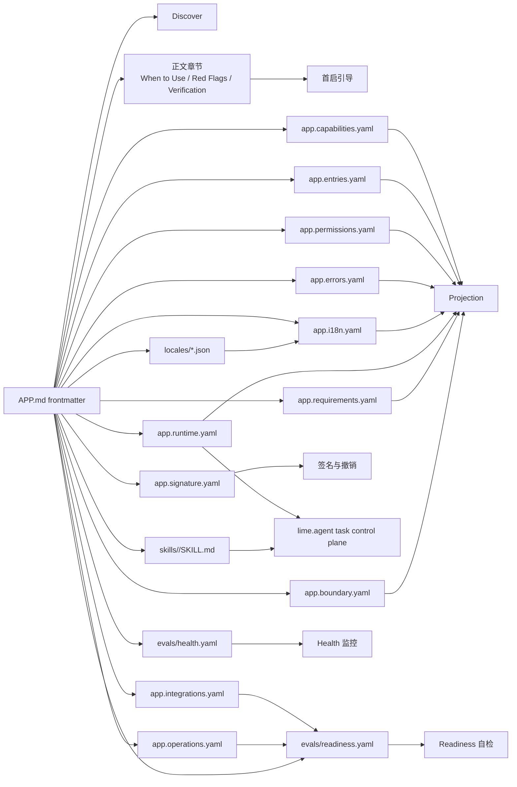

## 10. 升级与回滚关系

v0.6 / v0.5 / v0.4 / v0.3 manifest 在 v0.7 宿主中继续可用；reference CLI 提供 `migrate-check` / `migrate-generate`。

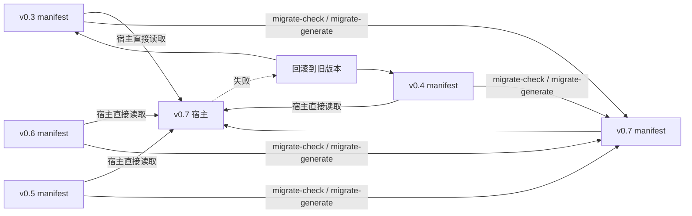

## 11. 后续阅读

- [规范](./specification)：字段、约束、契约的规则文本。
- [快速开始](./authoring/quickstart)：从零创建一个 v0.7 包。
- [运行时模型](./client-implementation/runtime-model)：宿主侧实现细节。
- [Capability SDK](./client-implementation/capability-sdk)：稳定能力调用契约。
- [v0.7 当前快照](./versions/v0.7/overview)：定格版本说明。
