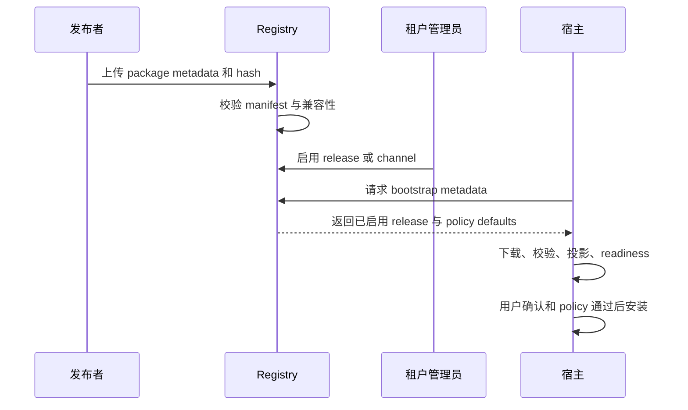

# 发布与分发

Agent App release 应该不可变、可审查、可回滚。Registry 可以分发 package 和授权租户，但本地宿主仍负责校验、readiness、policy 和 runtime 执行。安装契约还增加一个发布决策：同一个 package 可以面向 Lime 内安装、独立品牌安装、runtime-backed 安装或兼容 Web Host 分发。

## Release 对象

| 字段 | 作用 |
| --- | --- |
| `appId` | 稳定 App 身份。 |
| `version` | SemVer package version。 |
| `manifestVersion` | Agent App manifest version。 |
| `packageUrl` | 下载地址或 registry ref。 |
| `packageHash` | package 完整性校验。 |
| `manifestHash` | manifest 完整性校验。 |
| `signatureRef` | 可选签名或供应链证明。 |
| `compatibility` | 宿主、SDK、capability 版本范围。 |
| `install` | 来自 `app.install.yaml` 的 安装模式和 Runtime 关系。 |
| `releaseNotesUrl` | 变更说明。 |
| `rollbackTarget` | 已知安全回滚版本。 |

## Channel 和 Pin

Registry 可以提供 `stable`、`beta`、`internal` 等 channel，但租户启用最终应解析到具体 release。

```text
channel: stable
  -> release: content-factory-app@0.3.0
  -> packageHash: sha256:...
```

Pin 很重要，因为 App 可能包含 migration 和 runtime code。宿主必须知道安装的是哪个精确 package。

## 分发流程



Registry 负责分发，宿主负责安装和运行。对 standalone release 来说，宿主可以是嵌入品牌安装包的 Lime App Shell；对 runtime-backed release 来说，宿主必须确认系统 `lime-runtime` 满足声明的版本范围。

开发者工具的发布认证不属于宿主业务面。嵌入式 App 可以通过 `lime.cloudSession` just-in-time 获取宿主当前会话令牌，再由 App 自己调用 registry / control plane；宿主只提供通用登录、会话和授权能力，不代理具体发布动作，也不把 token 落到 App 配置里。

如果 just-in-time token 被控制面拒绝，App 可以调用 `lime.cloudSession.requestLogin` 并传入 `{ "force": true }`，然后重试一次。该重试仍然属于通用宿主会话能力：宿主只刷新授权，不代 App 执行发布操作。

面向普通开发者的可视化发布入口必须保持极简主路径：默认只展示应用目录、识别结果、发布按钮和发布结果。Token、Release ID、API Base、payload、hash、dry-run 明细等诊断信息必须默认收进折叠详情或 CLI 输出，不能作为主页面的常驻内容。

## 不能覆盖什么

升级 release 不得覆盖：

- 用户 Knowledge bindings
- workspace files
- app storage records
- secrets
- tenant overlays
- user overrides
- generated artifacts
- evidence history

官方 package 默认值可以变，但用户和租户状态必须分离。

## Migration 说明

如果 release 改 storage schema 或 workflow state，要显式写 migration metadata：

```yaml
lifecycle:
  upgrade:
    migrations:
      - from: "0.2.x"
        to: "0.3.0"
        storage: ./storage/migrations/003_v0_3.sql
        reversible: false
        risk: 删除旧索引前需要用户确认
```

宿主应尽量 dry-run migration，并展示不可逆风险。

## Rollback

回滚不是简单下载旧包。宿主要决定新版写入的数据如何处理。

最低回滚计划：

- 禁用不兼容新 entry
- 默认保留用户数据
- 不自动执行 downgrade migration
- 保留 Evidence
- 记录 Artifact 由哪个 release 创建
- 数据可能丢失时先提供 export

## 发布检查表

- `agentapp-ref validate` 通过。
- `agentapp-ref project` 输出稳定。
- `agentapp-ref readiness` 可行动。
- 记录 package hash 和 manifest hash。
- compatibility 范围准确。
- `app.install.yaml` 已声明支持的安装模式和 Runtime 要求。
- release notes 说明 breaking changes 和 migration。
- 示例 workspace 仍能通过预期 eval。
- 官方包不包含客户私有数据。
- rollback target 明确。
