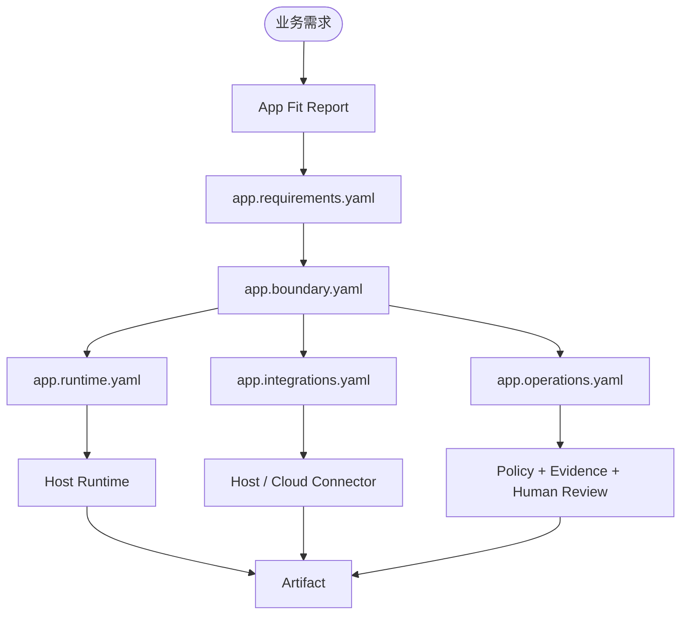

# 标准互操作

Agent App 不替代相邻标准。它把 Runtime、UI、Context、Knowledge、Skills、Tools / Connectors、Artifacts、Evidence、Policy、QC 和领域 profile 组合成一个可安装业务应用。

边界原则：**App 只声明组合和交付边界，不复制相邻标准的内部实现，也不把 Host / Cloud / Connector 的职责写进 App 包。**

## 信任模型

| 资产或标准 | 信任问题 | 运行行为 |
| --- | --- | --- |
| Agent Runtime | 任务执行、模型路由、tool 调用、session 和 checkpoint 是否受控？ | 由 Host 通过 `lime.agent` 执行；App 只声明 `app.runtime.yaml`。 |
| Agent UI | UI surface 是否在受控容器、Host Bridge 和权限边界内？ | 由 Host 注入主题、上下文和 capability handle。 |
| Agent Context | 上下文来源、预算、优先级和压缩是否可复现？ | Host 根据 entry / workflow 需求装配上下文。 |
| Agent Knowledge | 数据是否可信、新鲜、可溯源？ | 作为 fenced data 或检索上下文加载，不执行。 |
| Agent Skill | 工艺是否安全可执行、可复用？ | 经过 Skill 信任和权限检查后激活。 |
| Agent Tool / Connector | 外部能力是否授权、可审计、可回滚？ | 通过 Host / Cloud 托管的 connector、MCP、CLI、API 或 browser adapter 调用。 |
| Agent Artifact | 交付物 schema、viewer、导出和状态是否稳定？ | App 声明 artifact type，Host 保存和展示。 |
| Agent Evidence | 来源、trace、工具调用、审核和 replay 是否可追踪？ | Host 记录 evidence refs，App 展示和引用。 |
| Agent Policy | 权限、成本、风险、保留和租户规则是否被裁决？ | Host / Cloud 执行 policy；App 只能声明输入。 |
| Agent QC | 输出是否达到质量和验收门槛？ | 通过 evals、readiness、review gates 和报告体现。 |

## 引用模式

### Runtime

```yaml
requires:
  capabilities:
    - lime.agent
agentRuntime:
  agentTask:
    eventSchema: lime.agent-task-event.v1
    resultSchema: lime.agent-task-result.v1
    structuredOutput:
      type: json_schema
```

Runtime 是执行语义，不是 App 私有模型网关。App 不能直接绕过 Host 启动模型、工具或 MCP runtime。

### UI

```yaml
entries:
  - key: workspace
    kind: page
    title: 工作台
    route: /workspace
runtimePackage:
  ui:
    path: ./dist/ui
```

UI bundle 可以随包分发，但渲染、导航、下载、外链和 capability 调用仍由 Host Bridge 托管。

### Context

```yaml
metadata:
  contextHints:
    workspace: required
    sourceRecords: on_demand
    maxTokens: 12000
```

Context hints 只说明上下文需求；具体装配、预算、压缩和缺失上下文请求由 Host / Runtime 处理。

### Knowledge

```yaml
knowledgeTemplates:
  - key: project_knowledge
    standard: agentknowledge
    type: brand-product
    runtimeMode: retrieval
    required: true
```

Knowledge template 描述槽位，不包含私有事实。安装或 workspace setup 时，宿主把具体 Knowledge Pack 绑定到槽位。

### Skills

```yaml
skillRefs:
  - id: draft-review-rubric
    standard: agentskills
    activation: workflow
    required: true
```

Skill 是可复用工艺；App 可以引用或内置 Skill，但不能把整套 Skill 内容复制成 `APP.md` 正文。

### Tool / Connector

```yaml
integrations:
  - key: source_records
    provider: docs.table
    executionPlane: host
    hostCapability: lime.connectors
    adapter:
      kind: api
```

外部系统、MCP、CLI、API、browser adapter 都应由 Host / Cloud 托管。App 声明意图和 readiness，不直接保存凭证或执行外部副作用。

### Artifact / Evidence / Policy / QC

```yaml
artifactTypes:
  - key: content_draft
    standard: agentartifact

evals:
  - key: fact_grounding
    kind: quality
    evidenceRequired: true

permissions:
  - key: write_external_draft
    scope: tool
    access: write
```

Artifact 是交付物，Evidence 是可信链路，Policy 是裁决输入，QC 是验收门槛。它们不应该混在一个自由文本 prompt 中。

## v0.7 交接流程



## 常见错误

- 只声明少数资产类型，遗漏 Runtime、UI、Context、Tool、Artifact、Evidence、Policy、QC。
- 把外部系统适配写进 App 代码，而不是 connector / MCP / CLI / API adapter。
- 把私有事实写进官方包，而不是 Knowledge、workspace files、secrets 或 overlays。
- 把 runtime 执行语义放进 App 私有 worker，而不是 `lime.agent` / Host Runtime。
- 把 policy 和 QC 写成提示词，而不是稳定的 permission、operation、eval 和 evidence 规则。

## 检查表

- 每个 entry 都能说明需要哪些 Runtime、UI、Context、Knowledge、Skill、Tool 和 Artifact。
- 每个外部副作用都在 `app.operations.yaml` 中声明 approval、dry-run、idempotency 和 evidence。
- 每个外部系统都通过 `app.integrations.yaml` 和 Host / Cloud capability 进入。
- 每个私有事实都外置到 Knowledge、workspace files、secrets 或 overlays。
- Evidence 能串起 app entry、context、Knowledge source、Skill ID、Tool call、Artifact 和 QC verdict。
