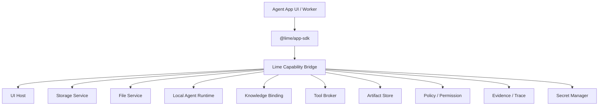

# Capability SDK

Capability SDK 是 Agent App 与 Lime 的稳定边界。它解决两个问题：

1. App 不重复实现 Lime 已有的文件、存储、任务、Artifact、Knowledge、Tool、Policy、Evidence。
2. Lime 底层升级时，App 只依赖版本化能力契约，不跟着内部实现大改。

## 架构



SDK 是 facade，不是 Lime 内部模块重导出。App 不能 import `lime/src/...`，只能请求 capability handle。

## 能力协商

安装时读取 manifest：

```yaml
requires:
  sdk: "@lime/app-sdk@^0.3.0"
  capabilities:
    lime.ui: "^0.3.0"
    lime.storage: "^0.3.0"
    lime.agent: "^0.3.0"
```

Host 决策：

| 结果 | 行为 |
| --- | --- |
| 全部满足 | 可以安装并启用。 |
| 可选能力缺失 | 安装但 readiness 显示降级。 |
| 必需能力缺失 | 阻止启用，提示升级 Lime 或禁用对应 entry。 |
| major 不兼容 | 阻止安装，给出兼容矩阵。 |

## Runtime 注入

App 运行时不携带宿主实现。Host 注入 capability handles：

```ts
const lime = await getLimeRuntime()
const table = lime.storage.table('content_assets')
const task = await lime.agent.startTask({ entry: 'batch_copy', input, idempotencyKey })
const hits = await lime.knowledge.search({ template: 'project_knowledge', query, topK: 8 })
const artifact = await lime.artifacts.create({ type: 'strategy_report', data: task.output })
await lime.evidence.record({ subject: artifact.id, sources: hits })
```

每个 handle 都应具备：

- appId / workspaceId / tenantId 上下文。
- permission 和 policy 拦截。
- provenance 自动附加。
- mock implementation，用于 App 单测。
- telemetry 和 evidence hook。

## App 作用域内的 Agent Task

`lime.agent` 是 App 使用 Lime Agent 的能力边界：它让 App 在自己的业务界面内调用智能任务，而不是把用户送回通用聊天框，也不是让 App 自建 Agent 基础设施。

`lime.agent.startTask(request)` 应该具备 App 作用域：

- `request.appId`、`entryKey`、`taskKind`、`idempotencyKey` 和业务上下文标识这个任务归哪个 App workflow 所有。
- `request.input` 传产品数据或引用，不暴露无边界的宿主内部对象。
- `request.expectedOutput` 描述 App 可写回的结构化结果，例如表格行、业务记录、报告段落或 artifact descriptor。
- `request.knowledge`、`tools`、`files` 和 `secrets` 是已声明的 capability binding，不是直接文件路径或明文凭证。
- 返回的任务暴露 `taskId`、`traceId`、流式事件、稳定错误码、取消、重试、成本策略、artifact 引用和 evidence 引用。

App 决定何时启动任务，以及如何把结构化结果应用到业务状态；Lime 决定 Agent 任务如何运行、哪些工具和知识可用、权限如何强制、trace / artifact / evidence 如何自动附加。

通用 Chat 和 Expert Chat 可以复用同一任务契约作为交互 surface，但不能成为 App 完成核心工作的唯一方式。

## Host Bridge 与 SDK Bridge

UI runtime 中的 `getLimeRuntime()` 可以由 Host Bridge 承载，但语义仍属于 Capability SDK。建议实现分两层：

1. `lime.agentApp.bridge`：跨 iframe / sandbox 的消息传输，负责 ready、snapshot、theme、toast、navigate、download 和 request / response。
2. `@lime/app-sdk`：App 可调用的 typed facade，负责把 `lime.storage.table()`、`lime.tools.invoke()` 等 API 转成标准 bridge 请求。

App 作者不应该直接手写私有 `postMessage` 协议。需要宿主能力时，优先调用 SDK；只有 `app:ready`、`host:getSnapshot` 这类 runtime 生命周期事件可以由轻量 bootstrap 直接发送。

Host 实现者必须保证：

- 所有 Host Bridge 消息都有 `protocol="lime.agentApp.bridge"` 和 `version=1`。
- 所有请求 / 响应通过 `requestId` 关联。
- 所有 capability 调用都经过 manifest 声明、entry readiness、permission 和 policy。
- 未开放能力返回稳定 blocked error，不写入假数据、不返回 mock 成功。
- 主题、语言、可见性和入口上下文是 Host 快照，不是 App 业务状态。

## v0.3 最小 typed API

Host 实现者至少要为这些调用提供类型、schema、mock 和 contract tests：

```ts
lime.ui.registerRoute(route)
lime.storage.table(name).get(id)
lime.storage.table(name).insert(record)
lime.files.read(ref)
lime.agent.startTask(request)
lime.knowledge.search(request)
lime.tools.invoke(request)
lime.artifacts.create(request)
lime.workflow.start(request)
lime.policy.requestPermission(request)
lime.secrets.getRef(key)
lime.evidence.record(event)
```

所有调用必须返回稳定错误码，并支持权限拒绝、取消、重试、超时、成本限制和 traceId。

## Capability 版本规则

- Major：允许破坏性变更，必须提供迁移指南。
- Minor：只新增能力，不破坏已有调用。
- Patch：修复 bug，不改变契约。
- Deprecated：至少保留两个 minor 版本或一个明确 LTS 窗口。
- Removed：只在 major 中移除。

## Host 实现者检查清单

- 每个 capability 都有 schema、TypeScript 类型、mock 和 contract tests。
- 所有调用都能关联 appId、entryId、taskId、workspaceId。
- 权限不只在 UI 提示，也在 runtime bridge 拦截。
- 底层服务替换不影响 SDK 契约。
- SDK 错误码稳定，App 可做降级处理。
- capability 调用默认记录 provenance 和 evidence。
