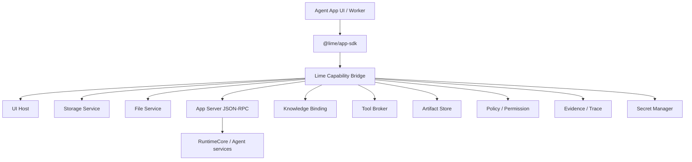

# Capability SDK

Capability SDK 是 Agent App 与 Lime 的稳定边界。它解决两个问题：

1. App 不重复实现 Lime 已有的文件、存储、任务、Artifact、Knowledge、Tool、Policy、Evidence。
2. Lime 底层升级时，App 只依赖版本化能力契约，不跟着内部实现大改。

## 架构



SDK 是 facade，不是 Lime 内部模块重导出。App 不能 import `lime/src/...`，只能请求 capability handle。

`lime.agent` / `lime.workflow` 的后端执行不在 SDK 内完成。桌面宿主应把 SDK 请求经 Host Bridge / Desktop Host IPC 投影到 App Server JSON-RPC，再进入 RuntimeCore / services。App 不能直接 import `app-server-client`、spawn sidecar、读取 JSONL transport 或持有 RuntimeCore 内部类型。

## 能力协商

安装时读取 manifest：

```yaml
requires:
  sdk: "@lime/app-sdk@^0.3.0"
  capabilities:
    lime.ui: "^0.3.0"
    lime.storage: "^0.3.0"
    lime.agent: "^0.3.0"
```

Host 决策：

| 结果 | 行为 |
| --- | --- |
| 全部满足 | 可以安装并启用。 |
| 可选能力缺失 | 安装但 readiness 显示降级。 |
| 必需能力缺失 | 阻止启用，提示升级 Lime 或禁用对应 entry。 |
| major 不兼容 | 阻止安装，给出兼容矩阵。 |

## Runtime 注入

App 运行时不携带宿主实现。Host 注入 capability handles：

```ts
const lime = await getLimeRuntime()
const table = lime.storage.table('content_assets')
const task = await lime.agent.startTask({ entry: 'batch_copy', input, idempotencyKey })
const hits = await lime.knowledge.search({ template: 'project_knowledge', query, topK: 8 })
const artifact = await lime.artifacts.create({ type: 'strategy_report', data: task.output })
await lime.evidence.record({ subject: artifact.id, sources: hits })
```

每个 handle 都应具备：

- appId / workspaceId / tenantId 上下文。
- permission 和 policy 拦截。
- provenance 自动附加。
- mock implementation，用于 App 单测。
- telemetry 和 evidence hook。

## 共享用户态与 App 自有服务

SDK 遵循类似小程序的边界：宿主共享用户态和平台能力，App 保留自己的产品代码、storage namespace 和后端服务。

App 可以读取 user id、workspace id、tenant id、locale、theme、有效模型 profile、billing entitlement 和 capability 可用状态等宿主 projection。这些是 projection，不是凭证。SDK 不得暴露 bearer token、refresh token、provider key、明文 secret、database handle、filesystem path、Electron 对象、Tauri command 或 RuntimeCore 内部类型。

App 自有后端服务使用与 UI、workflow code 相同的 SDK 契约。App 包内可以有 Python parser、Go report engine、Rust indexer、Node worker、Wasm transform 或远端服务，但它们请求 `lime.files`、`lime.storage`、`lime.agent`、`lime.artifacts`、`lime.secrets` 等能力时仍必须通过宿主中介的 handle。后端服务不得直接打开宿主数据库、读取 workspace 文件或获取 secret。

Storage 调用是逻辑 namespace 调用。宿主可以把它映射到每 App SQLite file、每 App database schema、独立 database 或共享 metadata table，但 App 只能看到 SDK namespace contract。

## App 作用域内的 Agent Task

`lime.agent` 是 App 使用 Lime Agent 的能力边界：它让 App 在自己的业务界面内调用智能任务，而不是把用户送回通用聊天框，也不是让 App 自建 Agent 基础设施。

`lime.agent.startTask(request)` 应该具备 App 作用域：

- `request.appId`、`entryKey`、`taskKind`、`idempotencyKey` 和业务上下文标识这个任务归哪个 App workflow 所有。
- `request.input` 传产品数据或引用，不暴露无边界的宿主内部对象。
- `request.expectedOutput` 描述 App 可写回的结构化结果，例如表格行、业务记录、报告段落或 artifact descriptor。
- `request.knowledge`、`tools`、`files` 和 `secrets` 是已声明的 capability binding，不是直接文件路径或明文凭证。
- 返回的任务暴露 `taskId`、`traceId`、流式事件、稳定错误码、取消、重试、成本策略、artifact 引用和 evidence 引用。

App 决定何时启动任务，以及如何把结构化结果应用到业务状态；Lime 决定 Agent 任务如何运行、哪些工具和知识可用、权限如何强制、trace / artifact / evidence 如何自动附加。

通用 Chat 和 Expert Chat 可以复用同一任务契约作为交互 surface，但不能成为 App 完成核心工作的唯一方式。

### `lime.agent` 到 App Server 的映射

支持 App Server bridge 的宿主应把 `lime.agent.startTask(request)` 投影为：

```text
agentSession/start
agentSession/turn/start
agentSession/event
agentSession/read
```

SDK 返回给 App 的 `taskId`、`traceId`、事件、artifact 引用和 evidence 引用是受控 projection。App 不感知 Electron IPC channel、Tauri command、JSON-RPC envelope、sidecar 路径或 provider API key。App Server 不可用时，SDK 必须返回稳定 blocked error，不能用 mock result 伪装成功。

## @limecloud/agent-app-runtime 包

Lime 宿主提供官方 JS SDK 包，App 开发者无需手写 postMessage 协议，也无需重复实现任何 Claw 能力。

### 安装与使用

该包从 Lime 宿主的 TypeScript SDK 编译而来，保持单一事实源。在 Lime 工作区内已通过 workspaces 可用：

```js
import {
  createLimeHostBridgeCapabilityInvoker,
  createLimeCoreCapabilityAdapters,
} from '@limecloud/agent-app-runtime';

// 初始化（在 App UI 的 iframe 内）
const invoker = createLimeHostBridgeCapabilityInvoker({
  appId: 'my-app',
  entryKey: 'dashboard',
});
const lime = createLimeCoreCapabilityAdapters({
  invoker,
  storageNamespace: 'my-app',
});

// 通知宿主 App 已就绪
invoker.sendReady();

// 监听宿主快照（主题、locale、capability 列表）
invoker.onHostSnapshot((snapshot) => {
  console.log('可用 capabilities:', snapshot.capabilities.available);
});
```

### 30 个 capability 命名空间

`createLimeCoreCapabilityAdapters` 返回对象覆盖全部已定义的 capability：

```js
// 示例调用
const task = await lime.agent.startTask({ taskKind, capabilityHints, input });
await lime.storage.set({ key: 'projects/p1', value: project });
const hits = await lime.knowledge.search({ query: '竞品分析' });
await lime.artifacts.create({ kind: 'strategy_report', title: '策略报告', content });
await lime.evidence.record({ kind: 'fact_grounding', message: '已保存', refs: [taskId] });
```

覆盖的 capability 包括：`lime.ui` / `lime.storage` / `lime.files` / `lime.agent` / `lime.knowledge` / `lime.tools` / `lime.artifacts` / `lime.workflow` / `lime.policy` / `lime.secrets` / `lime.evidence` / `lime.events` / `lime.capabilities` / `lime.models` / `lime.usage` / `lime.memory` / `lime.skills` / `lime.mcp` / `lime.browser` / `lime.search` / `lime.documents` / `lime.media` / `lime.terminal` / `lime.tasks` / `lime.settings` / `lime.workspace` / `lime.context` / `lime.connectors` / `lime.automation` / `lime.review`

### Capability API 约定

| 参数 | 说明 |
|---|---|
| 第一个参数 | `input` — 请求对象，无参方法传 `{}` 或省略 |
| 第二个参数 | `options` — 可选，支持 `provenance`、`idempotencyKey` 等 |
| 返回值 | `Promise<value>` — 失败时抛 `LimeCapabilityAdapterError` |

`LimeCapabilityAdapterError` 携带 `code`、`causeCode`、`capability`、`method` 字段，可用于稳定错误处理。


UI runtime 中的 `getLimeRuntime()` 可以由 Host Bridge 承载，但语义仍属于 Capability SDK。建议实现分两层：

1. `lime.agentApp.bridge`：跨 iframe / sandbox 的消息传输，负责 ready、snapshot、theme、toast、navigate、download 和 request / response。
2. `@lime/app-sdk`：App 可调用的 typed facade，负责把 `lime.storage.table()`、`lime.tools.invoke()` 等 API 转成标准 bridge 请求。

App 作者不应该直接手写私有 `postMessage` 协议。需要宿主能力时，优先调用 SDK；只有 `app:ready`、`host:getSnapshot` 这类 runtime 生命周期事件可以由轻量 bootstrap 直接发送。

主题同步也属于 SDK 边界，而不是业务 App 的页面逻辑。Host 负责通过 `host:snapshot` 和 `theme:update` 发送 `lime.ui` 主题快照；App 侧必须使用 SDK helper 应用主题，不应该在每个 App 中重复解析 `theme.tokens`、猜测 Lime 主题或读取外层 DOM。

```js
import {
  createLimeHostBridgeCapabilityInvoker,
  syncLimeHostTheme,
} from '@limecloud/agent-app-runtime';

const invoker = createLimeHostBridgeCapabilityInvoker({
  appId: 'my-app',
  entryKey: 'dashboard',
});

const stopThemeSync = syncLimeHostTheme(invoker);
```

如果 App 需要处理一次性的宿主快照或测试数据，应使用 `applyLimeHostTheme(payload)`。该 helper 只应用受支持的 `--lime-*` 和 `--app-*` CSS 变量，并维护 `data-lime-theme`、`data-lime-theme-effective` 和 `data-lime-color-scheme`。业务 App 只消费这些 CSS 变量来定义自己的视觉 token。

桌面共享能力也遵循同一规则。模型设置、云端会话、OEM 品牌、billing 和 App 更新都是宿主能力，通过 `lime.modelSettings`、`lime.cloudSession`、`lime.branding`、`lime.billing`、`lime.appUpdates` 等 SDK handle 暴露。业务 App 可以读取有效投影或请求 setup，但不得把宿主会话、全局模型配置、billing 账本或更新状态保存为 App 私有事实。

Host 实现者必须保证：

- 所有 Host Bridge 消息都有 `protocol="lime.agentApp.bridge"` 和 `version=1`。
- 所有请求 / 响应通过 `requestId` 关联。
- 所有 capability 调用都经过 manifest 声明、entry readiness、permission 和 policy。
- 未开放能力返回稳定 blocked error，不写入假数据、不返回 mock 成功。
- 主题、语言、可见性和入口上下文是 Host 快照，不是 App 业务状态。

## 最小 typed API

Host 实现者至少要为这些调用提供类型、schema、mock 和 contract tests：

```ts
lime.ui.registerRoute(route)
lime.storage.set({ key, value })
lime.storage.get({ key })
lime.files.readRef(ref)
lime.agent.startTask(request)
lime.knowledge.search(request)
lime.tools.invoke(request)
lime.artifacts.create({ kind, title, content })
lime.workflow.start(request)
lime.policy.requestPermission(request)
lime.secrets.getRef({ key })
lime.evidence.record({ kind, message, refs })
```

所有调用必须返回稳定错误码，并支持权限拒绝、取消、重试、超时、成本限制和 traceId。

## Capability 版本规则

- Major：允许破坏性变更，必须提供迁移指南。
- Minor：只新增能力，不破坏已有调用。
- Patch：修复 bug，不改变契约。
- Deprecated：至少保留两个 minor 版本或一个明确 LTS 窗口。
- Removed：只在 major 中移除。

## Host 实现者检查清单

- 每个 capability 都有 schema、TypeScript 类型、mock 和 contract tests。
- 所有调用都能关联 appId、entryId、taskId、workspaceId。
- 权限不只在 UI 提示，也在 runtime bridge 拦截。
- 底层服务替换不影响 SDK 契约。
- SDK 错误码稳定，App 可做降级处理。
- capability 调用默认记录 provenance 和 evidence。
