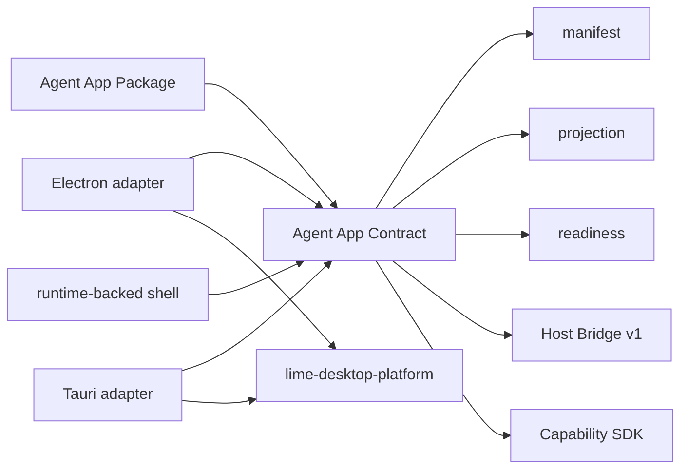
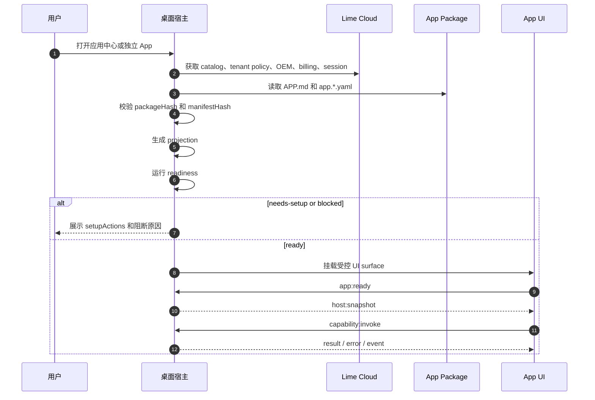

# 桌面宿主一致性

本页定义桌面宿主如何符合 Agent App 标准。它不是 `lime-desktop-platform` 的产品 PRD，也不是某个业务 App 的实现说明；它只规定一个桌面宿主必须怎样安装、投影、检查、运行和治理 Agent App。

事实源关系：

- `agentapp` 是 Agent App 标准事实源。
- `lime-desktop-platform` 是标准桌面宿主实现之一。
- `content-studio`、`zhongcao` 和 OEM App 是 Agent App 消费者；`lime-desktop-platform/samples/platform-conformance` 是宿主一致性 reference fixture。
- Electron 和 Tauri 可以有不同 adapter，但必须共享同一组 manifest、projection、readiness、Host Bridge、Capability SDK 和 App Server bridge 语义。

## 一致性等级

| 等级 | 宿主能力 | 不允许做什么 |
| --- | --- | --- |
| Desktop P0 | 读取 package、校验 hash、生成 projection、运行 readiness。 | 不执行 App UI、worker 或 workflow。 |
| Desktop P1 | 显示应用中心、安装状态、setup tasks、blocked / needs-setup。 | 不把 blocked 伪装成成功。 |
| Desktop P2 | 注入 Host Bridge 和 Capability SDK，运行受控 UI。 | 不暴露 Electron、Tauri、Node、Rust 或文件系统内部 API。 |
| Desktop P3 | 提供模型设置、OAuth 会话、OEM、billing、更新和本地 evidence 投影。 | 不把这些平台能力做成 App 私有实现。 |
| Desktop P4 | 支持多个 App 共用同一宿主能力，并能卸载、禁用、更新和回滚。 | 不让单个 App 特化污染宿主核心。 |
| Desktop P5 | 同协议迁移到 Tauri 或 runtime-backed shell，并保持 App Server JSON-RPC / RuntimeCore 事实源不变。 | 不为不同技术栈发明第二套标准或第二套 Agent runtime。 |

## 桌面宿主必须实现

| 标准能力 | 宿主职责 | App 看到什么 |
| --- | --- | --- |
| Discovery | 发现本地目录、registry 条目、OEM bootstrap 或开发 fixture。 | 可安装 App 列表。 |
| Verification | 校验 package hash、manifest hash、签名和版本兼容。 | 安装审查结果。 |
| Projection | 不执行代码，生成 catalog card、entry、capability preview 和 provenance。 | 应用中心和入口卡片。 |
| Readiness | 检查宿主版本、capability、会话、模型、secret、billing 和 policy。 | `ready` / `needs-setup` / `blocked`。 |
| Host Bridge | 使用 `lime.agentApp.bridge` v1 传输 host snapshot、主题、语言、导航和 capability 调用。 | SDK bridge 和生命周期事件。 |
| Capability SDK | 注入 `lime.*` handles，并由宿主裁决权限。 | 受控平台能力。 |
| App Server bridge | 宿主持有 App Server client，经 Desktop Host IPC 把 `lime.agent` / `lime.workflow` 投影到 JSON-RPC。 | App 只看到 SDK task、事件和产物 projection。 |
| Storage / Artifacts / Evidence | 按 app namespace 隔离数据、产物、日志和证据。 | 可追溯业务状态。 |
| Cleanup | 支持 disable、uninstall keep data、uninstall delete data、export then delete。 | 可恢复或可删除的 App 生命周期。 |

## 平台级共享能力

桌面宿主可以提供这些通用能力，但必须通过 Capability SDK 或 Host Bridge 暴露，不能要求业务 App 直接 import 宿主内部模块。

| 能力 | 建议 capability | 边界 |
| --- | --- | --- |
| 模型设置 | `lime.modelSettings` | App 读取有效配置或请求 setup，不直接保存全局模型设置。 |
| OAuth / 会话 | `lime.cloudSession` | snapshot 不含 bearer token；token 只能 just-in-time 获取。 |
| OEM / 品牌 | `lime.branding` / `lime.ui` | Host 投影品牌、主题和壳层文案；App 只消费 token。 |
| 充值 / 订阅 | `lime.billing` | Host 投影租户状态；App 不维护账本真相。 |
| 更新 / 分发 | `lime.appUpdates` | Host 检查 release、下载、切换和回滚；App 不自建更新器。 |
| 权限与策略 | `lime.policy` | 高风险动作必须有人审或 policy 通过。 |
| Evidence | `lime.evidence` | 所有关键运行和外部副作用都要留 provenance。 |

这些 capability 名称可以在未来 minor 版本中细化，但语义必须保持：App 请求能力，Host / Cloud 负责治理，业务事实留在 App 或外部系统。

## Electron 和 Tauri 的关系



Electron adapter 可以使用 `ipcMain`、`preload`、`BrowserView` 或 WebView。Tauri adapter 可以使用 Rust commands、WebView IPC 和系统 runtime。两者的实现细节不同，但 App 不应该感知这些差异。

桌面 Agent 执行推荐链路固定为：

```text
App UI / Worker
  -> Host Bridge / Capability SDK
  -> Electron ipcMain / preload 或 Tauri WebView IPC
  -> App Server client
  -> App Server JSON-RPC
  -> RuntimeCore / services
  -> ExecutionBackend
```

宿主实现约束：

- Electron / Tauri adapter 只负责桌面壳能力、IPC 白名单、sidecar lifecycle 和 renderer-safe projection。
- App Server client 由宿主 main process 或等价可信进程持有，renderer / iframe 不直接连接 sidecar。
- `initialize -> initialized` 是每条 App Server transport 的必需门禁。
- `agentSession/event` 是任务事件公共入口；App UI 不能用本地状态伪造 runtime 成功。
- App Server 不可用时返回 blocked / host:error；生产路径不能回退 mock。

## 启动流程



## Host snapshot 最低字段

Host snapshot 可以包含：

- app id、entry key、route、install mode。
- locale、timezone、workspace id、tenant id 的非敏感摘要。
- theme mode、effective theme、CSS variables。
- capability profile 摘要。
- readiness state 和 setup findings 摘要。
- cloud session presence、control-plane base URL 和 tenant context。
- billing、branding、model settings 的非敏感版本或状态。

Host snapshot 不得包含：

- bearer token。
- 明文 secret。
- 用户私有文件内容。
- 原始 billing 账本。
- 宿主内部路径、Electron 对象、Tauri command 名称或 Rust struct。

## Readiness 状态规则

| 状态 | 含义 | UI 要求 |
| --- | --- | --- |
| `ready` | 可以启动当前 entry。 | 主操作可用。 |
| `needs-setup` | 用户或管理员可以补齐配置。 | 展示 setupActions。 |
| `blocked` | 当前环境不能运行或不兼容。 | 展示原因，不允许启动。 |
| `disabled` | 管理员或 policy 隐藏入口。 | 入口可见性受控。 |

`blocked` 和 `needs-setup` 是用户可见状态，不是内部日志。宿主必须能解释哪个 capability、policy、secret、billing、model 或 host version 导致失败。

## 存储边界

桌面宿主应区分：

| 范围 | 保存内容 | 示例 |
| --- | --- | --- |
| App package cache | 官方包、hash、signature、projection cache。 | 安装目录或下载缓存。 |
| App namespace | app-local storage、workflow state、artifact refs。 | `appId` 命名空间。 |
| Workspace | 用户可迁移业务数据和 App 输出。 | workspace 文件、artifacts。 |
| User data | 会话、安全缓存、宿主偏好、下载缓存。 | OS `userData`。 |
| Cloud | registry、tenant policy、OAuth、billing、OEM。 | Lime Cloud 控制面。 |

App 不得把平台会话、全局模型设置、billing 账本或 OEM 权威配置复制进自己的持久状态。

## `lime-desktop-platform` 的定位

`lime-desktop-platform` 可以作为 Lime 组织的标准桌面宿主实现，但不能改变 Agent App 标准本身。

它应该实现：

- 应用中心。
- App 安装、投影、readiness、启动、禁用、卸载和更新。
- Host Bridge v1。
- Capability SDK adapter。
- 模型设置、OAuth、OEM、billing、更新和平台设置的宿主投影。
- 开发者诊断页。
- Electron first adapter。
- Tauri adapter 兼容计划。

它不应该实现：

- `content-studio` 的内容生产流程。
- `zhongcao` 或其他示例的领域业务逻辑。
- 垂直发布平台的业务操作代理。
- 私有模型网关绕过标准 capability。
- 与 Agent App 标准冲突的第二套 manifest、projection、readiness 或 bridge。

## 一致性检查清单

- [ ] 同一 package 在同一 host profile 下 projection 稳定。
- [ ] 执行 App 代码前完成 verification、projection 和 readiness。
- [ ] Host Bridge 消息包含 `protocol="lime.agentApp.bridge"` 和 `version=1`。
- [ ] App 只能通过 Capability SDK 调宿主能力。
- [ ] 声明 `agentRuntime.bridge.kind=app-server-json-rpc` 的 App 经 Desktop Host IPC 进入 App Server JSON-RPC。
- [ ] App Server transport 完成 `initialize -> initialized` 后才允许业务方法。
- [ ] `agentSession/event`、`artifact/read` 和 `evidence/export` 由 RuntimeCore / services facts 派生，不由 App UI 合成。
- [ ] `lime.cloudSession` snapshot 不泄露 token。
- [ ] 模型设置、OAuth、OEM、billing 和更新是平台能力，不是 App 私有状态。
- [ ] blocked / needs-setup 可见并可恢复或解释。
- [ ] App 数据、artifact、evidence 和日志有 namespace。
- [ ] disable / uninstall / update 不破坏其他 App。
- [ ] Electron 和 Tauri adapter 共享同一契约。
