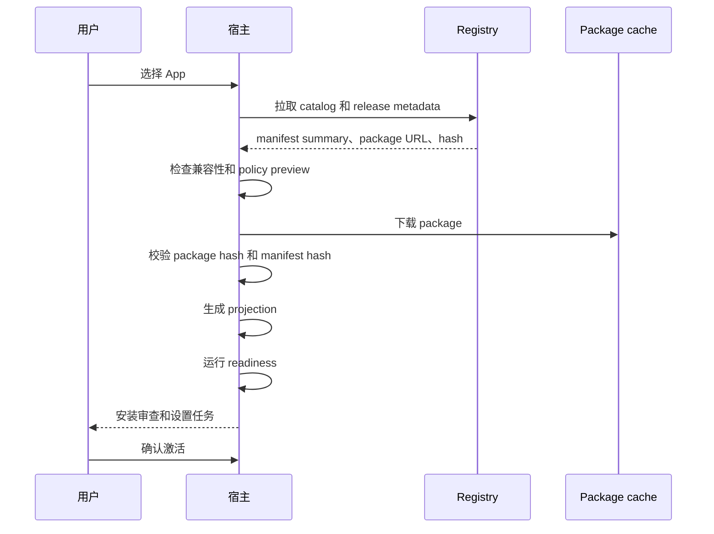

# 发现与安装

安装不是执行。宿主应该先发现和校验 Agent App，再创建运行状态或暴露可执行 entry。

## 发现来源

宿主可以从以下来源发现 App：

- 包含 `APP.md` 的本地目录
- registry catalog item
- tenant bootstrap payload
- private package URL
- development fixture

所有来源都应收敛到同一个 package identity 和 manifest parser。

## 安装阶段

## Package identity

Package identity 应包含 app name、package version、manifest version、source URI、package hash、manifest hash、installed timestamp、release channel 或 tenant enablement ref。

这个 identity 会附加到 projection、runtime run、artifact、evidence 和 cleanup plan。

## 先投影，再激活

Projection 把 manifest 编译成宿主对象：entry、card、workflow descriptor、permission、setup task。Projection 不能调用模型、Tool、读取客户数据或执行 package 代码。

Projection 是安全的安装审查输入。

## 先 Readiness，再运行

Readiness 会识别 blocker：宿主版本不支持、缺必需 capability、未绑定 Knowledge、Tool 不可用、secret 未绑定、permission denied、migration 风险等。

## 激活

激活应在安装审查和 readiness 后进行。宿主可以在缺少可选项时允许部分激活。

激活可以暴露 app dashboard、command palette entry、workflow start、artifact viewer、background task schedule、settings page。不要自动运行长 workflow，除非用户或租户 policy 明确允许。

## 更新流程

更新时宿主应：校验新 release、比较 manifest 和 capability、生成 migration plan、保留用户数据 / overlay / secret / artifact、重新运行 readiness、允许 rollback 或 disable。

## 卸载状态

| 状态 | 行为 |
| --- | --- |
| Disable only | 隐藏 entry，保留 package 和数据。 |
| Uninstall keep data | 删除 package 和 projection，保留 storage 和 artifacts。 |
| Uninstall delete data | 删除 package、projection、storage、artifacts、evidence、logs。 |
| Export then delete | 删除前导出用户数据。 |

## 实现检查表

- local 和 registry app 使用同一 parser。
- 校验 package 和 manifest hash。
- 激活前先 projection。
- readiness 不执行 app code。
- 安装审查展示权限和数据边界。
- 首次安装就建立 app namespace。
- 真实 runtime 前已经有 uninstall plan。
