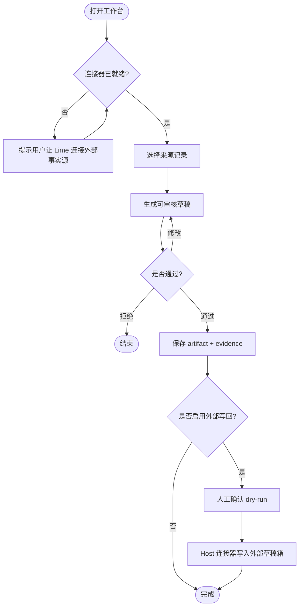

# 轻量内容运营工作台

这是一个脱敏 v0.7 示例，用常见内容运营流程说明：Agent App 能做什么，哪些需要 Lime Host、Lime Cloud、连接器、外部系统和人工决策配合。

参考包：[`docs/examples/lightweight-content-ops-app/APP.md`](../../examples/lightweight-content-ops-app/APP.md)

## 普通用户流程



## v0.7 文件

| 文件 | 用途 |
| --- | --- |
| `app.requirements.yaml` | MVP、非目标、后续阶段和验收标准。 |
| `app.boundary.yaml` | App / Host / Cloud / connector / external system / human 职责边界。 |
| `app.integrations.yaml` | Host/Cloud 托管的 `source_records` 和可选 `draftbox` 连接。 |
| `app.operations.yaml` | 副作用、审批、dry-run、幂等和 evidence 规则。 |

## 边界摘要

- App 负责工作台 UI、草稿审核流程、内容草稿 Artifact 和交接状态。
- Host 负责本地 Agent 执行、连接器调用、凭证、策略、沙箱和 evidence。
- Cloud 可负责 connector registry、tenant policy、OAuth broker、webhook 或 scheduled sync。
- 外部系统负责来源记录和可选草稿箱记录。
- 人工负责写回、发布、删除或批量更新前的确认。

## 本地验证

```bash
npm run cli -- validate docs/examples/lightweight-content-ops-app --version 0.7
npm run cli -- project docs/examples/lightweight-content-ops-app
npm run cli -- readiness docs/examples/lightweight-content-ops-app
```
