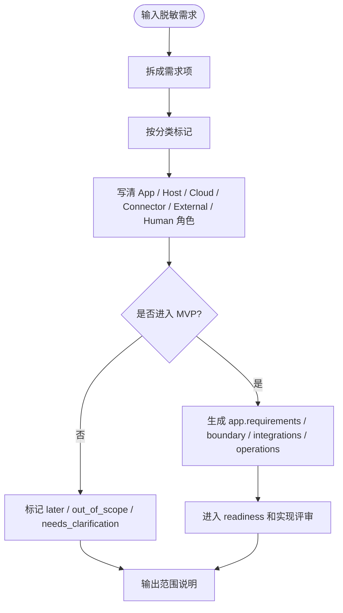

# App Fit Report

App Fit Report 是 v0.7 的方案阶段报告。它把自然语言业务需求拆成可交付边界，让团队先知道：哪些可以做成 Agent App，哪些需要 Lime Host，哪些需要 Lime Cloud，哪些需要 connector 或外部系统配合，哪些必须保留人工决策。

## 适配流程



## 分类枚举

| 分类 | 含义 |
| --- | --- |
| `APP_EXPERIENCE` | App 页面、面板、入口、看板、表单或普通用户可见体验。 |
| `APP_WORKFLOW` | App 内部业务流程、状态机、artifact 生成或人工审核节点。 |
| `HOST_CAPABILITY` | 需要本地 Host 提供 Agent、MCP、CLI、tools、文件、sandbox、secrets 或 evidence。 |
| `CLOUD_CAPABILITY` | 需要 Lime Cloud 提供 registry、tenant policy、OAuth、webhook、scheduled sync 或团队治理。 |
| `CONNECTOR_ADAPTER` | 需要外部系统适配器，如 API、MCP server、CLI adapter、browser adapter。 |
| `EXTERNAL_SYSTEM` | 事实源或最终写入状态仍属于外部系统。 |
| `HUMAN_DECISION` | 需要人工审核、发布确认、风险例外或最终业务判断。 |
| `LATER_PHASE` | 可以后续阶段做，不进入当前 MVP。 |
| `OUT_OF_SCOPE` | 不属于 Agent App 标准或本次交付范围。 |
| `NEEDS_CLARIFICATION` | 缺少关键业务、权限、数据或验收信息。 |

## 最小示例

```json
{
  "appFitReport": {
    "requirementSource": {
      "kind": "sanitized_business_request",
      "confidential": false
    },
    "recommendedApp": {
      "name": "lightweight-content-ops-app",
      "appType": "domain-app"
    },
    "requirementItems": [
      {
        "id": "R001",
        "text": "普通用户在工作台中完成素材整理、草稿生成和审核",
        "classification": ["APP_EXPERIENCE", "APP_WORKFLOW"],
        "appRole": "提供工作台、流程状态和 artifact",
        "mvp": true,
        "risk": "low"
      },
      {
        "id": "R002",
        "text": "读取外部表格或文档作为事实源",
        "classification": ["HOST_CAPABILITY", "CONNECTOR_ADAPTER", "EXTERNAL_SYSTEM"],
        "hostRole": "托管连接器和授权",
        "connectorRole": "适配外部表格或文档 API",
        "externalSystemRole": "保留事实源状态",
        "mvp": true,
        "risk": "medium"
      },
      {
        "id": "R003",
        "text": "一键发布到外部渠道",
        "classification": ["CONNECTOR_ADAPTER", "HUMAN_DECISION", "LATER_PHASE"],
        "humanRole": "发布前最终确认",
        "mvp": false,
        "risk": "high"
      }
    ]
  }
}
```

## 使用原则

- 先写 Fit Report，再写 App 包；不要把模糊需求直接塞进 workflow。
- 报告只能使用脱敏需求，不写真实主体名称、项目代号、真实账号、私有链接或合同信息。
- `OUT_OF_SCOPE` 不是拒绝客户，而是说明需要外部系统、云服务或人工流程配合。
- 如果一个需求同时跨多个平面，必须明确每个平面负责什么、验收什么、失败时谁处理。

