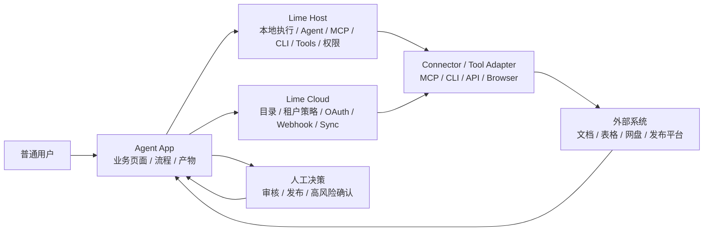
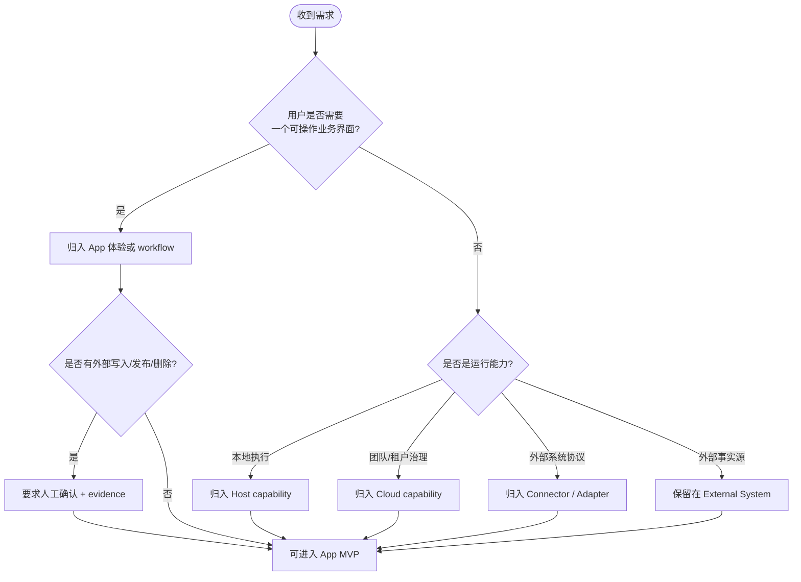

# 职责边界

v0.7 的核心问题不是“这个需求能不能用 AI 做”，而是“这个需求应该由哪个平面负责”。Agent App 负责业务体验和流程编排；Lime Host、Lime Cloud、connector、外部系统和人工决策分别提供运行、治理、连接、事实源和风险确认。

## 边界总览

## 分工表

| 平面 | 应该负责 | 不应该负责 |
| --- | --- | --- |
| Agent App | 用户界面、业务 workflow、App 状态、Artifact、Review、验收规则 | 凭证托管、直接启动 MCP/CLI、绕过 Host 权限、直接接管外部系统 |
| Lime Host | 本地 AgentRuntime、MCP、CLI、tools、文件、sandbox、用户确认、本地 evidence | 垂直业务规则、客户私有流程、厂商专属适配硬编码 |
| Lime Cloud | Registry、tenant policy、OAuth broker、webhook、scheduled sync、团队治理 | 默认执行本地 Agent task、承载客户业务实现、接管非核心厂商逻辑 |
| Connector / Tool Adapter | 外部系统协议适配、字段映射、读写动作、错误翻译 | 业务产品体验、租户策略最终裁决、明文凭证保存 |
| External System | 事实源、第三方状态、发布平台、已有业务系统 | Agent App 内部状态、Lime 权限模型 |
| Human | 高风险决策、最终审核、发布确认、例外处理 | 重复性机械执行、已声明可自动化的低风险动作 |

## 判断顺序

## 标准规则

- App **必须**在执行前声明外部副作用、依赖连接、验收条件和非目标。
- Host / Cloud **必须**托管 MCP、CLI、tools、凭证、策略、授权和 evidence 相关执行。
- App **不得**保存第三方明文凭证。
- App **不得**直接启动 MCP server、CLI 或 tool runtime。
- App **不得**默认自动执行发布、删除、批量更新等高风险动作。
- 非 Lime 核心厂商适配应作为 connector package、MCP server、CLI adapter、browser adapter 或 customer overlay 接入。

