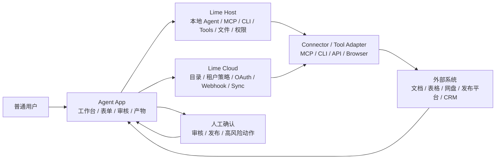
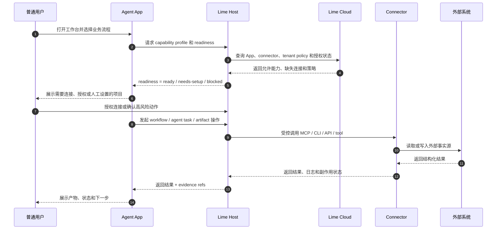
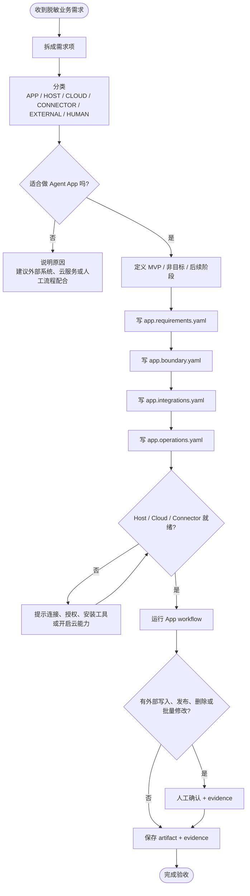
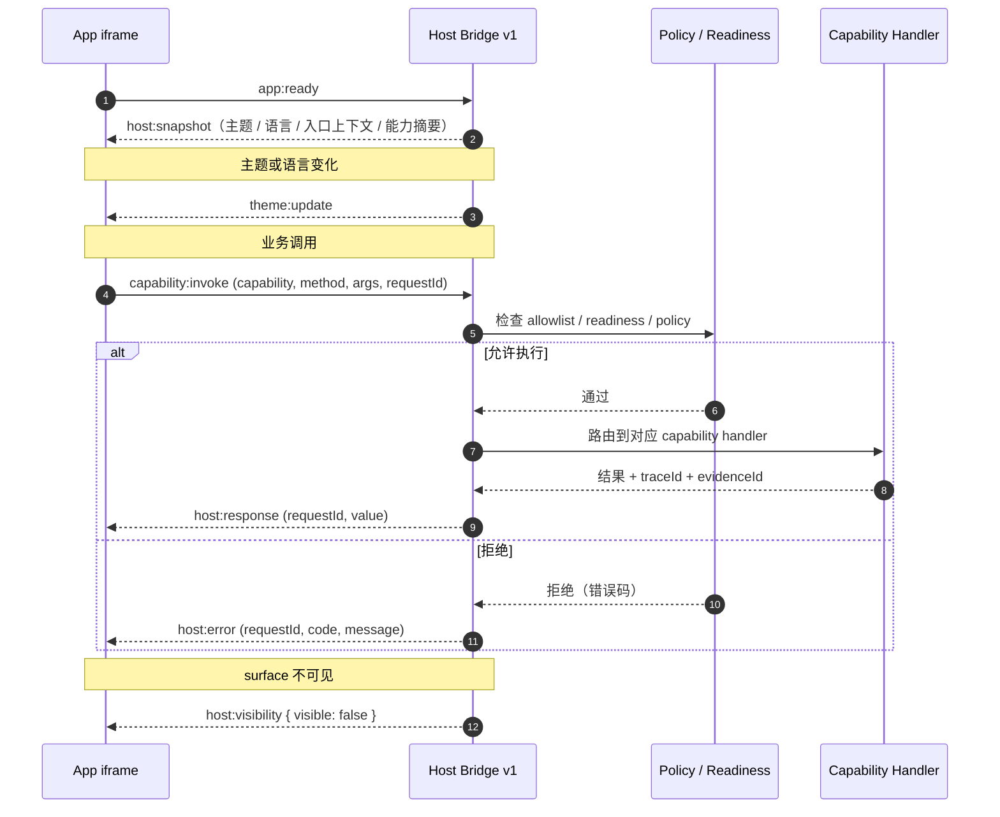
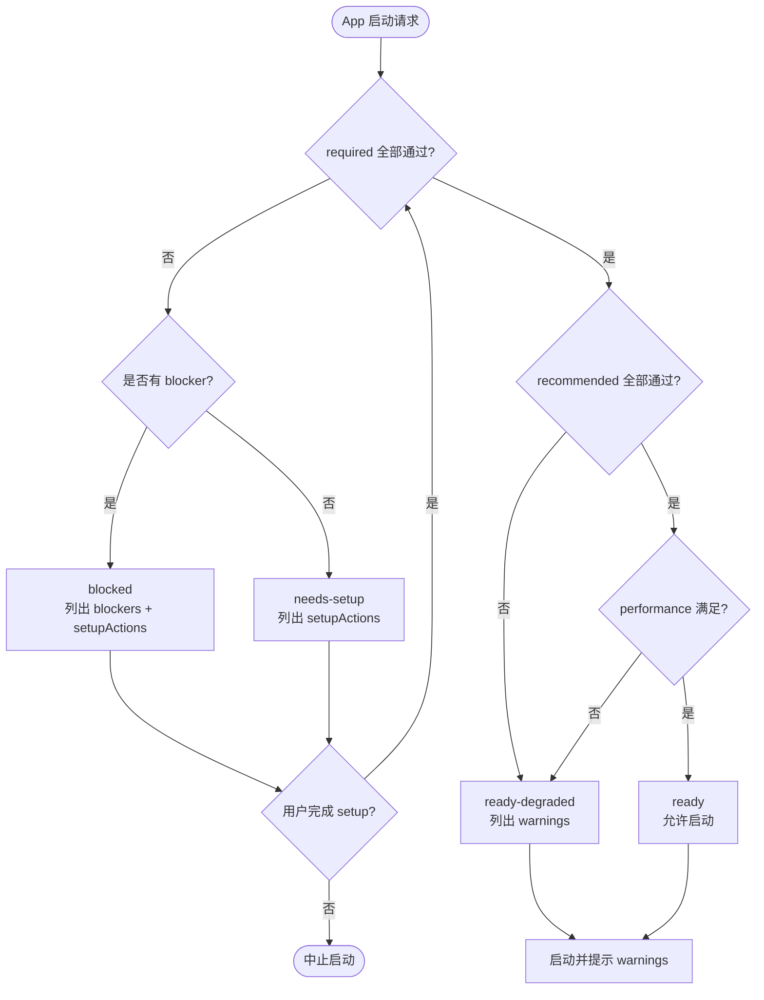

# 规范

Agent App 定义安装到 Agent 宿主中的完整智能应用包。它不是一个 Markdown prompt，也不是单个对话专家；它可以包含真实 UI bundle、worker / service 代码、数据模型、迁移脚本、业务 workflow、Agent entries、Runtime 意图、Context 需求、Knowledge 绑定、Skill 引用、Tool / Connector 需求、Artifacts、Evidence、Policies、QC 和 Evals。

`APP.md` 仍然是必需发现入口：宿主先通过它读取 manifest、说明和渐进加载线索。但 `APP.md` 只负责声明和指南，不负责承载业务系统实现。真实功能必须由 App 包内的 runtime package 和 Lime Capability SDK 调用完成。

当前协议组合 task runtime control plane、Requirement Boundary & Capability Handoff、Standalone Installation & Runtime Separation 与明确的 **App Server Bridge Profile**：App 必须能把业务需求拆成 App、Host、Cloud、Connector、外部系统和人工决策的责任边界，同时声明它是安装到 Lime Desktop、作为独立品牌 App、复用系统 Lime Runtime，还是运行在兼容 Web Host 中，声明 App 面 Agent task 如何映射到 Desktop Host IPC、App Server JSON-RPC、RuntimeCore services 和 execution backend，并遵循类似小程序的宿主模型：用户态和平台能力由宿主共享，App 私有存储和 App 后端能力保持隔离。

> 项目级的标准架构图、安装时序图、Host Bridge 时序图、Readiness 流程图、Workflow 状态机集中在 [架构概览](./architecture) 中，本规范只保留与具体章节绑定的图。

## 设计目标

1. 让真实业务应用可以安装到 Lime，而不是把业务分支写进 Lime Core。
2. 让 App 调用 Lime 平台能力，但不依赖 Lime 内部实现细节。
3. 让 UI、存储、后台任务、Artifact、Agent Runtime、Knowledge 和 Tools 都通过稳定 Capability SDK 访问。
4. 让 Cloud 负责 catalog、release、license、tenant enablement 和 gateway，不成为隐藏 Agent Runtime。
5. 让客户数据、凭证和租户差异留在 workspace、Agent Knowledge、secrets 或 overlay 中，不进入官方包。
6. 让每个 projected entry、task、tool call、artifact、eval 和 evidence 都带 App provenance。
7. 让 Agent App 可以成为独立产品，不把 Lime Desktop 变成所有用户的强制入口。
8. 让 App 共享宿主管控的用户态和平台能力，但不泄露 token、secret、宿主数据库或内部路径。
9. 允许 App 携带多语言后端服务，同时保证这些服务仍在宿主管控和 capability policy 内运行。

## 标准分层

```text
Lime Runtime Core
  Governed services: UI / Storage / Files / Agent Runtime / Tool Broker / Knowledge / Artifact / Policy / Evidence / Secrets
    ↑ 被 Lime Desktop / Lime App Shell / runtime-backed shell / 兼容 Web Host 复用
    ↓ Capability Bridge
@lime/app-sdk
  稳定、版本化、可授权、可 mock 的能力门面
    ↓
Agent App Runtime Package
  UI bundle / workers / workflows / storage schema / migrations / business code / agent entries
```

App 不得 import Lime 内部模块，不得绕过 host services 直接读写系统资源。所有能力都必须通过 SDK 或宿主注入的 capability handle 调用。

## 包结构

```text
app-name/
├── APP.md                    # 必需：discovery manifest + 应用指南
├── app.manifest.json         # 可选：机器可读 manifest 分离文件
├── app.capabilities.yaml     # 可选：详细能力配置
├── app.entries.yaml          # 可选：入口配置
├── app.permissions.yaml      # 可选：权限配置
├── app.errors.yaml           # 可选：标准化错误码
├── app.i18n.yaml             # 可选：多语言配置
├── app.signature.yaml        # 可选：签名和信任链
├── app.runtime.yaml          # 可选：lime.agent task runtime control plane 和 App Server bridge profile
├── app.requirements.yaml     # 可选：需求项、MVP、非目标、验收标准
├── app.boundary.yaml         # 可选：App / Host / Cloud / Connector / External / Human 边界
├── app.integrations.yaml     # 可选：Host/Cloud 托管的外部集成需求
├── app.operations.yaml       # 可选：操作副作用、审批、dry-run、evidence
├── app.install.yaml          # 可选：Lime 内安装、独立安装、runtime-backed 安装模式
├── dist/
│   ├── ui/                   # 可选：真实 UI bundle、route manifest、assets
│   ├── worker/               # 可选：业务 worker、后台任务、long-running job
│   └── tools/                # 可选：随包工具适配器；仍由 Tool Broker 授权执行
├── services/                 # 可选：App 自有后端服务，可为多语言实现
├── storage/
│   ├── schema.json           # 可选：App namespace 下的数据模型
│   └── migrations/           # 可选：版本化迁移脚本
├── workflows/                # 可选：业务 workflow / state machine / human review 节点
├── agents/                   # 可选：expert-chat persona、对话入口说明
├── skills/                   # 标准化：内置 Agent Skill 包（含 SKILL.md）
├── knowledge-templates/      # 可选：Agent Knowledge 绑定槽位模板
├── artifacts/                # 可选：Artifact schema、viewer、exporter、示例
├── evals/                    # 可选：质量门禁、readiness、回归 fixture
│   ├── readiness.yaml        # 可选：自检模型
│   └── health.yaml           # 可选：运行时健康检查
├── policies/                 # 可选：权限、数据边界、成本和风险策略
├── locales/                  # 可选：多语言翻译文件
├── assets/                   # 可选：图标、截图、模板、样例媒体
└── examples/                 # 可选：样板 workspace、输入、输出、回放
```

只有 `APP.md` 必需。兼容宿主必须先读取 `APP.md` 和 catalog metadata，再按用户动作、readiness、权限和能力版本渐进加载 runtime package。

分层配置原则：`APP.md` 只承载发现元数据和人类可读指南，复杂配置（capabilities、entries、permissions、errors、i18n、signature、Agent task runtime contracts、App Server bridge profile、需求边界、外部集成、操作副作用和安装模式）按需放入独立 `app.*.yaml` 文件，避免 frontmatter 膨胀。

## `APP.md`

`APP.md` 必须包含 YAML frontmatter 和 Markdown 指南。

frontmatter 是安装和投影的机器入口；Markdown 正文给人、AI 客户端和审核者读取：这个 App 解决什么问题、如何 setup、哪些能力是必需、哪些数据不能打包、如何验收。

### 必需字段

| 字段 | 约束 |
| --- | --- |
| `name` | 1-64 字符；建议 lowercase kebab-case；建议匹配目录名。 |
| `description` | 1-1024 字符；描述用户价值和激活场景。 |
| `version` | App 包版本；正式发布建议 SemVer。 |
| `status` | `draft`、`ready`、`needs-review`、`deprecated` 或 `archived`。 |
| `appType` | `agent-app`、`workflow-app`、`domain-app`、`customer-app` 或 `custom`。 |

### 开放平台元数据

面向开放平台分发，把"App 自身的身份、版本、时间轴、链接、合规"全部结构化为顶层字段。除注明"宿主裁决"的字段外，其余可由作者自填。

#### 身份与展示

| 字段 | 用途 |
| --- | --- |
| `displayName` | 1-128 字符，目录与启动器展示名。 |
| `displayNameI18n` | locale -> displayName 覆盖。 |
| `shortDescription` | 1-140 字符，目录卡片一句话标语。 |
| `shortDescriptionI18n` | locale -> shortDescription 覆盖。 |
| `keywords` | 目录搜索关键词（最多 32 项），与 `triggers.keywords` 互补。 |
| `categories` | 顶级目录分类（最多 8 项）。 |
| `publisher.publisherId` | **开放平台必填**：发布者全局唯一 ID，由 registry 颁发，不可自声明。 |
| `publisher.name` / `publisher.displayName` | 发布者名称（机器名 / 展示名）。 |
| `publisher.kind` | `individual / organization / team / platform`。 |
| `publisher.verified` | **宿主裁决**：通过身份验证后由 registry 写入；App 自填会被忽略。 |
| `publisher.verifiedDomain` | 通过 DNS / .well-known / DID 验证的域名。 |
| `publisher.did` | DID（去中心化标识）。 |
| `publisher.homepage` / `publisher.email` / `publisher.logoUrl` | 发布者公开链接。 |
| `publisher.country` | ISO 3166-1 alpha-2 国家码。 |
| `author` | npm 风格的 string 或 `{ name, email, url }` 对象。 |
| `maintainers[]` | `{ name, email, url, role }`。 |
| `contributors[]` | `{ name, email, url }`。 |

#### 版本与时间轴

| 字段 | 用途 |
| --- | --- |
| `manifestVersion` | manifest 协议版本，当前版本应填 `0.10.0`。 |
| `version` | App 包版本（SemVer）。 |
| `createdAt` | ISO 8601；App 首次进入任意 registry 的时间。 |
| `updatedAt` | ISO 8601；当前 manifest 最后更新时间。 |
| `releasedAt` | ISO 8601；当前版本对外可安装的时间。 |
| `deprecatedAt` | ISO 8601；进入 deprecation 的时间。 |
| `endOfLifeAt` | ISO 8601；宿主停止支持的时间；之后 readiness 直接 blocked。 |
| `supportWindow.channel` | `stable / lts / preview / experimental`。 |
| `supportWindow.supportedUntil` | ISO 8601 的支持截止时间。 |
| `supportWindow.supersededBy` | 替代版本号。 |

#### 链接与支持

| 字段 | 用途 |
| --- | --- |
| `homepage` | App 主页 URL。 |
| `repository` | string 或 `{ type, url, directory }`。 |
| `documentation` | 文档站 URL。 |
| `issues` | 反馈渠道 URL。 |
| `changelog` | URL 或包内相对路径。 |
| `license` | SPDX 标识（`Apache-2.0`、`MIT`、`UNLICENSED`、`proprietary` 等）。 |
| `licenseUrl` | 许可全文 URL。 |
| `copyright` | 版权声明，1-256 字符。 |
| `support.email` / `support.url` | 用户支持入口（至少之一）。 |
| `support.statusPageUrl` | 状态页。 |
| `support.discordUrl` / `support.slackUrl` / `support.discussionsUrl` | 社区入口。 |
| `support.responseSla` | 文本 SLA 描述。 |

#### 分发与合规

`distribution` 字段在 仅作为开放平台预留，计费逻辑不属于本标准；宿主和平台可据此选择是否进入付费流程。

| 字段 | 用途 |
| --- | --- |
| `distribution.channel` | `stable / preview / beta / alpha / internal`。 |
| `distribution.visibility` | `public / unlisted / private / invite-only`。 |
| `distribution.pricing` | `free / freemium / paid / contact_sales / custom`。 |
| `distribution.billingModel` | `one_time / subscription / usage_based / tiered / contact_sales / none`。 |
| `distribution.trialDays` | 试用天数（0-365）。 |
| `distribution.regions` | ISO 3166-1 alpha-2 区域码数组。 |
| `compliance.dataResidency` | `global / cn / eu / us / apac / sg / jp / kr / in` 数组。 |
| `compliance.dataRetention` | 文本保留策略。 |
| `compliance.certifications` | `soc2 / iso27001 / gdpr / hipaa / pci-dss / ccpa / csa-star` 数组。 |
| `compliance.privacyPolicyUrl` | 隐私政策。 |
| `compliance.termsOfServiceUrl` | 服务条款。 |
| `compliance.dpaUrl` | 数据处理协议。 |
| `compliance.subprocessorsUrl` | 子处理者列表。 |
| `compliance.exportControl` | 出口管制说明。 |

#### 元数据生命周期

```text
草稿 (status=draft, createdAt 写入)
  ↓ 内部测试
预览 (status=needs-review, distribution.channel=preview)
  ↓ 评审通过 + publisher.verified=true（registry 写入）
发布 (status=ready, releasedAt 写入, distribution.channel=stable)
  ↓ 新版本上线
弃用 (status=deprecated, deprecatedAt 写入, supersededBy 指向新版本)
  ↓ EOL 到期
退役 (status=archived, endOfLifeAt 写入；readiness 直接 blocked)
```

宿主必须把 `endOfLifeAt < now` 的 App 在 readiness 中标记为 `blocked` 并提示 `supersededBy`；如果 `deprecatedAt < now` 则展示弃用警告但不阻塞。

### 推荐字段

| 字段 | 用途 |
| --- | --- |
| `manifestVersion` | Agent App manifest 版本。 |
| `runtimeTargets` | `local`、`hybrid` 或 `server-assisted`。`local` 表示安装后由宿主本地 Runtime 执行。 |
| `requires` | 宿主、SDK 和 capability 版本约束。 |
| `triggers` | AI 自动发现触发词与场景。包含 `keywords[]` 和 `scenarios[]`。 |
| `quickstart` | 首次启动建议入口与示例 workflow。 |
| `runtimePackage` | UI、worker、tools、storage、migrations 等实现包位置和 hash。 |
| `capabilities` | App 需要的 Lime capability 或相邻 Agent 标准。 |
| `permissions` | 安装或运行前宿主必须授权的权限请求。 |
| `entries` | 宿主可见入口，如 page、panel、expert-chat、command、workflow、artifact、background-task、settings。 |
| `ui` | App UI routes、panels、cards、settings、artifact viewers 的声明。 |
| `storage` | App namespace、schema、indexes、migrations 和 retention 规则。 |
| `services` | worker、App 自有后端服务、background task、tool adapter、scheduler 等服务声明。 |
| `knowledgeTemplates` | 用户、租户或 workspace overlay 需要绑定的 Agent Knowledge 槽位。 |
| `skillRefs` | App 需要或推荐的 Agent Skill 包。优先使用 `skills/` 目录承载内置 Skills。 |
| `toolRefs` | App 需要的 Agent Tool 表面、外部连接器或 ToolHub 能力。 |
| `artifactTypes` | App 会产出的 Agent Artifact 合约、viewer 或 exporter。 |
| `evals` | 质量门禁、就绪检查、回归评测和人工审核规则。 |
| `events` | App 发出或订阅的事件。 |
| `secrets` | 需要由宿主 Secret Manager 托管的凭证槽位。 |
| `lifecycle` | install、activate、upgrade、disable、uninstall 时的 hooks。 |
| `agentRuntime` | Agent task runtime control plane 简写；详细配置优先使用 `app.runtime.yaml`。 |
| `requirements` | 需求、MVP、非目标和验收标准简写；详细配置优先使用 `app.requirements.yaml`。 |
| `boundary` | App / Host / Cloud / Connector / External / Human 职责边界简写；详细配置优先使用 `app.boundary.yaml`。 |
| `integrations` | 外部集成需求简写；详细配置优先使用 `app.integrations.yaml`。 |
| `operations` | 操作副作用、审批、dry-run 和 evidence 简写；详细配置优先使用 `app.operations.yaml`。 |
| `install` | Lime 内安装、独立安装、Runtime-backed 和 Web Host 安装模式简写；详细配置优先使用 `app.install.yaml`。 |
| `overlayTemplates` | tenant、workspace、user 或 customer overlay 的可配置槽位。 |
| `presentation` | 应用卡片、图标、分类、首页文案和排序提示。 |
| `compatibility` | 兼容矩阵、降级策略、弃用窗口。 |
| `metadata` | 命名空间化的实现元数据。 |

### 分层配置

详细配置可移到独立文件，frontmatter 只保留核心元数据：

| 文件 | 用途 | 引用方式 |
| --- | --- | --- |
| `app.capabilities.yaml` | capabilities、entries 详细配置 | manifest 自动加载 |
| `app.entries.yaml` | 入口详细配置 | manifest 自动加载 |
| `app.permissions.yaml` | permissions、policies 详细配置 | manifest 自动加载 |
| `app.errors.yaml` | 标准化错误码与恢复策略 | manifest 自动加载 |
| `app.i18n.yaml` | 多语言配置 | manifest 自动加载 |
| `app.signature.yaml` | 签名、信任链、撤销检查 | manifest 自动加载 |
| `app.runtime.yaml` | Agent task 事件 / 结果、结构化输出、审批、session、工具发现、checkpoint、可观测性；App Server bridge profile | manifest 自动加载 |
| `app.requirements.yaml` | 需求项、MVP 范围、非目标、后续阶段和验收标准 | manifest 自动加载 |
| `app.boundary.yaml` | App / Host / Cloud / Connector / External / Human 职责边界 | manifest 自动加载 |
| `app.integrations.yaml` | Host/Cloud 托管的外部系统、CLI、MCP、API、webhook 或 browser adapter 需求 | manifest 自动加载 |
| `app.operations.yaml` | 操作副作用、审批、dry-run、幂等和 evidence 要求 | manifest 自动加载 |
| `app.install.yaml` | Lime 内安装、独立安装、Runtime-backed 和 Web Host 安装模式 | manifest 自动加载 |
| `evals/readiness.yaml` | readiness 自检模型 | manifest 自动加载 |
| `evals/health.yaml` | 运行时健康检查 | manifest 自动加载 |

宿主在解析 manifest 时按文件名约定加载这些独立文件；frontmatter 与独立文件冲突时，独立文件优先。

### 安装模式

`app.install.yaml` 是产品打包和 Runtime 底座之间的边界。它允许同一个业务包以多种形态分发，而不改变 App 内部业务实现：

```yaml
install:
  modes:
    - in_lime
    - standalone
    - runtime_backed
  runtime:
    minVersion: current
    distribution:
      standalone:
        embedRuntime: true
        shell: lime-app-shell
      runtimeBacked:
        requires: lime-runtime
  standalone:
    shell: lime-app-shell
    bundleId: ai.limecloud.contentfactory
    platforms: [macos, windows]
  runtimeBacked:
    requires: lime-runtime
    minVersion: current
  branding:
    name: Content Factory
    icon: ./assets/icon.svg
    windowTitle: Content Factory
```

安装契约不允许 App 绕过治理。Standalone 和 runtime-backed App 仍然从兼容 host shell 接收 `lime.*` capability handles，模型路由、工具执行、secrets、policy、storage namespace 和 evidence 仍归 Lime Runtime 管理。需要 Agent 后端能力时，宿主必须把 SDK 调用投影到 Desktop Host IPC / App Server JSON-RPC / RuntimeCore 主链；App 不得直接启动 sidecar、读取 JSONL stdout、调用旧 desktop command，或复制 RuntimeCore / ExecutionBackend。

### 触发词字段

`triggers` 帮助宿主和 AI 客户端把用户自然语言请求路由到正确的 App，借鉴 Agent Skills 标准 `description` 包含触发词的实践：

```yaml
triggers:
  keywords:
    - 内容
    - 营销
    - 文案
    - 创意
    - 日历
  scenarios:
    - content_planning
    - batch_generation
    - asset_management
```

`keywords` 是用户语义匹配关键词；`scenarios` 是机器可读场景标识，宿主可与 catalog 索引、推荐排序、命令面板联动。

### 快速启动字段

`quickstart` 声明首次启动建议的入口和示例 workflow：

```yaml
quickstart:
  entry: dashboard
  sampleWorkflow: content_scenario_planning
  setupSteps:
    - bind_knowledge: brand_guidelines
    - configure_secret: api_key
```

宿主可据此生成首启引导、示例工作区、验证清单。

## Capability SDK

Capability SDK 是 App 和 Lime 的唯一稳定边界。SDK 应足够薄：暴露能力，不暴露实现。

| Capability | 典型职责 |
| --- | --- |
| `lime.ui` | 注册页面、面板、命令、设置页、Artifact viewer，读取主题和语言。 |
| `lime.storage` | App namespace、表、CRUD、migration、本地索引、cache。 |
| `lime.files` | 用户选择文件、读取授权文件、解析文档、保存持久 file ref。 |
| `lime.agent` | 启动 task、流式输出、中断、重试、模型选择、trace 读取。 |
| `lime.knowledge` | 绑定 Knowledge Pack、Top-K 检索、导出 Markdown / TXT、读取版本和引用。 |
| `lime.tools` | 调用 Tool Broker / ToolHub，处理权限、长任务进度和失败降级。 |
| `lime.artifacts` | 创建报告、表格、PPT、图片、代码等持久交付物，注册 viewer / exporter。 |
| `lime.workflow` | 启动 workflow、保存状态、人工确认节点、后台任务和定时任务。 |
| `lime.policy` | 权限申请、风险确认、成本限制、企业策略和数据边界。 |
| `lime.evidence` | 记录模型调用、工具调用、知识来源、Artifact provenance 和 eval 结果。 |
| `lime.secrets` | 由宿主管理 API key、OAuth token、外部服务凭证，App 不持有明文。 |
| `lime.cloudSession` | 宿主当前会话快照、登录授权触发和 just-in-time 访问令牌；快照不暴露 token。 |
| `lime.modelSettings` | 有效模型 provider / profile 投影和设置状态；App 不持久化全局模型设置。 |
| `lime.branding` | OEM 品牌、壳层文案和视觉 token 投影；App 消费 token，不硬编码宿主品牌。 |
| `lime.billing` | 租户账单、订阅、额度和 needs-payment 投影；App 不拥有账本真相。 |
| `lime.appUpdates` | 宿主管理 release 检查、下载、切换、回滚和已安装 package 状态。 |
| `lime.events` | App 内外事件发布订阅，支持 workflow 和 UI 解耦。 |

App 安装时必须声明所需 capability 和版本范围。宿主在安装、激活和每次运行前进行 capability negotiation。`lime.cloudSession` snapshot 绝不能包含 bearer token。需要调用控制面的 App 可以显式请求 just-in-time token；如果该 token 被拒绝，App 可以调用 `lime.cloudSession.requestLogin` 并传入 `{ "force": true }`，然后重试一次。宿主只刷新通用会话，可以用本机 OAuth 回调桥完成登录，不代理 App 的业务操作。

```yaml
requires:
  lime:
    appRuntime: "current"
  sdk: "@lime/app-sdk"
  capabilities:
    lime.ui: "current"
    lime.storage: "current"
    lime.agent: "current"
    lime.artifacts: "current"
    lime.cloudSession: "current"
    lime.modelSettings: "current"
```

SDK 是 typed contract，而不是能力名清单。兼容宿主至少应稳定以下调用语义：

```ts
const lime = await getLimeRuntime()
await lime.ui.registerRoute(routeDescriptor)
const table = lime.storage.table('content_assets')
const task = await lime.agent.startTask({ entry: 'batch_copy', input, idempotencyKey })
const hits = await lime.knowledge.search({ template: 'project_knowledge', query, topK: 8 })
const result = await lime.tools.invoke({ key: 'document_parser', input })
const artifact = await lime.artifacts.create({ type: 'strategy_report', data })
const run = await lime.workflow.start({ key: 'content_calendar', input })
await lime.evidence.record({ subject: artifact.id, sources: hits })
```

SDK 调用必须支持稳定错误码、取消、重试、超时、权限拒绝、成本限制、traceId 和 mock implementation。App 只能依赖这些契约，不能依赖宿主内部文件路径、数据库表或前端组件。

## Agent Task Runtime Control Plane

这一层不把 Agent App 变成新的 AgentRuntime，也不要求 App 直接集成某个模型 SDK。它把 `lime.agent` 的任务运行控制面标准化，让 App、Host、AgentRuntime、ToolHub、Evidence 和 UI 对同一个 task 有一致的事实源。

### 设计目标

1. App 只声明业务任务、输出契约和运行边界；Host 仍是权限、策略、工具、凭证、证据和模型路由的唯一裁决方。
2. 任务执行过程必须可流式观察、可恢复、可重试、可审计，并能映射到 artifact / evidence。
3. 结构化输出必须可校验和可物化，不能只靠 prompt 约定。
4. 会话、业务状态和文件 / Artifact checkpoint 必须分清作用域。
5. 工具和 Skills 应按需发现，避免把大量工具 schema 一次性塞入上下文。

### `app.runtime.yaml`

需要 `lime.agent` 的 App 建议增加 `app.runtime.yaml`，集中声明 Agent task runtime 约束：

```yaml
agentRuntime:
  bridge:
    kind: app-server-json-rpc
    transport: host-mediated
    protocolVersion: appserver.v0
    clientSurface: capability-sdk
    hostBoundary: desktop-host-ipc
    runtimeOwner: runtime-core
    methods:
      initialize: initialize
      initialized: initialized
      startSession: agentSession/start
      readSession: agentSession/read
      startTurn: agentSession/turn/start
      cancelTurn: agentSession/turn/cancel
      respondAction: agentSession/action/respond
      events: agentSession/event
      listCapabilities: capability/list
      readArtifact: artifact/read
      exportEvidence: evidence/export
  agentTask:
    eventSchema: lime.agent-task-event.v1
    resultSchema: lime.agent-task-result.v1
    structuredOutput:
      type: json_schema
      schemaRef: ./artifacts/workspace-patch.schema.json
      maxValidationRetries: 2
      failureSubtype: error_max_structured_output_retries
    approval:
      behavior: host-mediated
      supportsUpdatedInput: true
      supportsDefer: true
      rememberScopes: [task, session, workspace]
    sessionPolicy:
      modes: [new, resume, continue, fork]
      compactionEvents: true
    toolDiscovery:
      mode: on_demand
      topK: 5
      includeSchemas: selected_only
    checkpointScope:
      workflowState: true
      appStorage: true
      artifacts: true
      files: tracked_only
      conversation: resume_only
      externalSideEffects: record_only
    observability:
      profileEvents: true
      openTelemetryMapping: true
      exportContentByDefault: false
```

`agentRuntime.bridge` 是 App Server bridge profile。它声明宿主应如何把 App 面的 `lime.agent` / `lime.workflow` 调用投影到后端事实源，但它不是 App 可以直接访问的网络地址或进程句柄。

固定规则：

- App 只调用 Capability SDK 或 Host Bridge 的 `capability:invoke`，不能直接 import `app-server-client`、spawn sidecar、读写 JSONL transport 或持有 RuntimeCore 内部类型。
- Electron / Tauri / runtime-backed shell 只作为 Desktop Host bridge，负责 IPC、preload / WebView 白名单、sidecar lifecycle、窗口和 renderer-safe projection；不拥有 Agent 执行事实。
- Agent 执行事实必须来自 App Server JSON-RPC：`initialize -> initialized -> agentSession/start -> agentSession/turn/start -> agentSession/event -> agentSession/read`。
- `agentSession/event` 是公共事件入口。`assistant:delta`、tool、approval、artifact、evidence 和 terminal status 必须由 RuntimeCore facts 派生，不能由 App UI state 猜测。
- `capability/list`、`artifact/read`、`evidence/export` 是宿主向 App 投影能力、产物和证据的 current 入口；App 不得绕过它们访问宿主数据库或文件系统。
- `mock` 只允许用于 reference host、测试夹具或离线评测；产品路径没有真实 Desktop Host IPC / App Server JSON-RPC 时必须 fail closed。

这些字段是 App 的运行意图，不是执行权限。Host 必须结合 `app.permissions.yaml`、租户策略、readiness 和当前用户授权后再执行。

### Agent task 事件信封

Host 应把 `lime.agent.startTask`、`streamTask`、`getTask` 和订阅事件投影为稳定事件信封：

```ts
interface AgentTaskEvent {
  schemaVersion: "lime.agent-task-event.v1"
  eventId: string
  sequence: number
  type:
    | "system:init"
    | "system:compact_boundary"
    | "task:queued"
    | "task:progress"
    | "assistant:delta"
    | "tool:call"
    | "approval:requested"
    | "artifact:created"
    | "evidence:recorded"
    | "result"
  subtype?: string
  appId: string
  taskId: string
  traceId: string
  sessionId: string
  turnId?: string
  parentTaskId?: string
  at: string
  payload?: unknown
  refs?: string[]
  usage?: unknown
  cost?: unknown
}
```

最终结果必须使用 `type: "result"`，并给出稳定 `subtype`：

| subtype | 含义 |
| --- | --- |
| `success` | 任务完成，结构化输出和 evidence 已可读取。 |
| `error_max_turns` | 达到最大回合数。 |
| `error_during_execution` | 执行时错误。 |
| `error_max_budget` | 达到预算或成本上限。 |
| `error_max_structured_output_retries` | 结构化输出多次校验失败。 |
| `error_permission_denied` | 权限或策略拒绝。 |
| `cancelled` | 用户或系统取消。 |

### 结构化输出

`expectedOutput` 可以继续放在 `lime.agent.startTask` 请求里，但推荐使用显式 JSON Schema：

```ts
await lime.agent.startTask({
  taskKind: "content_factory.copy.generate",
  input,
  expectedOutput: {
    artifactKind: "content_batch",
    outputFormat: {
      type: "json_schema",
      schemaRef: "./artifacts/content-factory-workspace-patch.schema.json",
      maxValidationRetries: 2
    },
    materializer: {
      kind: "content_factory.workspace_patch",
      acceptedKeys: ["contentFactoryWorkspacePatch", "workspacePatch"]
    }
  }
})
```

Host / AgentRuntime 应在 artifact 或 storage 写回前校验结构化输出。校验失败可以触发有限重试；超过次数后返回 `error_max_structured_output_retries`，不得把自然语言总结伪装成成功 patch。

### Runtime approval

Runtime approval 统一工具审批、用户提问和补上下文：

```ts
interface RuntimeApprovalRequest {
  requestId: string
  kind: "tool_confirmation" | "ask_user" | "elicitation" | "policy_exception"
  toolName?: string
  input?: unknown
  risk?: "low" | "medium" | "high"
  scope: { appId: string; taskId: string; sessionId: string; turnId?: string }
  suggestions?: Array<{ label: string; updatedInput?: unknown }>
  rememberPolicy?: "never" | "task" | "session" | "workspace"
}

interface RuntimeApprovalDecision {
  behavior: "allow" | "deny" | "defer"
  updatedInput?: unknown
  message?: string
  remember?: boolean
  interrupt?: boolean
}
```

权限评估顺序必须遵循：App manifest allowlist → readiness → tenant / workspace policy → deny rules → risk policy → runtime approval → post-action evidence。拒绝优先于允许。Agent App manifest 不得声明 `bypassPermissions`。

### Session、fork 与 checkpoint

`sessionPolicy` 只描述 Agent 对话历史，不代表业务状态：

| mode | 含义 |
| --- | --- |
| `new` | 新建 Agent 会话。 |
| `resume` | 恢复已有会话上下文。 |
| `continue` | 继续同一业务任务或上一轮未完成任务。 |
| `fork` | 从已有会话分叉，探索替代方案；业务 storage 不自动分叉。 |

Checkpoint 必须声明作用域：`workflowState`、`appStorage`、`artifacts` 可恢复；`files` 仅跟踪 Host 管理的文件快照；`conversation` 只能 resume / fork；`externalSideEffects` 只能记录 evidence，不自动回滚。

### Tool discovery 与 observability

当工具很多时，App 应声明 `toolDiscovery.mode: on_demand`，Host 从 ToolHub / Creative Capability / Skills catalog 选择最相关工具，并只加载选中工具的 schema。工具目录应提供描述、关键词、输入输出 schema、只读 / 破坏性提示、可用性、成本和租户可用状态。

Runtime profile 事件应可映射到 OpenTelemetry span：`agent.task`、`llm.request`、`tool.call`、`approval.request`、`artifact.materialize`、`evidence.record`、`subagent.run`。默认不导出 prompt、用户内容或 artifact body；内容导出必须显式 opt-in。


## Requirement Boundary & Capability Handoff

这一层不替代 runtime control plane，而是在它之上补齐“需求边界”和“能力交接”。给定一份脱敏业务需求，Agent App 必须能说明：哪些由 App 做成用户可见体验，哪些由 Host 执行，哪些由 Cloud 治理，哪些需要 Connector 适配，哪些事实仍留在外部系统，哪些必须由人确认。

### 普通用户视角架构图



### 安装、就绪与执行时序图



### 需求拆解流程图



### 新增分层文件

```yaml
# app.requirements.yaml
requirements:
  - id: R001
    text: 普通用户在 App 工作台内完成最小业务流程
    priority: mvp
    acceptance:
      - 用户不需要离开 App 也能看到状态、产物和下一步
      - 输出保存为可审查 Artifact
  - id: R002
    text: 读取外部事实源并生成可审核草稿
    priority: mvp
    acceptance:
      - 外部读取由 Host/Cloud 托管连接器完成
      - 草稿写入 App storage 和 evidence
nonGoals:
  - 在 App 包内保存第三方明文凭证
  - 绕过 Host policy 直接写入外部系统
later:
  - 自动发布到外部渠道
```

```yaml
# app.boundary.yaml
boundaries:
  - requirementId: R001
    planes:
      app:
        owns: [business_ui, workflow_state, artifact_contracts]
      host:
        requires: [lime.agent, lime.storage, lime.artifacts, lime.evidence]
      human:
        owns: [review_decision]
  - requirementId: R002
    planes:
      app:
        owns: [draft_review_ui, handoff_status]
      host:
        requires: [lime.connectors, lime.secrets, lime.policy, lime.evidence]
      cloud:
        optional: [tenant_policy, connector_registry, oauth_broker]
      connector:
        requires: [external_source_adapter]
      external:
        owns: [source_of_truth_state]
```

```yaml
# app.integrations.yaml
integrations:
  - key: source_records
    provider: cloud.table
    role: source_of_truth
    executionPlane: host
    hostCapability: lime.connectors
    cloudCapability: lime.oauth
    adapter:
      kind: api
      outputFormat: json
    access:
      read: true
      write: false
    readiness:
      missing: blocked
      setupAction: open_host_connector
  - key: draft_export
    provider: local.cli
    role: draft_exporter
    executionPlane: host
    hostCapability: lime.terminal
    adapter:
      kind: cli
      command: draft-export
      outputFormat: json
```

```yaml
# app.operations.yaml
operations:
  - key: generate_reviewable_artifact
    type: agent_task
    sideEffect: artifact_create
    approvalRequired: false
    dryRunRequired: false
    evidenceRequired: true
    autoExecute: true
  - key: write_external_draft
    type: external_write
    integration: source_records
    sideEffect: external_write
    approvalRequired: true
    dryRunRequired: true
    idempotencyRequired: true
    evidenceRequired: true
    autoExecute: false
```

### App Fit Report 分类

| 分类 | 说明 |
| --- | --- |
| `APP_EXPERIENCE` | App 页面、表单、看板、普通用户可见体验。 |
| `APP_WORKFLOW` | App 内 workflow、状态机、artifact 生成、人工审核节点。 |
| `HOST_CAPABILITY` | 需要 Host 提供 Agent、MCP、CLI、tools、文件、sandbox、secrets、evidence。 |
| `CLOUD_CAPABILITY` | 需要 Cloud 提供 registry、tenant policy、OAuth、webhook、scheduled sync、团队治理。 |
| `CONNECTOR_ADAPTER` | 需要 connector package、MCP server、CLI adapter、API 或 browser adapter。 |
| `EXTERNAL_SYSTEM` | 事实源或最终写入状态属于外部系统。 |
| `HUMAN_DECISION` | 高风险确认、发布审核、例外处理或最终业务判断。 |
| `LATER_PHASE` | 后续阶段，不进入当前 MVP。 |
| `OUT_OF_SCOPE` | 不属于 Agent App 标准或本次交付范围。 |
| `NEEDS_CLARIFICATION` | 缺少关键业务、权限、数据或验收信息。 |

### MUST / MUST NOT

- App **必须**在运行前声明外部副作用、依赖连接、验收条件和非目标。
- Host / Cloud **必须**托管 MCP、CLI、tools、凭证、policy、授权和 evidence 执行。
- App **不得**保存第三方明文凭证。
- App **不得**直接启动 MCP server、CLI 或 tool runtime。
- App **不得**默认自动执行发布、删除、批量修改等高风险动作。
- 非 Lime 核心厂商适配 **不得**写进 Lime Core；应以 connector package、MCP server、CLI adapter、browser adapter 或 customer overlay 接入。

## Host Bridge v1

Host Bridge 是 UI runtime 内 `lime.ui` 与 Capability SDK 的事件边界。它把主题、语言、入口上下文、导航、通知、下载和能力调用统一到一个受控消息协议里，避免每个 App 自定义 `postMessage`。

Host Bridge 不替代 Capability SDK；它是沙箱 UI 和宿主 capability bridge 之间的传输层。Host 仍然是唯一裁决方，App 只能请求，不能直接访问宿主 DOM、Tauri、Node、文件系统、数据库或凭证。

在桌面宿主中，Host Bridge 也不替代 Desktop Host IPC 或 App Server JSON-RPC。推荐链路是：

```text
App UI / Worker
  -> @lime/app-sdk 或 lime.agentApp.bridge capability:invoke
  -> Desktop Host IPC / preload allowlist
  -> App Server JSON-RPC
  -> RuntimeCore / services
  -> ExecutionBackend
```

App 只能看到 SDK 结果、事件和受控 projection；不能看到 Electron IPC channel、Tauri command、App Server transport、Rust struct、sidecar path 或 provider API key。

标准消息信封：

```ts
interface LimeAgentAppBridgeMessage {
  protocol: "lime.agentApp.bridge"
  version: 1
  type: string
  requestId?: string
  appId: string
  entryKey?: string
  payload?: unknown
}
```

Host -> App 事件：

| 事件 | 用途 |
| --- | --- |
| `host:snapshot` | 首次完整快照，包含主题、语言、宿主信息、入口上下文和可用能力摘要。 |
| `theme:update` | 主题、配色或系统深浅色变化后的主题 token 快照。 |
| `host:response` | 对 App 请求的成功响应，必须带 `requestId`。 |
| `host:error` | 对 App 请求的失败响应，必须带稳定错误码、用户可读消息和 `requestId`。 |
| `host:visibility` | runtime surface 可见性变化，供 App 暂停刷新或恢复轻量同步。 |

App -> Host 事件：

| 事件 | 用途 |
| --- | --- |
| `app:ready` | App 初始化完成，请求首包快照。 |
| `host:getSnapshot` | 主动拉取当前 Host 快照，防止错过首次推送。 |
| `host:navigate` | 请求切换 Agent App entry 或 App 内 route。 |
| `host:toast` | 请求宿主展示非技术提示。 |
| `host:openExternal` | 请求宿主打开外链；Host 必须校验协议和来源。 |
| `host:download` | 请求下载同源 runtime 产物；Host 必须校验 URL 和权限。 |
| `capability:invoke` | 统一能力调用信封；Host 按 capability allowlist、readiness 和 policy 决定执行或拒绝。 |

主题同步必须使用 Host Bridge：Host 从当前 Lime 主题读取已生效 CSS variables，发送 `host:snapshot` 和 `theme:update`；App 只把 token 写入自己的 `document.documentElement.style`。App 不应猜测 Lime 主题，不应读取外层 DOM，也不应把主题持久化为业务事实。

### Host Bridge 消息时序



## 入口模型

Entry 是宿主暴露给用户或系统的启动点，不等于单一聊天专家。

| 类型 | 含义 | 常见投影 |
| --- | --- | --- |
| `page` | App 自有页面。 | 工作台、数据看板、业务首页。 |
| `panel` | 嵌入式侧栏或详情面板。 | 文件详情、Artifact 辅助编辑。 |
| `expert-chat` | 对话型专家入口。 | Chat-first expert，组合 persona + skills + tools。 |
| `command` | 原子命令入口。 | 命令面板、slash command、快捷动作。 |
| `workflow` | 多步骤业务流程。 | 向导、状态机、人工确认流。 |
| `artifact` | Artifact 查看、编辑或导出入口。 | 报告、表格、PPT、代码、图片工作区。 |
| `background-task` | 后台任务或定时任务。 | 同步、监控、复盘、索引重建。 |
| `settings` | App 设置入口。 | 凭证、模型、默认知识绑定、规则配置。 |

Expert 只是 `expert-chat` entry；Agent App 可以包含多个 expert，也可以完全没有 expert。

当前标准不再把 `scene` 作为 current entry kind。旧 manifest 中的 `scene` / `home` 只属于兼容入口，新 App 应使用 `page`、`command`、`workflow`、`artifact`、`background-task` 或 `settings`。

## Workflow 描述符

Workflow 是可恢复的业务状态机，不是 prompt 文本。Manifest 可以引用 workflow 文件，也可以声明机器可读状态：

```yaml
workflows:
  - key: knowledge_builder
    path: ./workflows/knowledge-builder.workflow.md
    humanReview: true
    states:
      - key: parse_files
        kind: tool-call
        uses: [document_parser]
        next: structure_sections
      - key: structure_sections
        kind: agent-task
        next: human_confirm
      - key: human_confirm
        kind: human-review
        next: persist_knowledge
      - key: persist_knowledge
        kind: storage-write
        next: create_evidence
```

宿主应至少理解 `agent-task`、`tool-call`、`human-review`、`storage-write`、`artifact-create`、`branch`、`wait` 和 `end`。长任务必须支持 interrupt、resume、retry policy、timeout、artifact outputs 和 evidence 记录。

## 能力声明

Agent App 可以引用相邻标准，也可以声明 Lime platform capability。两者不能混淆：

| 类型 | 示例 | 含义 |
| --- | --- | --- |
| Agent 标准 | `agentruntime`、`agentui`、`agentcontext`、`agentknowledge`、`agentskills`、`agenttool`、`agentartifact`、`agentevidence`、`agentpolicy`、`agentqc` | App 组合的生态资源和协议。 |
| Lime Capability | `lime.ui`、`lime.storage`、`lime.agent`、`lime.tools`、`lime.connectors`、`lime.artifacts`、`lime.evidence`、`lime.policy` | App 运行时通过 SDK 调用的宿主能力。 |

App 不应重新定义 Runtime、UI、Context、Knowledge、Skills、Tool / Connector、Artifact、Evidence、Policy 或 QC；但可以声明自己如何调用它们，并提供业务实现代码。

## 共享宿主模型

Agent App 遵循类似小程序的宿主模型：

```text
共享用户态
+ 共享宿主能力和 UI
+ App 私有存储
+ App 自有后端服务
+ 宿主管控的隔离、policy 和 provenance
```

宿主可以向已安装 App 共享非敏感的用户、租户、workspace、locale、theme、entitlement、模型 profile 和 capability 可用状态。宿主不得向 App 暴露 bearer token、refresh token、provider key、明文 secret、原始 billing 账本、直接数据库 handle 或内部文件系统路径。

App 可以拥有产品 UI、workflow state、storage schema、migration、cache 和后端服务。这些后端服务可以用 JavaScript、TypeScript、Python、Go、Rust、Java、Wasm 或宿主支持的其他 runtime 实现，但它们必须在宿主管控下运行，并且只能通过已授权 capability 访问文件、secret、模型、storage、tool、artifact 和用户态。

推荐的 App 后端协议：

| 协议 | 适用场景 | 约束 |
| --- | --- | --- |
| `stdio-jsonrpc` | 跨语言本地服务，适合短任务或长任务。 | 宿主负责进程生命周期、环境变量、stdout/stderr 捕获、取消和权限信封。 |
| `local-http` 或本地 socket | 长驻本地后端，需要 streaming 或多路复用。 | 宿主负责绑定、随机端口 / socket、认证 token 和关闭；App 不得把它直接暴露到公网。 |
| `wasm` | 确定性转换或沙箱计算。 | 无默认文件系统、网络或 secret 访问。 |
| `remote-http` | SaaS 或 OEM 后端。 | 必须声明数据边界、认证方式、租户 policy、audit 和 server-assisted execution。 |

## Storage 与数据边界

App 可以声明自己的 storage namespace、schema 和 migrations，但真实存储由宿主提供。

规则：

1. App 只能访问自己的 namespace，除非用户显式授权跨 App 或 workspace 数据。
2. 客户事实属于 Agent Knowledge、workspace files 或 App storage，不应写进官方包。
3. 凭证属于 `lime.secrets`，不得进入 `storage` 或包文件。
4. migration 必须可重放、可回滚或声明不可回滚风险。
5. 升级不得覆盖 tenant / workspace overlay 和用户数据。
6. 宿主 core state 不得被 App 自有 migration 写入。
7. 宿主可以把多个 App 的存储放在同一个物理数据库引擎中，但必须以隔离的 app namespace、schema 或 database 暴露。
8. 高风险 App 应使用独立 database 或独立 schema。低风险共享索引可以使用共享表，但必须带 tenant / workspace / app scope 和数据库层 policy。

推荐存放方式：

| 环境 | 默认方式 | 什么时候进一步隔离 |
| --- | --- | --- |
| 本地桌面 | 独立 host database + 每个 App 独立 SQLite database file。 | 高频写入、合规数据、破坏性 migration、或 App 特定损坏风险。 |
| App Server / PostgreSQL | 共享实例 + 每个 App 独立 schema 和 role。 | 企业租户、合规数据、重写入负载、自定义备份 / retention 或严格合规要求。 |
| 共享 metadata | 共享表携带 `tenantId`、`workspaceId`、`appId` 和 row-level policy。 | 只用于 catalog、索引或非敏感 metadata；不能作为 App 业务事实源。 |

## Projection 契约

Projection 是确定性的宿主操作，把 App manifest 编译成宿主目录对象。Projection 不运行 Agent、不调用模型、不执行 worker、不访问客户数据。

Projection 输出应包含：

- app summary
- capability requirements
- projected entries
- UI routes / panels / settings / artifact viewers
- storage namespace、schema、migration plan
- service / worker descriptors
- knowledge templates
- tool requirements
- artifact types
- eval rules
- permissions and policy prompts
- provenance

每个投影对象应包含：

```text
appName + appVersion + packageHash + manifestHash + standard + standardVersion
```

## 运行时契约

兼容宿主必须：

1. 通过 `APP.md` 发现 App。
2. 校验 package hash、签名、manifest 和 capability 版本。
3. 只有在用户、租户或 workspace 同意后安装或激活 App。
4. 按 manifest 生成 projection，并把 entries、UI、storage、services、skills、knowledge、tools、artifacts、evals 和 permissions 注册进宿主目录。
5. 执行前完成 readiness：capability negotiation、权限、Knowledge 绑定、secrets、storage migration、tool availability、policy。
6. 运行时由 Host 注入 capability handles；App 不得直接访问 Lime 内部模块。
7. UI bundle 在宿主受控容器中渲染；worker 和 App 后端服务在宿主受控 runtime 中执行。
8. Cloud 只做 catalog、release、license、tenant enablement 和 gateway，不默认运行 Agent。
9. 在 task、tool call、artifact、eval、storage migration 和 evidence 上保留 app provenance。

## Overlay 优先级

```text
Workspace Override > User Overlay > Tenant Overlay > App Default > Host Default
```

Overlay 可以覆盖知识绑定、工具凭证、默认模型、UI 排序、禁用 entry、eval 阈值、禁用词、成本限制和行业默认设置。Overlay 不应修改官方 package hash。

## Overlay Package

行业 App 应保持可复用；客户差异进入 overlay，而不是 fork 官方包。当前 package 应使用以下对象：

```yaml
overlayTemplates:
  - key: tenant_defaults
    scope: tenant
    required: false
  - key: workspace_content_rules
    scope: workspace
    required: false
```

Overlay 可覆盖：

- Knowledge 绑定和默认检索策略。
- 工具凭证、默认模型、预算和网络策略。
- UI 排序、禁用入口、默认工作流参数。
- 质量阈值、禁用词、品牌语气和行业规则。

Overlay 不得覆盖官方 package hash，不得把 secret 明文写入包文件，不得绕过 readiness 和 policy。

## Readiness

Readiness 是执行前的宿主侧检查。它回答当前 workspace 里 App 是否能安全、有用地运行。

Readiness 应检查：

- 宿主版本和 capability 版本满足要求。
- UI / worker / storage package 完整且 hash 匹配。
- 必需 permissions 已授权。
- 必需 Knowledge templates 已绑定到兼容 pack。
- 必需 Skills、Tools、Artifact viewers、Evals 可用。
- 必需 secrets 已配置。
- storage migration 已完成或等待用户确认。
- policy 允许请求的 entry。

Readiness 可以返回 `ready`、`needs-setup` 或 `failed`；宿主也可以使用 `ready-degraded`、`blocked` 和 `unknown`。

### Readiness 自检模型

`evals/readiness.yaml` 把 readiness 检查从宿主硬编码逻辑下沉到 App 声明，分三层：

```yaml
readiness:
  required:
    - check: sdk_version
      expect: current
      blocker: true
      message: 需要当前 Lime SDK
    - check: capability_available
      capability: lime.agent
      blocker: true
      message: 内容工厂需要 Agent Runtime 能力
    - check: knowledge_bound
      template: brand_guidelines
      blocker: true
      message: 请先绑定品牌指南知识库
  recommended:
    - check: knowledge_bound
      template: product_catalog
      blocker: false
      message: 建议绑定产品目录以提升内容质量
  performance:
    - check: storage_quota
      expect: ">= 100MB"
      blocker: false
      message: 建议至少 100MB 存储空间
```

| 层 | 失败行为 | 状态映射 |
| --- | --- | --- |
| `required` | 阻塞启动 | `needs-setup` 或 `blocked` |
| `recommended` | 警告但可继续 | `ready-degraded` |
| `performance` | 信息提示 | `ready` 或 `ready-degraded` |

宿主必须把检查结果暴露给用户，并提供 `setupActions[]` 指向修复入口。

### Readiness 流程图



## 健康检查

`evals/health.yaml` 描述运行时健康观测：

```yaml
health:
  startup:
    - check: sdk_connection
      timeout: 5s
      critical: true
    - check: storage_accessible
      timeout: 3s
      critical: true
    - check: ui_bundle_loaded
      timeout: 10s
      critical: true
  runtime:
    - check: agent_runtime_available
      interval: 60s
      critical: false
    - check: knowledge_sync_status
      interval: 300s
      critical: false
  metrics:
    - metric: task_success_rate
      threshold: "> 0.8"
      alert: true
    - metric: average_task_duration
      threshold: "< 30s"
      alert: false
```

`startup` 失败应回退到 readiness `blocked`；`runtime` 失败应触发降级或自动恢复；`metrics` 用于宿主可观测性面板。健康检查不允许执行 App 业务逻辑，只读宿主能力可观测信号。

## 标准化错误码

`app.errors.yaml` 把 App 错误从临时字符串变成稳定契约：

```yaml
errors:
  CAPABILITY_NOT_AVAILABLE:
    code: APP_E001
    message: 所需能力不可用
    recovery: 检查 Lime 版本和能力配置
    userAction: 联系管理员启用所需能力
  PERMISSION_DENIED:
    code: APP_E002
    message: 权限被拒绝
    recovery: 请求用户授权
    userAction: 在设置中授予权限
  AGENT_TASK_FAILED:
    code: APP_E101
    message: Agent 任务失败
    recovery: 检查输入参数和模型可用性
    userAction: 重试或调整输入
    retryable: true
    maxRetries: 3
```

错误码分段：

- `APP_E0xx` SDK / 权限 / 配置错误
- `APP_E1xx` Agent 任务错误
- `APP_E2xx` 存储错误
- `APP_E3xx` Workflow 错误
- `APP_E9xx` 未分类错误

宿主把错误码透传到 evidence 与 telemetry；UI 层根据 `userAction` 渲染建议；`retryable: true` 的错误必须支持自动或手动重试。

## 多语言配置

`app.i18n.yaml` 声明本地化策略，避免每个 App 自建一套：

```yaml
i18n:
  defaultLocale: zh-CN
  supportedLocales:
    - zh-CN
    - zh-TW
    - en-US
    - ja-JP
    - ko-KR
  translations:
    zh-CN: ./locales/zh-CN.json
    zh-TW: ./locales/zh-TW.json
    en-US: ./locales/en-US.json
    ja-JP: ./locales/ja-JP.json
    ko-KR: ./locales/ko-KR.json
  fallback:
    zh-TW: zh-CN
    ja-JP: en-US
    ko-KR: en-US
```

翻译文件为扁平 / 嵌套 JSON，覆盖 entries、errors、workflows、UI 文案。宿主通过 `lime.ui.getLocale()` 把当前语言交给 App；App 不再猜测宿主语言。

## 包签名与撤销

`app.signature.yaml` 描述签名、信任链与撤销检查：

```yaml
signature:
  package:
    algorithm: sha256
    hash: aaaa...aaaa
    signedBy: sigstore
    signatureRef: sigstore:content-factory-app@current
    timestamp: 2026-05-16T00:00:00Z
  manifest:
    algorithm: sha256
    hash: bbbb...bbbb
    signedBy: sigstore
  trust:
    publisher: Lime Official
    publisherId: lime-official
    verifiedDomain: limecloud.example
  revocation:
    checkUrl: https://revoke.limecloud.example/check
    cacheSeconds: 3600
```

宿主必须按以下顺序校验：

1. 校验 packageHash 与 manifest hash。
2. 校验 sigstore 签名。
3. 调用 `revocation.checkUrl` 检查撤销状态（带缓存）。
4. 校验 publisher / verifiedDomain。
5. 任意一步失败应阻断安装并告警。

签名信息不替代 Cloud release 校验；它是包级别的可重复验证。

## Skills 集成

借鉴 [Agent Skills](https://agentskills.io) 标准，App 可以内置或引用 Skills，统一通过 SDK 调用。

`skills/` 目录约定：

```text
skills/
└── content_ideation/
    ├── SKILL.md            # 必需：Skill 元数据 + 指南
    └── scripts/            # 可选：辅助脚本或 fixture
```

`SKILL.md` 必须遵循 Agent Skills 标准；App manifest 不重复定义 Skill 内部字段，只声明激活策略：

```yaml
skills:
  bundled:
    - path: ./skills/content_ideation
      activation: auto
    - path: ./skills/copywriting
      activation: on-demand
  references:
    - id: anthropic/marketing-skills/seo-optimization
      version: ^1.0.0
      activation: on-demand
      required: false
```

激活策略：

- `auto`：App 启动后由宿主自动加载，进入 Agent 上下文。
- `on-demand`：Agent 在 task 执行中按 description 触发匹配。
- `manual`：用户显式启用。

Skill 的执行仍由 `lime.agent` capability 调度，App 不直接 spawn Skill 进程，避免绕过 readiness、policy、evidence。

## Workflow 描述符增强

Workflow 描述符可以在状态机基础上引入人类可读概览、Mermaid 流程图、统一恢复策略：

```yaml
workflow:
  key: content_scenario_planning
  title: 内容场景规划
  overview: |
    1. 用户输入主题与受众
    2. Agent 生成多个场景
    3. 用户审核与调整
    4. 保存到内容日历
  diagram: |
    flowchart TD
      A[输入主题] --> B[Agent 分析]
      B --> C[生成场景]
      C --> D{用户审核}
      D -->|通过| E[保存日历]
      D -->|修改| C
      D -->|拒绝| F[重新规划]
  states:
    - key: input_topic
      kind: user-input
      next: analyze_topic
    - key: analyze_topic
      kind: agent-task
      entry: content_ideation
      timeout: 60s
      next: generate_scenarios
      onError: show_error_and_retry
  recovery:
    onTimeout: retry_with_longer_timeout
    onError: show_error_and_allow_retry
    maxRetries: 3
    saveCheckpoint: true
```

`recovery` 是必需字段：宿主据此实现断点续传、超时重试、错误降级。`overview` 与 `diagram` 给人类、AI 客户端、审核者读取，不参与执行。

## APP.md 正文章节约定

借鉴 Agent Skills 的 SKILL.md 结构，建议 APP.md 正文（Markdown 部分）按以下章节组织：

| 章节 | 用途 | 受众 |
| --- | --- | --- |
| `## 何时使用` | 列出 App 适用场景 | 用户、AI 客户端 |
| `## 不适用场景` | 列出反向场景，避免误用 | 用户、AI 客户端 |
| `## 工作流程` | 高层业务流程 | 用户 |
| `## 快速开始` | 安装、setup、首启示例命令 | 作者、用户 |
| `## 红旗信号` | 自检：当前用法是否偏离正确路径 | 用户、审核者 |
| `## 验证清单` | 安装后可勾选的能力自检 | 用户 |
| `## 故障排查` | 常见问题与排查命令 | 用户 |

这些章节不是强制 schema，但宿主和 catalog 可以解析它们生成首启引导、安装清单、用户文档。

## 安全规则

1. `APP.md` 不是 system prompt，不能覆盖宿主 policy。
2. App 不能直接 import Lime 内部模块，只能使用 Capability SDK。
3. App 不能直接读写文件系统、网络、数据库或凭证，必须通过授权 capability。
4. UI bundle 不能绕过宿主权限提示诱导用户授权。
5. worker、tool adapter 和 background task 必须由宿主 sandbox / policy 管理。
6. 生产 Registry 中的 App 包应签名或按 package hash pin 住。
7. 客户知识、私有文件、凭证和 overlay 不进入官方 App 包。
8. server-assisted target 必须显式声明并受 policy 控制。

## 示例

```yaml
name: content-factory-app
version: 0.3.0
status: ready
appType: domain-app
description: 内容工厂，用于知识库构建、内容场景规划、内容生产和数据复盘。
runtimeTargets:
  - local
requires:
  lime:
    appRuntime: ">=0.3.0 <1.0.0"
  sdk: "@lime/app-sdk@^0.3.0"
  capabilities:
    lime.ui: "^0.3.0"
    lime.storage: "^0.3.0"
    lime.agent: "^0.3.0"
    lime.artifacts: "^0.3.0"
capabilities:
  - lime.ui
  - lime.storage
  - lime.files
  - lime.agent
  - lime.knowledge
  - lime.tools
  - lime.artifacts
  - lime.evidence
  - agentskills
  - agentknowledge
runtimePackage:
  ui:
    path: ./dist/ui
  worker:
    path: ./dist/worker
  storage:
    schema: ./storage/schema.json
    migrations: ./storage/migrations
entries:
  - key: dashboard
    kind: page
    title: 项目首页
    route: /dashboard
  - key: content_strategist
    kind: expert-chat
    title: 内容策略专家
    persona: ./agents/content-strategist.md
  - key: batch_copy
    kind: workflow
    title: 批量文案
    workflow: ./workflows/batch-copy.workflow.md
storage:
  namespace: content-factory-app
  schema: ./storage/schema.json
knowledgeTemplates:
  - key: project_knowledge
    standard: agentknowledge
    type: brand-product
    runtimeMode: retrieval
    required: true
```

## 符合性级别

| 级别 | 含义 |
| --- | --- |
| Catalog | 宿主能发现 `APP.md` 并展示 app metadata。 |
| Installable | 宿主能校验包、生成 projection、安装 / 卸载并保留 provenance。 |
| Capability | 宿主能按 manifest 注入 SDK capability handles，并做权限拦截。 |
| Runtime | 宿主能运行 UI、worker、workflow、storage migration、Agent task 和 Artifact。 |
| Product | App 具备独立业务 UI、数据模型、流程、交付物、升级和回归验证。 |
| Executable | Host 能执行 typed workflow、typed SDK、overlay、readiness、evidence 和回归 eval。 |
