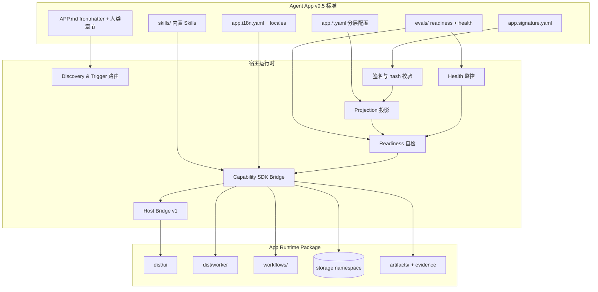
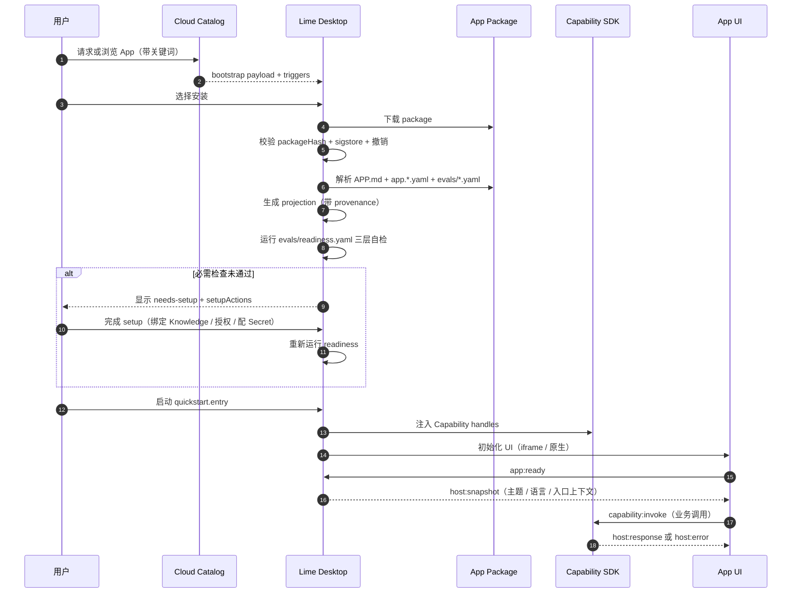
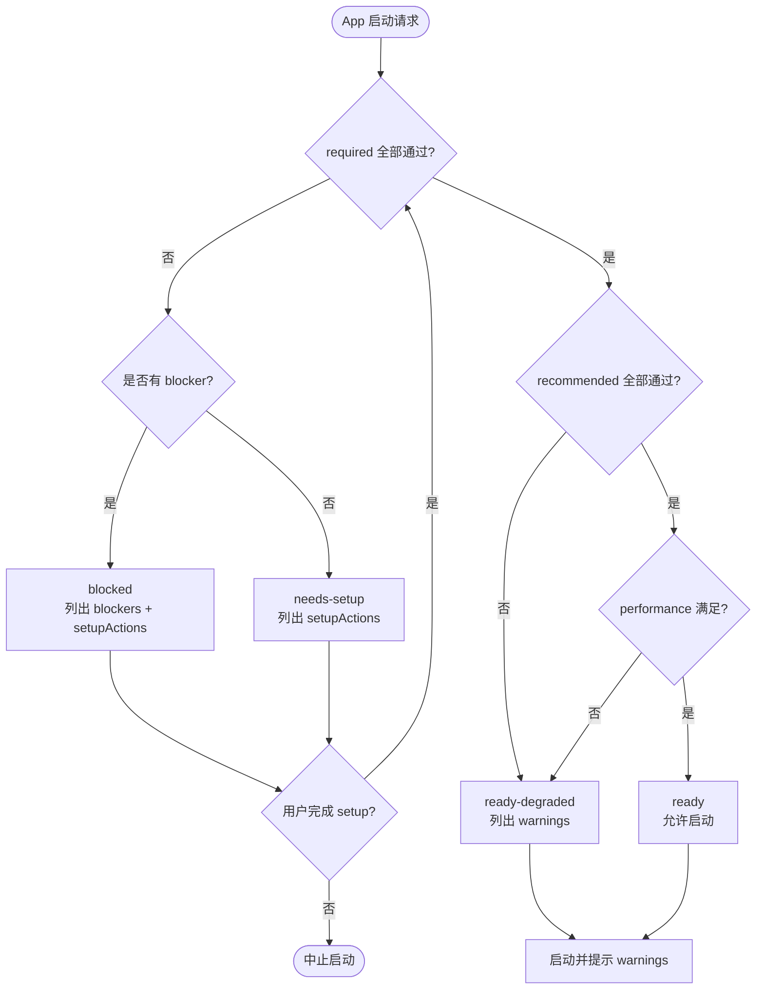
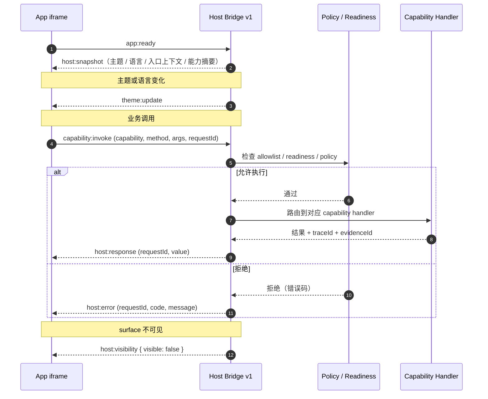
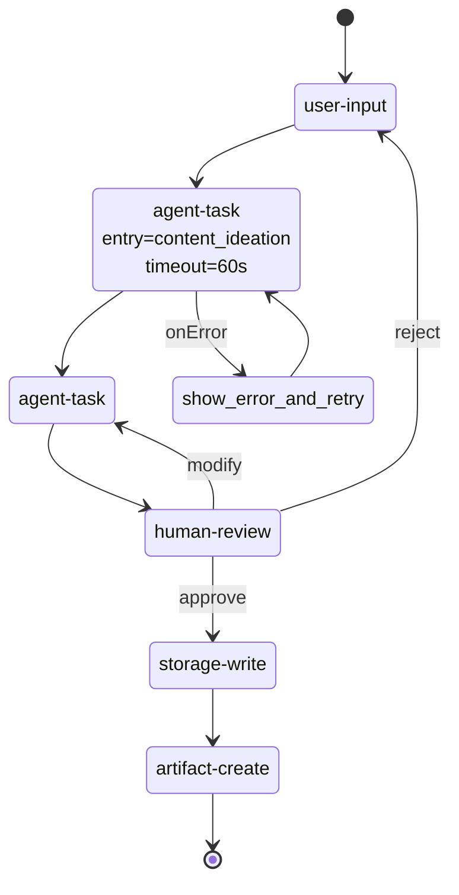

# v0.5 概览

v0.5 借鉴 [Agent Skills 标准](https://agentskills.io) 的发现与编写纪律，让 Agent App 标准更利于 AI 客户端理解、作者编写和宿主实现。

## 核心变化

- **分层 manifest**：`APP.md` frontmatter 保持精简，详细配置下沉到独立 YAML 文件（`app.capabilities.yaml`、`app.entries.yaml`、`app.permissions.yaml`、`app.errors.yaml`、`app.i18n.yaml`、`app.signature.yaml`、`evals/readiness.yaml`、`evals/health.yaml`）。
- **AI 自动发现**：新增 `triggers`（keywords / scenarios）和 `quickstart`（entry / sampleWorkflow / setupSteps）。
- **标准化 Skills 集成**：`skills/` 目录承载 bundled Agent Skills（含 SKILL.md），manifest 只声明激活策略（auto / on-demand / manual）。
- **Readiness 自检**：`evals/readiness.yaml` 把 readiness 从宿主硬编码下沉为 App 声明，分 required / recommended / performance 三层；状态扩展为 `ready / ready-degraded / needs-setup / blocked / unknown`。
- **稳定错误码**：`app.errors.yaml` 提供错误码、恢复策略、retryable、maxRetries。
- **包签名与撤销**：`app.signature.yaml` 提供 sigstore 签名、信任链、撤销检查。
- **一等 i18n**：`app.i18n.yaml` + `locales/*.json`。
- **运行时健康**：`evals/health.yaml`（startup / runtime / metrics）。
- **Workflow 增强**：mermaid 流程图、人类可读 overview、统一 recovery 策略（onTimeout / onError / maxRetries / saveCheckpoint）。
- **APP.md 章节约定**：When to Use / Not Suitable For / Workflow / Quickstart / Red Flags / Verification Checklist / Troubleshooting。

## 为什么重要

v0.4 之前 manifest 字段不断膨胀，作者编写门槛上升；v0.5 通过分层让 frontmatter 回归极简、详细配置按需启用，同时为 AI 客户端提供 `triggers`，提升自动路由的准确率。

## 兼容说明

- v0.4 / v0.3 manifest 在 v0.5 宿主中继续可用。
- 新字段都是可选的，仅在 `manifestVersion: 0.5.0` 时建议启用 v0.5 章节约定与 readiness / errors / signature。
- Reference CLI 提供 `migrate-check` / `migrate-generate` 协助迁移。

## 心智模型

```text
APP.md (精简 frontmatter + 人类可读章节)
  ↳ triggers / quickstart                # AI 自动发现
  ↳ app.capabilities.yaml                # 详细能力
  ↳ app.entries.yaml                     # 详细入口
  ↳ app.permissions.yaml                 # 权限与 policy
  ↳ app.errors.yaml                      # 稳定错误码
  ↳ app.i18n.yaml + locales/*.json       # 一等 i18n
  ↳ app.signature.yaml                   # 签名与撤销
  ↳ evals/readiness.yaml                 # 自检
  ↳ evals/health.yaml                    # 运行时健康
  ↳ skills/<name>/SKILL.md               # bundled Agent Skills
```

## 架构图

v0.5 把标准、宿主、运行时切成三层，分层 manifest 与 Capability SDK 是稳定边界。



## 安装与启动时序图

下图展示 v0.5 一个完整的安装→启动流程，含 trigger 路由、签名校验、readiness 自检与 Host Bridge 注入：



## Readiness 自检流程图

`evals/readiness.yaml` 把自检分三层，状态机如下：



## Host Bridge 消息时序图

App UI 与 Host 之间通过 `lime.agentApp.bridge` 协议交换事件，所有能力调用走 `capability:invoke`：



## Workflow 状态机示例

v0.5 workflow 描述符在 v0.3 状态机基础上引入 mermaid 流程图与统一 recovery 策略：



