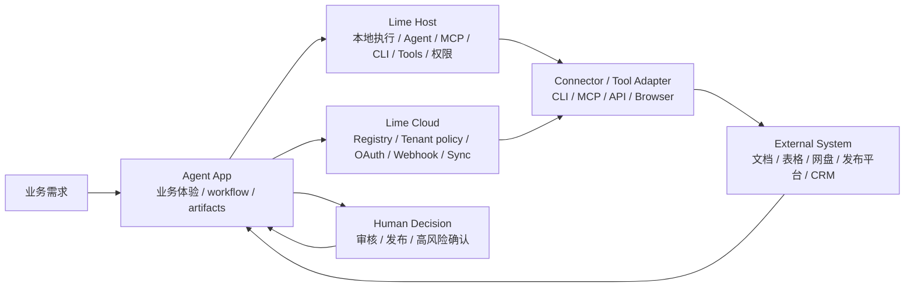
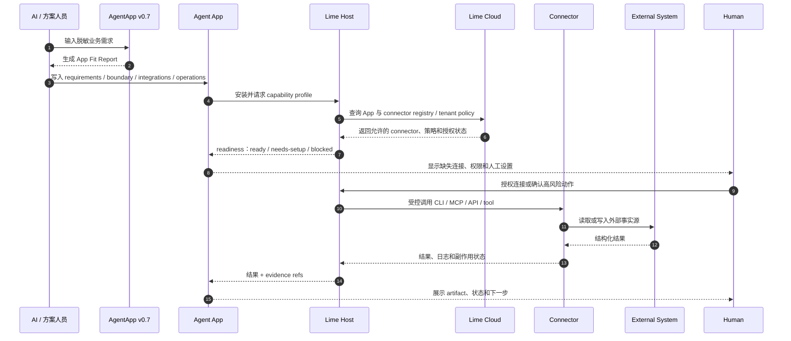
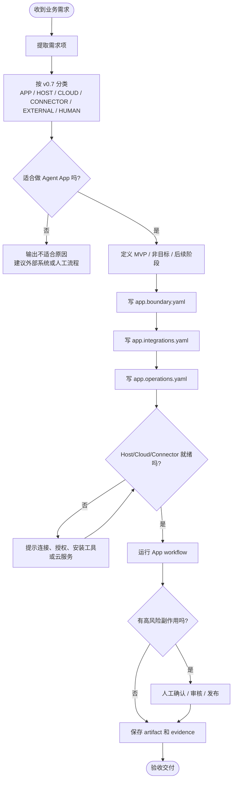

# v0.7 概览

v0.7 的主题是 **Requirement Boundary & Capability Handoff**：给定一个真实业务需求，Agent App 必须能说明哪些由 App 负责，哪些需要 Lime Host、Lime Cloud、connector、外部系统或人工决策共同完成。

v0.7 不把某个行业、客户或厂商写进标准。它把真实交付中反复出现的问题标准化：需求拆解、职责边界、外部集成、操作副作用、验收范围和非目标。

## 核心变化

- **`app.requirements.yaml`**：声明业务需求项、MVP 范围、非目标、后续阶段和验收标准。
- **`app.boundary.yaml`**：把每个需求映射到 App / Host / Cloud / connector / external system / human 平面。
- **`app.integrations.yaml`**：声明外部系统、CLI、MCP、API、webhook 或 browser adapter 需求，但执行由 Host/Cloud 托管。
- **`app.operations.yaml`**：声明读写动作、副作用、审批、dry-run、幂等和 evidence 要求。
- **App Fit Report**：新增售前 / 方案阶段报告，用于把自然语言需求标准化拆成可交付平面。
- **Host/Cloud 执行平面**：Host 负责本地 AgentRuntime、MCP、CLI、tools、文件、沙箱和用户确认；Cloud 负责 registry、tenant policy、OAuth broker、webhook、scheduled sync 和团队治理。

## 架构图

## 时序图

## 流程图

## 兼容说明

- v0.6 App 在 v0.7 Host 中继续有效。
- v0.7 不替代 `app.runtime.yaml`；它在 runtime control plane 之上补齐需求边界和能力交接。
- 非 Lime 核心的厂商适配应以 connector package、MCP server、CLI adapter、browser adapter 或 customer overlay 接入，不应写入 Lime Core。
