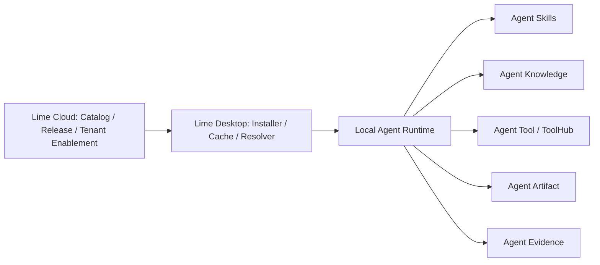

# 什么是 Agent App？

Agent App 是面向 Agent 宿主的可安装应用包标准草案。它不替代 Agent Skills、Agent Knowledge、Agent Runtime、Agent Tool、Agent UI、Agent Artifact、Agent Evidence、Agent Policy、Agent Context 或 Agent QC，而是把它们组合成一个用户可安装的应用单位。

一句话：**Agent App 描述一个智能体应用由哪些入口、能力、知识槽位、工具权限、产物和质量门禁组成。**

## 小程序平台类比

可以把 Agent App 理解成 AI Agent 时代的小程序：

| 微信小程序心智 | Agent App 对应物 |
| --- | --- |
| 微信是宿主平台。 | Lime / Cursor / IDE / AI Client 是宿主平台。 |
| 小程序声明页面、组件、权限。 | Agent App 声明 entries、capabilities、permissions。 |
| 客户端下载小程序包到本地。 | 宿主安装 Agent App package 到本地 cache。 |
| 小程序调用 `wx.*` 能力。 | Agent App 通过宿主调用 Skills、Knowledge、Tools、Runtime、Artifacts。 |
| 平台管理审核、发布和权限。 | Cloud / Registry 管 App release、tenant enablement、policy 和 provenance。 |

这个类比只用于理解架构，不意味着 Agent App 要复刻微信的 JS 框架或页面模型。Agent App 的核心不是页面，而是可运行的 Agent 应用组合。

## 在 Lime 里的位置

Lime Cloud 可以分发和授权 Agent App。Lime Desktop 负责安装、解析和本地运行。Cloud 不应该在默认链路里变成隐藏 Agent Runtime。

## Agent App 适合什么

- AI 内容工程化应用。
- 客服知识库应用。
- 销售 SOP 应用。
- 法务文书应用。
- 投研报告应用。
- 企业内部流程应用。
- 某个客户的私有工作流应用。

这些场景不应该通过修改 Lime Core 实现。新场景应该优先成为新的 Agent App。

## Agent App 不是什么

- 不是云端 Agent Runtime。
- 不是 `SKILL.md` 的替代品。
- 不是知识格式。
- 不是 UI 组件库。
- 不是工具协议。
- 不是客户资料包。

## 为什么需要它

只有 Skills 和 Knowledge 还不够。一个真实应用通常还需要：

- 用户从哪里进入。
- 运行前要绑定哪些知识。
- 哪些工具是必需，哪些是可选。
- 产出什么 Artifact。
- 用什么 Eval 判断能不能交付。
- 安装到哪个宿主、哪个 workspace、哪个租户。
- 如何记录 app provenance，方便审计和升级。

Agent App 就是补齐这些组合关系的标准层。
