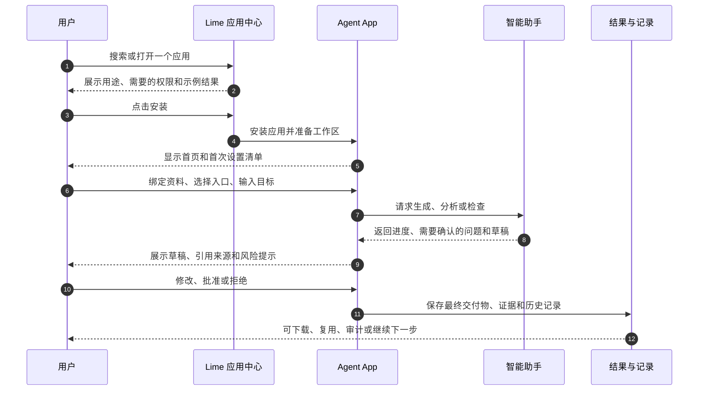
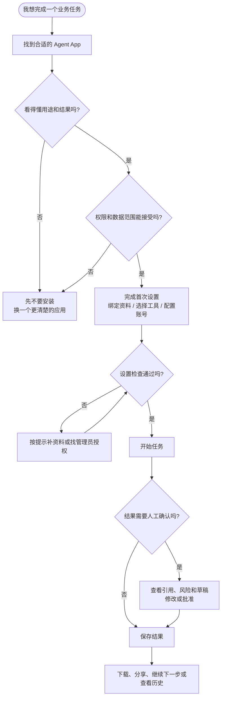
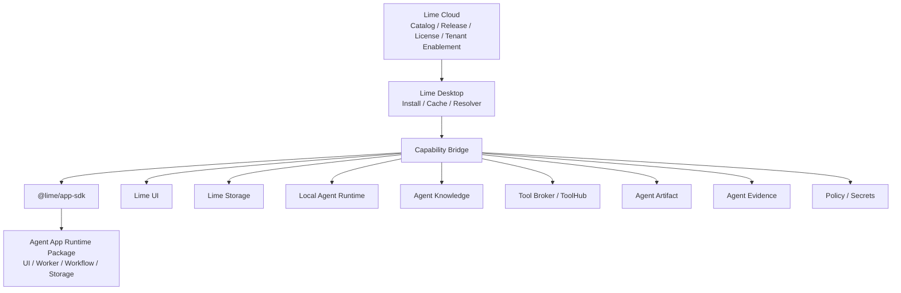

# 什么是 Agent App？

Agent App 是面向 Agent 宿主的完整可安装应用包标准。它可以包含真实 UI、业务流程、数据存储、后台任务、Agent 入口、Skills、Tools、Knowledge 绑定、Artifacts、Policies 和 Evals。

一句话：**Agent App 是运行在 Lime 平台能力之上的智能应用，不是一个 Markdown 文件，也不是一个聊天专家。**

`APP.md` 只是发现入口和 manifest 载体；真正的业务能力来自 App runtime package，并通过 Lime Capability SDK 调用平台能力。

## 业务工作台，不是 Chat 外壳

产品边界是：

> 业务不出 App 上下文，Agent 不出 Lime 能力治理边界。

Agent App 应该是用户完成工作的地方：看板、表格、表单、人工确认队列、交付物、设置和内嵌助手都可以在 App 内出现。App 可以调用 `lime.agent`、`lime.knowledge`、`lime.tools`、`lime.storage`、`lime.artifacts` 和 `lime.evidence`，但用户不应该为了完成 App 核心流程再跳回 Lime 通用聊天框。

这也防止另一个错误方向：App 不应该为了绕开 Lime 而自建模型网关、凭证系统、权限系统、证据系统或工具调度器。那会让 Lime 退化成独立 SaaS 的分发壳。Agent App 要走中间路线：App 拥有业务形态和业务状态；Lime 拥有 Agent 运行时和受治理的平台能力。

## 和“专家”的关系

大公司的“专家”通常是：

```text
Expert = Chat UI + Persona + Skills + Tools + Data Connections
```

Agent App 是更高一层：

```text
Agent App = UI + Workflow + Storage + Services + Agent Entries + Skills + Tools + Knowledge + Artifacts + Policy
```

所以 Expert 只是 Agent App 的一种 `expert-chat` entry。一个 App 可以有多个专家，也可以没有专家。比如“内容工厂”应该有项目首页、知识库页面、内容工厂、数据复盘看板和后台任务；“内容策略专家”只是其中一个入口。

因此 Expert Chat 是 App 的一种交互方式，不是所有业务流程的默认容器。App 可以把专家嵌到表格、确认步骤或报告页面旁边；专家应读取当前 App 上下文，并通过 SDK 触发 App workflow，而不是生成一段脱离业务状态、需要用户手工复制回 App 的聊天文本。

## 小程序平台类比

可以把 Agent App 理解成 AI Agent 时代的小程序，但它不复刻微信小程序框架。

| 微信小程序心智 | Agent App 对应物 |
| --- | --- |
| 微信是宿主平台。 | Lime / IDE / AI Client 是宿主平台。 |
| 小程序声明页面、组件、权限、存储。 | Agent App 声明 UI、entries、capabilities、storage、permissions。 |
| 小程序调用 `wx.*` 能力。 | Agent App 通过 `@lime/app-sdk` 调用 `lime.ui`、`lime.storage`、`lime.agent` 等能力。 |
| 平台管理审核、发布和权限。 | Cloud / Registry 管 release、tenant enablement、license、policy。 |
| 客户端运行小程序。 | Lime Desktop 安装并本地运行 App package。 |

关键不是“像小程序一样长什么样”，而是“宿主开放能力，App 通过稳定 SDK 调用能力”。

## 普通用户怎么看

对普通用户来说，Agent App 不需要理解 manifest、SDK 或运行时。它更像一个“带智能助手的业务应用”：打开应用、按提示完成设置、选择一个任务、确认关键动作、最后拿到可保存和可追溯的结果。

### 从安装到完成任务



### 使用时的决策流程



普通用户只需要记住三点：

- 安装前看清“这个应用做什么、要哪些权限、会产生什么结果”。
- 运行中遇到确认提示时，先看引用、风险和将要执行的动作。
- 完成后结果应该留在 App 里，可追溯、可修改、可继续使用。

## 在 Lime 里的位置



Lime Cloud 可以分发、授权和启用 Agent App。Lime Desktop 负责安装、权限、能力注入和本地运行。Cloud 不应该在默认链路里变成隐藏 Agent Runtime。

## Agent App 适合什么

- 内容工厂系统。
- 客服知识库工作台。
- 销售 SOP 应用。
- 法务合同审查产品。
- 投研报告工作台。
- 企业内部流程应用。
- 某个客户的私有业务系统。

这些场景不应该通过修改 Lime Core 实现。新场景应优先成为新的 Agent App，调用 Lime 平台能力。

## Agent App 不是什么

- 不是 `APP.md` 文档集合。
- 不是单个 Expert / Persona。
- 不是 `SKILL.md` 的替代品。
- 不是知识库格式。
- 不是工具协议。
- 不是云端 Agent Runtime。
- 不是把客户资料打包进官方包。

## 为什么需要它

只有 Skills、Knowledge 和 Tools 还不够。真实业务应用还需要：

- 自己的 UI 页面、面板和设置。
- 自己的数据模型、索引、迁移和缓存。
- 自己的业务 workflow、后台任务和人工确认节点。
- 多个对话专家或非对话入口。
- 可追踪的 Artifact、Evidence 和 Eval。
- 权限、成本、凭证、租户 overlay 和升级策略。
- 与 Lime 底层能力解耦的 SDK 边界。

Agent App 就是补齐这些应用级关系的标准层。
