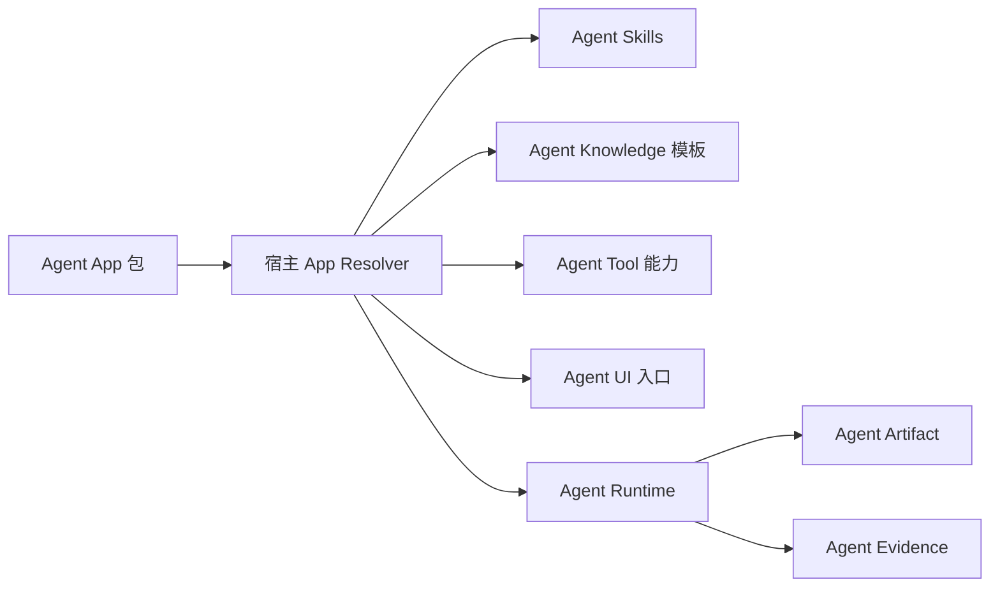

# 什么是 Agent App？

Agent App 是面向 Agent 宿主的可安装应用包标准草案。它不替代 Agent Skills、Agent Knowledge、Agent Runtime、Agent Tool、Agent UI、Agent Artifact、Agent Evidence、Agent Policy、Agent Context 或 Agent QC，而是把它们组合成一个用户可安装的应用单位。

一个有用的类比是小程序平台：

- 宿主平台开放能力。
- App 声明入口、权限、依赖和展示信息。
- 客户端把包下载或安装到本地。
- 宿主通过受控 API 和本地 Runtime 执行。

对 Lime 来说，Lime Cloud 可以分发和授权 Agent App；Lime Desktop 负责安装、解析和本地运行。

## 边界

Agent App 拥有组合声明。Runtime 拥有执行事实。Skills 拥有工艺。Knowledge 拥有可信数据。Tools 拥有可调用能力。

## 适合场景

- AI 内容工程化应用。
- 客服知识库应用。
- 销售 SOP 应用。
- 法务文书应用。
- 投研报告应用。
- 内部流程应用。

## 非目标

- 不是云端 Agent Runtime。
- 不是 `SKILL.md` 的替代品。
- 不是知识格式。
- 不是 UI 组件库。
- 不是工具协议。
